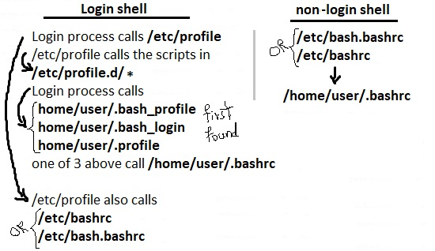

## **105.1 Personalizar y utilizar el entorno de shell**

**Peso**: 4

**Descripción:** Los candidatos deben poder personalizar los entornos de shell para satisfacer las necesidades de los usuarios. Los candidatos deben poder modificar los perfiles globales y de usuario.

**Áreas de conocimiento clave:**

* Establecer variables de entorno (p. ej., PATH) al iniciar sesión o al crear un nuevo shell
* Escribir funciones de Bash para secuencias de comandos de uso frecuente
* Mantener directorios básicos para nuevas cuentas de usuario
* Establecer la ruta de búsqueda de comandos con el directorio adecuado

**La siguiente es una lista parcial de los archivos, términos y utilidades utilizados:**

* source
* /etc/bash.bashrc
* /etc/profile
* env
* export
* set
* unset
* \~/.bash_profile
* \~/.bash_login
* \~/.profile
* \~/.bashrc
* \~/.bash_logout
* function
* alias
* lists


Ya hemos hablado sobre las variables de entorno en la sección "103-1". En esta sección queremos hablar sobre los perfiles de usuario y los perfiles de todo el sistema, y ​​cómo interactúan cuando el usuario inicia sesión.

### Shell de inicio de sesión y shell sin inicio de sesión

El programa shell, por ejemplo Bash, utiliza una colección de scripts de inicio para crear un entorno. Cada script tiene un uso específico y afecta al entorno de inicio de sesión de forma diferente. Cada script ejecutado posteriormente puede anular los valores asignados por scripts anteriores.

El inicio se configura de forma diferente para los shells de inicio de sesión y los shells sin inicio de sesión.

1. **Shells de inicio de sesión**: si abre un shell o terminal (o cambia a uno) y le pide que inicie sesión (¿Nombre de usuario? ¿Contraseña?) antes de mostrarle un mensaje, es un shell de inicio de sesión.
2. **Shells sin inicio de sesión**: si no le pide que inicie sesión (como _gnome-terminal_) y le permite usarlo directamente, es un shell sin inicio de sesión (GUI)



#### Agregar configuración global para el shell de inicio de sesión

### /etc/profile

/etc/profile contiene el entorno de todo el sistema Linux y los programas de inicio. Lo utilizan todos los usuarios con shell bash, ksh y sh. Solo se ejecuta para el shell de inicio de sesión.

### /etc/profile.d

Si necesita personalizar el entorno de inicio de sesión para todos los usuarios de su sistema, puede utilizar /etc/profile, pero como los archivos de distribución en /etc, como /etc/profile, pueden modificarse con las actualizaciones del sistema, es mejor no editarlos directamente. En su lugar, cree archivos adicionales en /etc/profile.d.

#### agregar configuraciones globales para shell sin inicio de sesión (interactivo)

### /etc/bash.bashrc y /etc/bashrc

Puede utilizar /etc/bash.bashrc (o /etc/bashrc) [según su distribución] para agregar configuraciones globales y alias globales.

#### configuraciones específicas del usuario

### /home/user/.bash_profile  &  /home/user/.bashrc

`~/.bash_profile` y `~/.bashrc` son scripts de shell que contienen comandos de shell. Estos archivos se ejecutan en el contexto de un usuario cuando se abre un nuevo shell o cuando un usuario inicia sesión para que su entorno esté configurado correctamente. Como mencionamos, `~/.bash_profile` se ejecuta para shells de inicio de sesión y `~/.bashrc` se ejecuta para shells interactivos que no son de inicio de sesión.

Esto significa que cuando un usuario inicia sesión (a través de nombre de usuario y contraseña) en la consola (ya sea localmente o de forma remota a través de algo como SSH), el script `~/.bash_profile` se ejecuta antes de que se le devuelva al usuario el símbolo del sistema inicial. Después de eso, cada vez que se abre un nuevo shell, se ejecuta el script `~/.bashrc`.

> La mayoría de las veces, las variables PATH y de entorno van a \~/.bash_profile y los alias van a \~/.bashrc.

### Alias

En bash, puedes definir alias para los comandos. Los alias se utilizan para proporcionar un nombre alternativo para un comando, para proporcionar parámetros predeterminados para el comando o, a veces, para construir un comando nuevo o más complejo.

Los alias se establecen o se enumeran con el comando `alias` y se eliminan con el comando `unalias`.

```bash
### list aliases
root@ubuntu16-1:~# alias 
alias egrep='egrep --color=auto'
alias fgrep='fgrep --color=auto'
alias grep='grep --color=auto'
alias l='ls -CF'
alias la='ls -A'
alias ll='ls -alF'
alias ls='ls --color=auto'

### unalias with unalias command
root@ubuntu16-1:~# unalias ll
root@ubuntu16-1:~# ll
ll: command not found

### setting an alias
root@ubuntu16-1:~# alias ll='ls -alF'
root@ubuntu16-1:~# ll
total 472
...
```

Para que los alias sean permanentes para el usuario, se definen en `/home/user/.bashrc`:

```
...
# some more ls aliases
alias ll='ls -alF'
alias la='ls -A'
alias l='ls -CF'
...
```

> Otro uso común de los alias es para el usuario root. Los comandos `cp`, `rm` y `mv` suelen tener alias que incluyen el parámetro `-i` para ayudar a prevenir la destrucción accidental de archivos.

### /etc/skel

Quizás te preguntes cómo se crearon archivos como \~/.bash_profile, \~/.bashrc o \~/.bash_logout en tu directorio personal. Estos son archivos esqueleto que se copian desde /etc/skel.

```
root@ubuntu16-1:~# ls -1a /etc/skel/
.
..
.bash_logout
.bashrc
examples.desktop
.profile
```

### .bash_logout

El archivo .bash_logout se lee y se ejecuta cada vez que se sale de un shell de inicio de sesión. Limpia la pantalla cada vez que se cierra la sesión. Sin .bash_logout, ¡el siguiente usuario podría ver todo aquello en lo que estaba trabajando!

```bash
root@ubuntu16-1:~# cat /etc/skel/.bash_logout 
# ~/.bash_logout: executed by bash(1) when login shell exits.

# when leaving the console clear the screen to increase privacy

if [ "$SHLVL" = 1 ]; then
    [ -x /usr/bin/clear_console ] && /usr/bin/clear_console -q
fi
```

### . and source

Si un script se ejecuta en un shell secundario, cualquier variable que pueda exportar se pierde cuando regresa al shell principal.

```bash
root@ubuntu16-1:~# cat .profile 
# ~/.profile: executed by Bourne-compatible login shells.

if [ "$BASH" ]; then
  if [ -f ~/.bashrc ]; then
    . ~/.bashrc
  fi
fi

mesg n || true
```

Entonces, si .profile ejecuta el script \~/.bashrc, ¿por qué no se pierden las variables y funciones que se exportan desde \~/.bashrc? La respuesta es que ejecuta el script en el entorno actual utilizando el comando `source` (o `.`).

### Funciones de shell

Los alias son útiles, pero ¿qué sucede si desea manejar parámetros? Los alias expanden solo la primera palabra y todo lo demás en la línea de comandos se agrega a la expansión. Si desea ejecutar un comando con algunos parámetros y luego procesar la salida de alguna manera, no podrá hacerlo con un alias. En este caso, necesita una función de shell.

```
myfunc() {
    echo "hello $1"
}

# Same as above (alternate syntax)
function myfunc() {
    echo "hello $1"
}
```

`$1` returns the first argument

```
root@ubuntu16-1:~# myfunc "payam"
hello payam
```

Las funciones de Shell tienen un par de ventajas sobre los alias:

* Puede manejar parámetros.
* Puede usar construcciones de programación, como pruebas y bucles, para mejorar su procesamiento.

Podemos usar el comando `unset `para anular la configuración de nuestra función definida.

### listas

Shell admite un tipo diferente de variable llamada variable de matriz. Esta puede contener múltiples valores al mismo tiempo. Las matrices proporcionan un método para agrupar un conjunto de variables. En lugar de crear un nuevo nombre para cada variable que se requiere, puede usar una única variable de matriz que almacene todas las demás variables.

```
array_name=(value1 ... valuen)

### example:
root@ubuntu16-1:~# mylist=(lets learn linux)

### for accessing value:  {array_name[index]}

### example:
root@ubuntu16-1:~# echo ${mylist[2]}
linux
```

Otro ejemplo:

```
root@ubuntu16-1:~# mylist2=("we are" "learning" "lpic 1-102 exam")
root@ubuntu16-1:~# echo ${mylist2[2]}
lpic 1-101 exam
```

¡Mantén tus ojos en la sintaxis!

[http://howtolamp.com/articles/difference-between-login-and-non-login-shell/](http://howtolamp.com/articles/difference-between-login-and-non-login-shell/)

[https://askubuntu.com/questions/155865/what-are-login-and-non-login-shells](https://askubuntu.com/questions/155865/what-are-login-and-non-login-shells)

[https://www.cyberciti.biz/faq/set-environment-variable-linux/](https://www.cyberciti.biz/faq/set-environment-variable-linux/)

[https://developer.ibm.com/tutorials/l-lpic1-105-1/](https://developer.ibm.com/tutorials/l-lpic1-105-1/)

[https://jadi.gitbooks.io/lpic1/content/1051\_customize_and_use_the_shell_environment.html](https://jadi.gitbooks.io/lpic1/content/1051\_customize_and_use_the_shell_environment.html)

[https://www.tutorialspoint.com/unix/unix-using-arrays.htm](https://www.tutorialspoint.com/unix/unix-using-arrays.htm)

