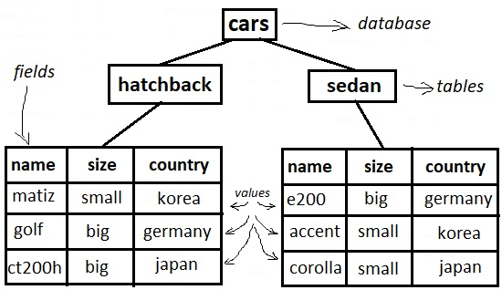

# 105.3. Gestión de datos SQL

**Peso: **2

**Descripción: **Los candidatos deben poder consultar bases de datos y manipular datos utilizando comandos SQL básicos. Este objetivo incluye la realización de consultas que impliquen la unión de 2 tablas y/o subselecciones.

**Áreas de conocimiento clave:**

* Uso de comandos SQL básicos
* Realizar manipulación básica de datos

**Términos y utilidades:**

* insert
* update
* select
* delete
* from
* where
* group by
* order by
* join

Hasta ahora, en esta serie de tutoriales, hemos utilizado archivos de texto sin formato para almacenar datos. Los archivos de texto sin formato pueden ser adecuados para pequeñas cantidades de datos, pero no son buenos para almacenar grandes cantidades de datos o para consultarlos. A lo largo de los años, se han desarrollado varios tipos de bases de datos para ese fin; la más común es ahora la **base de datos relacional**.

En la actualidad existen varios sistemas de bases de datos relacionales, incluidos productos comerciales como Oracle Database e IBM DB2®, y proyectos de código abierto como MySQL, PostgreSQL SQLite y MariaDB (una bifurcación de MySQL). Las bases de datos relacionales utilizan SQL como lenguaje de consulta y definición de datos.

SQL (pronunciado "ess-que-el") significa lenguaje de consulta estructurado. SQL se utiliza para comunicarse con una base de datos. Es el lenguaje estándar para los sistemas de gestión de bases de datos relacionales. Las sentencias SQL se utilizan para realizar tareas como actualizar datos en una base de datos o recuperar datos de una base de datos.

### Bases de datos, tablas, columnas y filas <a href="databases-tables-columns-and-rows" id="databases-tables-columns-and-rows"></a>

Una base de datos relacional consta de un conjunto de _tablas_. Piense en cada _fila_ de datos de la tabla como un registro, y cada _columna_ de la tabla corresponde a los campos del registro de la fila correspondiente. Los datos de una columna son todos del mismo _tipo_, como caracteres, números enteros, fechas o datos binarios (como imágenes).

No vamos a instalar MySQL ni a crear bases de datos desde cero, nos centraremos en SQL y utilizaremos una base de datos existente (ubuntu16.04):



#### Línea de comandos MySQL

MySQL tiene una línea de comandos SQL simple que usamos para conectarnos de manera interactiva a un servidor MySQL.

```
# mysql -u root -p
Enter password: 
```

Significa que voy a usar `u` como root y la `p`assword que voy a proporcionar. También es posible escribir la contraseña en el comando y definir qué base de datos voy a usar, ¡lo cual no es una gran idea!

```
# mysql -u root -p password cars
```

#### using a database

Después de conectarnos al servidor MySQL, debemos definir qué base de datos vamos a utilizar. Puede haber demasiadas bases de datos, primero las vemos mediante el comando SHOW DATABASES y luego usamos el comando para definir qué base de datos vamos a utilizar.

Por lo general, los comandos MySQL se escriben con LETRAS MAYÚSCULAS y los nombres y valores, ... en minúsculas. Debe haber un ; al final de cada comando MySQL.

```
root@ubuntu16-1:~# mysql -u root -p
Enter password: 
Welcome to the MySQL monitor.  Commands end with ; or \g.
Your MySQL connection id is 239
Server version: 5.7.17-0ubuntu0.16.04.1 (Ubuntu)

Copyright (c) 2000, 2016, Oracle and/or its affiliates. All rights reserved.

Oracle is a registered trademark of Oracle Corporation and/or its
affiliates. Other names may be trademarks of their respective
owners.

Type 'help;' or '\h' for help. Type '\c' to clear the current input statement.

mysql> SHOW DATABASES;
+--------------------+
| Database           |
+--------------------+
| information_schema |
| cars               |
| mysql              |
| performance_schema |
| phpmyadmin         |
| sys                |
+--------------------+
6 rows in set (0.00 sec)

mysql> USE cars;
Reading table information for completion of table and column names
You can turn off this feature to get a quicker startup with -A

Database changed
```

Veamos las tablas:
```
mysql> SHOW TABLES;
+----------------+
| Tables_in_cars |
+----------------+
| hatchback      |
| sedan          |
+----------------+
2 rows in set (0.00 sec)
```

### Exploración de tablas y columnas <a href="exploring-tables-and-columns" id="exploring-tables-and-columns"></a>

### SELECT

La instrucción **select** se utiliza para consultar la base de datos y recuperar los datos seleccionados. Podemos seleccionar todo en la tabla utilizando ` *` , o podemos seleccionar de columnas específicas:

>  SELECT _column1_,_ column2, ..._\
> FROM _table_name_;

```
mysql> SELECT * FROM hatchback;
+--------+-------+---------+
| name   | size  | country |
+--------+-------+---------+
| matiz  | small | korea   |
| golf   | big   | germany |
| ct200h | big   | japan   |
+--------+-------+---------+
3 rows in set (0.05 sec)

mysql> SELECT name FROM hatchback;
+--------+
| name   |
+--------+
| matiz  |
| golf   |
| ct200h |
+--------+
3 rows in set (0.01 sec)
```

### WHERE

 Podemos elegir qué datos mostrar utilizando `WHERE :`

>  SELECT _column1_,_ column2, ..._\
> FROM _table_name_\
> WHERE _condition_;

```
mysql> SELECT *  FROM hatchback WHERE size = 'big';
+--------+------+---------+
| name   | size | country |
+--------+------+---------+
| golf   | big  | germany |
| ct200h | big  | japan   |
+--------+------+---------+
2 rows in set (0.00 sec)
```

También es posible realizar la condición deseada mediante AND y OR cuando se usa WHERE:

```
mysql> SELECT *  FROM hatchback WHERE size = 'big' AND country = 'germany';
+------+------+---------+
| name | size | country |
+------+------+---------+
| golf | big  | germany |
+------+------+---------+
1 row in set (0.00 sec)

mysql> SELECT *  FROM hatchback WHERE size = 'big' OR country = 'korea';
+--------+-------+---------+
| name   | size  | country |
+--------+-------+---------+
| matiz  | small | korea   |
| golf   | big   | germany |
| ct200h | big   | japan   |
+--------+-------+---------+
3 rows in set (0.01 sec)
```

### ORDER BY

ORDERBY se utiliza si queremos ordenar los datos en función de un campo:

>  SELECT _column1_,_ column2, ..._\
> FROM _table_name_\
> ORDER BY _column1, column2, ..._

```
mysql> SELECT *  FROM hatchback ORDER BY name;
+--------+-------+---------+
| name   | size  | country |
+--------+-------+---------+
| ct200h | big   | japan   |
| matiz  | small | korea   |
| golf   | big   | germany |
+--------+-------+---------+
3 rows in set (0.01 sec)
```

y puede ordenar los resultados según cualquier campo:

```
mysql> SELECT *  FROM hatchback ORDER BY country;
+--------+-------+---------+
| name   | size  | country |
+--------+-------+---------+
| golf   | big   | germany |
| ct200h | big   | japan   |
| matiz  | small | korea   |
+--------+-------+---------+
3 rows in set (0.00 sec)
```

### GROUP BY

A veces, desea agregar información de una tabla. Por ejemplo, desea saber cuántos hatchbacks grandes tiene. Podemos usar la cláusula `GROUP BY` para agrupar sus datos con este fin:

>  SELECT _column_name(s)_\
> FROM _table_name_\
> WHERE _condition_\
> GROUP BY _column_name(s)_

```
mysql> SELECT *  FROM hatchback GROUP BY size;                                  +-------+-------+---------+
| name  | size  | country |
+-------+-------+---------+
| golf  | big   | germany |
| matiz | small | korea   |
+-------+-------+---------+
2 rows in set (0.00 sec)
```

Actúa como un comando único y agrupa el resultado. Para entender cuántas filas se han agrupado, podemos usar count:

```
mysql> SELECT count(size)  FROM hatchback GROUP BY size;
+-------------+
| count(size) |
+-------------+
|           2 |
|           1 |
+-------------+
2 rows in set (0.04 sec)

mysql> SELECT name,count(size)  FROM hatchback GROUP BY size;
+-------+-------------+
| name  | count(size) |
+-------+-------------+
| golf  |           2 |
| matiz |           1 |
+-------+-------------+
2 rows in set (0.00 sec)
```

### Creating, changing, and deleting data and tables <a href="creating-changing-and-deleting-data-and-tables" id="creating-changing-and-deleting-data-and-tables"></a>

###  INSERT

 El comando `INSERT` agrega una o más filas de datos a una tabla.

>  INSERT INTO _table_name_ (_column1_,_ column2_,_ column3_, ...)\
> VALUES (_value1_,_ value2_,_ value3_, ...);

```
mysql> INSERT INTO hatchback (name,size,country) VALUES ('yaris','small','japan');
Query OK, 1 row affected (0.07 sec)

mysql> SELECT * FROM hatchback;
+--------+-------+---------+
| name   | size  | country |
+--------+-------+---------+
| matiz  | small | korea   |
| golf   | big   | germany |
| ct200h | big   | japan   |
| yaris  | small | japan   |
+--------+-------+---------+
4 rows in set (0.00 sec)
```

> the order is not important and bellow query would have the same result:

```
INSERT INTO hatchback (size,name,country) VALUES ('small','yaris','japan');
```
###   UPDATE

Comando `UPDATE` para corregir este error. Actualiza la fila, pero ¿cuál? Deberíamos especificarlo con el comando WHERE.

>  UPDATE _table_name_\
> SET _column1 _=_ value1_,_ column2 _=_ value2_, ...\
> WHERE _condition_;

```
mysql> UPDATE hatchback SET size= 'big' WHERE name= 'yaris';
Query OK, 1 row affected (0.05 sec)
Rows matched: 1  Changed: 1  Warnings: 0

mysql> SELECT * FROM hatchback;
+--------+-------+---------+
| name   | size  | country |
+--------+-------+---------+
| matiz  | small | korea   |
| golf   | big   | germany |
| ct200h | big   | japan   |
| yaris  | big   | japan   |
+--------+-------+---------+
4 rows in set (0.00 sec)
```

### DELETE

La instrucción DELETE se utiliza para eliminar registros existentes en una tabla.

>  DELETE FROM _table_name _WHERE _condition_;

¡Tenga cuidado al eliminar registros de una tabla! Observe el WHERE en la declaración DELETE. La cláusula WHERE especifica qué registro(s) se deben eliminar. Si omite la cláusula WHERE, se eliminarán todos los registros de la tabla.

```
mysql> DELETE FROM hatchback WHERE name= 'yaris';
Query OK, 1 row affected (0.03 sec)

mysql> SELECT * FROM hatchback;
+--------+-------+---------+
| name   | size  | country |
+--------+-------+---------+
| matiz  | small | korea   |
| golf   | big   | germany |
| ct200h | big   | japan   |
+--------+-------+---------+
3 rows in set (0.00 sec)
```

### JOIN

Una cláusula JOIN se utiliza para combinar filas de dos o más tablas, en función de una columna relacionada entre ellas. Si no se proporciona ninguna columna relacionada, cada fila de la segunda tabla (sedán) se copia delante de la primera tabla (hatchback).

```
mysql> SELECT * FROM hatchback;
+--------+-------+---------+
| name   | size  | country |
+--------+-------+---------+
| matiz  | small | korea   |
| golf   | big   | germany |
| ct200h | big   | japan   |
+--------+-------+---------+
3 rows in set (0.00 sec)

mysql> SELECT * FROM sedan;
+---------+-------+---------+
| name    | size  | country |
+---------+-------+---------+
| e200    | big   | germany |
| accent  | small | korea   |
| corolla | small | japan   |
+---------+-------+---------+
3 rows in set (0.00 sec)

mysql> SELECT * FROM hatchback JOIN sedan;
+--------+-------+---------+---------+-------+---------+
| name   | size  | country | name    | size  | country |
+--------+-------+---------+---------+-------+---------+
| matiz  | small | korea   | e200    | big   | germany |
| golf   | big   | germany | e200    | big   | germany |
| ct200h | big   | japan   | e200    | big   | germany |
| matiz  | small | korea   | accent  | small | korea   |
| golf   | big   | germany | accent  | small | korea   |
| ct200h | big   | japan   | accent  | small | korea   |
| matiz  | small | korea   | corolla | small | japan   |
| golf   | big   | germany | corolla | small | japan   |
| ct200h | big   | japan   | corolla | small | japan   |
+--------+-------+---------+---------+-------+---------+
9 rows in set (0.01 sec)
```

y si le damos a JOIN un campo común para UNIR las tablas en base a eso, ocurre la magia:

```
mysql> SELECT * FROM hatchback JOIN sedan ON  hatchback.country = sedan.country; 
+--------+-------+---------+---------+-------+---------+
| name   | size  | country | name    | size  | country |
+--------+-------+---------+---------+-------+---------+
| golf   | big   | germany | e200    | big   | germany |
| matiz  | small | korea   | accent  | small | korea   |
| ct200h | big   | japan   | corolla | small | japan   |
+--------+-------+---------+---------+-------+---------+
3 rows in set (0.01 sec)


mysql> SELECT * FROM hatchback JOIN sedan ON  hatchback.size = sedan.size;
+--------+-------+---------+---------+-------+---------+
| name   | size  | country | name    | size  | country |
+--------+-------+---------+---------+-------+---------+
| golf   | big   | germany | e200    | big   | germany |
| ct200h | big   | japan   | e200    | big   | germany |
| matiz  | small | korea   | accent  | small | korea   |
| matiz  | small | korea   | corolla | small | japan   |
+--------+-------+---------+---------+-------+---------+
4 rows in set (0.00 sec)

```

### Diferentes tipos de uniones SQL

A continuación se muestran los diferentes tipos de uniones en SQL:

* **(INNER) JOIN**: Devuelve registros que tienen valores coincidentes en ambas tablas
* **LEFT (OUTER) JOIN**: Devuelve todos los registros de la tabla izquierda y los registros coincidentes de la tabla derecha
* **RIGHT (OUTER) JOIN**: Devuelve todos los registros de la tabla derecha y los registros coincidentes de la tabla izquierda
* **FULL (OUTER) JOIN**: Devuelve todos los registros cuando hay una coincidencia en la tabla izquierda o derecha


Finalmente, use el comando quit para salir de la línea de comandos MySQL.

```
mysql> quit
Bye
root@ubuntu16-1:~# 
```

¡eso es todo!

[https://developer.ibm.com/tutorials/l-lpic1-105-3/](https://developer.ibm.com/tutorials/l-lpic1-105-3/)

[http://www.sqlcourse.com/intro.html](http://www.sqlcourse.com/intro.html)

[https://dev.mysql.com/doc/refman/8.0/en/mysql.html](https://dev.mysql.com/doc/refman/8.0/en/mysql.html)

[https://jadi.gitbooks.io/lpic1/content/1053\_sql_data_management.html](https://jadi.gitbooks.io/lpic1/content/1053\_sql_data_management.html)

[`https://www.w3schools.com/sql/sql_select.asp`](https://www.w3schools.com/sql/sql_select.asp)

[https://tableplus.com/blog/2018/08/mysql-how-to-turn-off-only-full-group-by.html](https://tableplus.com/blog/2018/08/mysql-how-to-turn-off-only-full-group-by.html)
