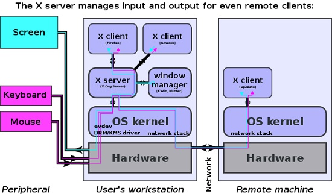

## **106.1 Instalar y configurar X11**

**Peso:** 2

**Descripción: **Los candidatos deben ser capaces de instalar y configurar X11.

**Áreas de conocimiento clave:**

- Verificar que la tarjeta de vídeo y el monitor sean compatibles con un servidor X
- Conocimiento del servidor de fuentes X
- Comprensión y conocimiento básicos del archivo de configuración de X Window

**Términos y utilidades:**

- /etc/X11/xorg.conf
- xhost
- DISPLAY
- xwininfo
- xdpyinfo
- X

En la época de las computadoras muy caras que se compartían entre muchos usuarios, las terminales X proporcionaban una forma económica para que muchos usuarios compartieran los recursos de una sola computadora. Hoy en día, las computadoras se han vuelto tan poderosas que nadie piensa en compartir recursos, pero hay algunas lecciones de historia que conviene conocer.

### X

El sistema X Window, a menudo conocido como X, es un sistema de ventanas para estaciones de trabajo gráficas desarrollado en el MIT. Se basa en un modelo cliente/servidor: El modelo cliente/servidor en el sistema X funciona a la inversa del modelo cliente/servidor típico, donde el cliente se ejecuta en la máquina local y solicita servicios del servidor. En el sistema X, el servidor se ejecuta en la máquina local y proporciona su visualización y servicios a los programas cliente. Los programas cliente pueden ser locales o existir de forma remota en diferentes redes, pero los servidores X aparecen de forma transparente.



Además de mostrar las ventanas para los clientes (aplicaciones), el **servidor X** también **maneja dispositivos de entrada como teclados, ratones y pantallas táctiles

**XOrg** Server fue la implementación libre y de código abierto del servidor de visualización para el sistema X Window administrado por la Fundación X.Org. El nombre X11 apunta a la versión 11 de X Windows.

En muchas distribuciones modernas de Linux, el servidor de administración de visualización aún existe, pero X Window ha sido reemplazado por nuevas soluciones como wayland.
### /etc/X11/xorg.conf

El archivo xorg.conf es un archivo que se utiliza para configurar el servidor X.Org. xorg.conf suele estar ubicado en /etc/X11/xorg.conf, pero ya no existe en las distribuciones de Linux modernas, por lo que utilizamos un xorg.conf de muestra para explicarlo.

El archivo de configuración xorg.conf está organizado en secciones que pueden especificarse en cualquier orden. El formato general de las secciones es:

> Sección "SectionName"
> SectionEntry ...
> EndSection

Veamos rápidamente las más importantes:

* Archivos: nombres de ruta para archivos como fontpath

```bash
Section "Files"
	FontPath	"/usr/share/X11/fonts/misc"
	FontPath	"/usr/share/X11/fonts/100dpi/:unscaled"
	FontPath	"/usr/share/X11/fonts/75dpi/:unscaled"
	FontPath	"/usr/share/X11/fonts/Type1"
	FontPath	"/usr/share/X11/fonts/100dpi"
	FontPath	"/usr/share/X11/fonts/75dpi"
	FontPath	"/var/lib/defoma/x-ttcidfont-conf.d/dirs/TrueType"
EndSection
```

* Módulo - qué módulos cargar

```bash
Section "Module"
	Load	"bitmap"
	Load	"ddc"
	Load	"dri"
	Load	"extmod"
	Load	"freetype"
	Load	"glx"
	Load	"int10"
	Load	"type1"
	Load	"vbe"
EndSection
```

Por ejemplo, `glx` se encarga de los efectos gráficos en 3D.

* InputDevice: teclado y puntero (ratón)

```bash
Section "InputDevice"
	Identifier	"Generic Keyboard"
	Driver		"kbd"
	Option		"CoreKeyboard"
	Option		"XkbRules"	"xorg"
	Option		"XkbModel"	"pc105"
	Option		"XkbLayout"	"us"
EndSection

Section "InputDevice"
	Identifier	"Configured Mouse"
	Driver		"mouse"
	Option		"CorePointer"
	Option		"Device"		"/dev/input/mice"
	Option		"Protocol"		"ImPS/2"
	Option		"Emulate3Buttons"	"true"
	Option		"ZAxisMapping"		"4 5"
EndSection

Section "InputDevice"
        Identifier      "Synaptics Touchpad"
        Driver          "synaptics"
        Option          "SendCoreEvents"        "true"
        Option          "Device"                "/dev/psaux"
        Option          "Protocol"              "auto-dev"
        Option		"RightEdge"		"5000"
EndSection
```

Estas secciones de InputDevice están configuradas para cualquier dispositivo de entrada, como paneles táctiles, ratones y teclados, que pueda tener conectados a su sistema.

* Monitor: descripción del dispositivo de visualización

```bash
Section "Monitor"
	Identifier	"Generic Monitor"
	Option		"DPMS"
EndSection
```

* Dispositivo - descripción/información de la tarjeta de video

```bash
Section "Device"
	Identifier	"ATI Technologies, Inc. Radeon Mobility 7500 (M7 LW)"
	Driver		"radeon"
	BusID		"PCI:1:0:0"
	Option		"DynamicClocks"	"on"

	Option		"CRT2HSync"	"30-80"
	Option		"CRT2VRefresh"	"59-75"

  	Option		"MetaModes"	"1024x768 800x600 640x480 1024x768+1280x1024"

    Option  "XAANoOffscreenPixmaps"	"true"
EndSection

```

* Pantalla: vincula un adaptador de video a un monitor

```bash
Section "Screen"
    Identifier    "Screen0"
    Device        "Screen0 ATI Technologies, Inc. Radeon Mobility 7500 (M7 LW)"
    Monitor        "Generic Monitor"
    DefaultDepth    24
    SubSection "Display"
        Depth        1
        Modes        "1024x768"
    EndSubSection
    SubSection "Display"
        Depth        4
        Modes        "1024x768"
    EndSubSection
    SubSection "Display"
        Depth        8
        Modes        "1024x768"
    EndSubSection
    SubSection "Display"
        Depth        15
        Modes        "1024x768"
    EndSubSection
    SubSection "Display"
        Depth        16
        Modes        "1024x768"
    EndSubSection
    SubSection "Display"
        Depth        24
        Modes        "1024x768"
    EndSubSection
EndSection
```

* ServerLayout: vincula una o más pantallas con uno o más dispositivos de entrada

```bash
Section "ServerLayout"
	Identifier	"DefaultLayout"
	Screen		"Default Screen"
	InputDevice	"Generic Keyboard"
	InputDevice	"Configured Mouse"
	InputDevice	"Synaptics Touchpad"
EndSection
```

### xwininfo

Puede haber situaciones en las que necesitemos obtener información detallada sobre la ventana de una aplicación en nuestro sistema Linux. Por ejemplo, es posible que necesitemos obtener el tamaño y la posición de la ventana.

xwininfo es la herramienta que nos ayudará en este caso. Es básicamente una utilidad de información de ventanas para X (o sistema X-Windows). Proporciona información variada sobre esa ventana según las opciones seleccionadas. Información como tamaño, posición, color, profundidad, etc.

```bash
root@ubuntu16-1:~# xwininfo

xwininfo: Please select the window about which you
          would like information by clicking the
          mouse in that window.

xwininfo: Window id: 0x320000a "root@ubuntu16-1: ~"

  Absolute upper-left X:  65
  Absolute upper-left Y:  52
  Relative upper-left X:  0
  Relative upper-left Y:  0
  Width: 732
  Height: 410
  Depth: 32
  Visual: 0x2a0
  Visual Class: TrueColor
  Border width: 0
  Class: InputOutput
  Colormap: 0x3200009 (not installed)
  Bit Gravity State: NorthWestGravity
  Window Gravity State: NorthWestGravity
  Backing Store State: NotUseful
  Save Under State: no
  Map State: IsViewable
  Override Redirect State: no
  Corners:  +65+52  -3+52  -3-138  +65-138
  -geometry 80x24--7+14
```

### xdpyinfo

Xdpyinfo es una utilidad para mostrar información sobre un servidor X.

```bash
root@ubuntu16-1:~# xdpyinfo 
name of display:    :0
version number:    11.0
vendor string:    The X.Org Foundation
vendor release number:    11906000
X.Org version: 1.19.6
maximum request size:  16777212 bytes
motion buffer size:  256
bitmap unit, bit order, padding:    32, LSBFirst, 32
image byte order:    LSBFirst
number of supported pixmap formats:    7
supported pixmap formats:
    depth 1, bits_per_pixel 1, scanline_pad 32
    depth 4, bits_per_pixel 8, scanline_pad 32
    depth 8, bits_per_pixel 8, scanline_pad 32
    depth 15, bits_per_pixel 16, scanline_pad 32
    depth 16, bits_per_pixel 16, scanline_pad 32
    depth 24, bits_per_pixel 32, scanline_pad 32
    depth 32, bits_per_pixel 32, scanline_pad 32
keycode range:    minimum 8, maximum 255
focus:  window 0x320000b, revert to Parent
number of extensions:    29
    BIG-REQUESTS
    Composite
    DAMAGE
...
```

### xhost

Como dijimos, **X** está diseñado para ser transparente en la red, de modo que un servidor X pueda mostrar ventanas desde fuentes de aplicaciones locales o en red.

El comando principal para ejecutar estas actividades de red es xhost, el programa de control de acceso al servidor para X. Normalmente, el acceso remoto estará deshabilitado, ya que representa un riesgo de seguridad. Pero, si necesita ejecutar una aplicación GUI en una computadora remota y hacer que la GUI aparezca en su propia pantalla, puede usar XHOST para permitir el acceso a la computadora remota. Comencemos:

* xhost sin opción nos indica el estado del acceso:

```bash
root@ubuntu16-1:~# xhost
access control enabled, only authorized clients can connect
SI:localuser:user1
```

* xhost + : desactiva el control de acceso (todos los hosts remotos tendrán acceso al servidor X)
* xhost - : vuelve a activar el control de acceso.

```bash
root@ubuntu16-1:~# xhost +
access control disabled, clients can connect from any host
root@ubuntu16-1:~# xhost -
access control enabled, only authorized clients can connect
```

* xhost + hostname: agrega el nombre de host a la lista de control de acceso del servidor X.
* xhost - hostname: elimina el nombre de host de la lista de control de acceso del servidor X.

```bash
root@ubuntu16-1:~# xhost +172.16.43.136
172.16.43.136 being added to access control list

root@ubuntu16-1:~# xhost 
access control enabled, only authorized clients can connect
INET:172.16.43.136	(no nameserver response within 5 seconds)
SI:localuser:user1

root@ubuntu16-1:~# xhost -172.16.43.136
172.16.43.136 being removed from access control list
```

El programa xhost se utiliza para agregar y eliminar nombres de usuarios de la lista a los que se les permite realizar conexiones al servidor X:

* xhost +si:localuser:some_user Otorga acceso a "some_user" al "usuario local" X (localuser se refiere al usuario que está conectado actualmente).
* xhost -si:localuser:some_user Revoca el acceso de "some_user".

```bash
root@ubuntu16-1:~# xhost +si:localuser:payam
localuser:payam being added to access control list

root@ubuntu16-1:~# xhost
access control disabled, clients can connect from any host
SI:localuser:payam
SI:localuser:user1

root@ubuntu16-1:~# xhost -si:localuser:payam
localuser:payam being removed from access control list
```

### PANTALLA

La palabra mágica en el sistema de ventanas X es PANTALLA. Una pantalla consta (simplificadamente) de:

* un teclado,
* un ratón
* y una pantalla.

UNA PANTALLA es administrada por un programa servidor X. El servidor ofrece capacidades de visualización a otros programas que se conectan a él. El servidor remoto sabe a dónde debe redirigir el tráfico de red X a través de la definición de la variable de entorno DISPLAY que generalmente apunta a un servidor de pantalla X ubicado en su computadora local.

```
root@ubuntu16-1:~# echo $DISPLAY
:0
```

El valor de la variable de entorno de visualización es: **`hostname:D.S`**

donde:

* **hostname** es el nombre de la computadora donde se ejecuta el servidor X. Un nombre de host omitido significa el host local.
* **D** es un número de secuencia (normalmente 0). Puede variar si hay varias pantallas conectadas a una computadora.
* **S** es el número de pantalla. Una pantalla puede tener varias pantallas. Normalmente, solo hay una pantalla, donde 0 es el valor predeterminado.

> :0.0 significa que estamos hablando de la primera pantalla conectada a su primera pantalla en su host local

Podemos cambiar el entorno DISPLAY y conectar mi salida gráfica a otra máquina.

```
root@ubuntu16-1:~# export DISPLAY=172.16.43.136:0
root@ubuntu16-1:~# xeyes 
```

En este caso, si se ejecuta un programa gráfico, su salida (ventanas) se mostrará en otra máquina

> Al utilizar el comando ssh de OpenSSH en Linux, se puede utilizar la opción -X para especificar el reenvío X11.


- [https://developer.ibm.com/tutorials/l-lpic1-106-1/](https://developer.ibm.com/tutorials/l-lpic1-106-1/)
- [https://kb.iu.edu/d/adnu](https://kb.iu.edu/d/adnu)
- [https://commons.wikimedia.org/wiki/File:X11\_display_server_protocol.svg](https://commons.wikimedia.org/wiki/File:X11\_display_server_protocol.svg)
- [https://en.wikipedia.org/wiki/X.Org_Server](https://en.wikipedia.org/wiki/X.Org_Server)
- [https://mg.pov.lt/xorg.conf](https://mg.pov.lt/xorg.conf)
- [https://www.faqforge.com/linux/fetch-detailed-information-application-window-linux/](https://www.faqforge.com/linux/fetch-detailed-information-application-window-linux/) 
- [https://www.x.org/releases/X11R7.7/doc/man/man1/xwininfo.1.xhtml](https://www.x.org/releases/X11R7.7/doc/man/man1/xwininfo.1.xhtml) 
- [https://linux.die.net/man/1/xdpyinfo](https://linux.die.net/man/1/xdpyinfo) 
- [https://www.x.org/releases/X11R7.7/doc/man/man1/xdpyinfo.1.xhtml](https://www.x.org/releases/X11R7.7/doc/man/man1/xdpyinfo.1.xhtml) 
- [https://www.lifewire.com/linux-command-xhost-4093456](https://www.lifewire.com/linux-command-xhost-4093456)
- [https://beamtic.com/xhost-linux](https://beamtic.com/xhost-linux) 
- [https://linux.die.net/man/1/xhost](https://linux.die.net/man/1/xhost) 
- [https://askubuntu.com/questions/432255/what-is-the-display-environment-variable](https://askubuntu.com/questions/432255/what-is-the-display-environment-variable)


.
