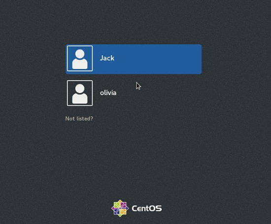
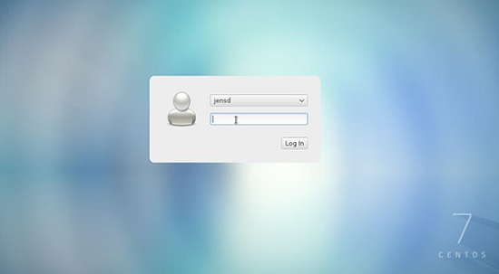
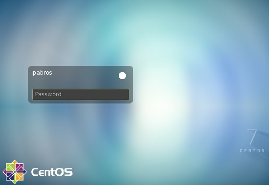

**Peso: **1

**Descripción: **Los candidatos deben poder describir las características básicas y la configuración del administrador de pantalla LightDM. Este objetivo cubre el conocimiento de los administradores de pantalla XDM (X Display Manager), GDM (Gnome Display Manager) y KDM (KDE Display Manager).

**Áreas de conocimiento clave**:

* Configuración básica de LightDM
* Activar o desactivar el administrador de pantalla
* Cambiar el saludo del administrador de pantalla
* Conocimiento de XDM, KDM y GDM

**Términos y utilidades:**

* lightdm
* /etc/lightdm/

Un entorno de escritorio Linux es una colección de aplicaciones diseñadas para funcionar bien entre sí y brindar una experiencia de usuario consistente. Un entorno de escritorio generalmente se combina con un administrador de inicio de sesión. El administrador de inicio de sesión también se conoce como un saludo o administrador de pantalla

#### ¿Qué es el Administrador de pantalla?

El administrador de pantalla es un fragmento de código que proporciona la pantalla de inicio de sesión de la interfaz gráfica de usuario para su escritorio Linux. Después de iniciar sesión en un escritorio con interfaz gráfica de usuario, el administrador de pantalla cede el control al administrador de ventanas.

> Kernel -> X -> DisplayManager -> Desktop

Cuando cierra sesión en el escritorio, el administrador de pantalla vuelve a recibir el control para mostrar la pantalla de inicio de sesión y esperar a que se inicie otra sesión.



Existen varios administradores de pantalla; algunos se proporcionan con sus respectivos escritorios, mientras que otros no.

Cualquiera de los administradores de pantalla se puede utilizar para la pantalla de inicio de sesión, independientemente del escritorio que esté utilizando. Tal es la flexibilidad de Linux y el código modular bien escrito.

| Desktop | Display Manager | notes                                                |
| ------- | --------------- | ---------------------------------------------------- |
| GNOME   | GDM             | GNOME Display Manager                                |
| KDE     | KDM             | KDE Display Manager (up through Fedora 20)           |
| KDE     | SDDM            | Simple Desktop Display Manager (Fedora 21 and above) |
| LXDE    | LXDM            | LXDE Display Manager                                 |
|         | XDM             | Default X Window System Display Manager              |
|         | LightDM         | Lightweight Display Manage                           |

Para obtener el administrador de pantalla predeterminado, puede intentar: ` `

```
cat /etc/X11/default-display-manager 
###OR
systemctl status display-manager
```

#### Instalación y cambio a lightdm

En esta lección, utilizamos CentOS7, que utiliza el administrador de pantalla gdm de manera predeterminada. Cambiemos a lightdm con los siguientes comandos y comprobémoslo:

```
yum install -y epel-release 
yum search lightdm
yum install -y lightdm.x86_64 
vim /etc/lightdm/lightdm.conf ### change enabled=true 
systemctl disable gdm.service 
systemctl enable lightdm.service 
reboot
```

Si reinicia el servicio, su sistema se bloqueará.



### LightDM

LightDM es un administrador de pantalla X gratuito y de código abierto que pretende ser ligero, rápido, extensible y multi-escritorio.

> **LightDM** es el administrador de pantalla que se ejecuta en Ubuntu hasta la versión 16.04 LTS. Si bien ha sido reemplazado por GDM en versiones posteriores de Ubuntu

### /etc/lightdm

La configuración de LightDM se encuentra en el directorio /etc/lightdm:

```
[root@centos7-1 ~]# ls -l /etc/lightdm/
total 20
-rw-r--r-- 1 root root   40 Nov 27  2017 keys.conf
-rw-r--r-- 1 root root 7009 Feb 10 01:16 lightdm.conf
drwxr-xr-x 2 root root    6 Nov 27  2017 lightdm.conf.d
-rw-r--r-- 1 root root 1325 Aug  4  2015 lightdm-gtk-greeter.conf
-rw-r--r-- 1 root root  452 Nov 27  2017 users.conf
```

Veamos algunas configuraciones dentro de /etc/lightdm/lightdm.conf:

```
...
[Seat:*]

#autologin-user=
#allow-user-switching=true
#allow-guest=true
#greeter-session=example-gtk-gnome
#user-session=default

...
```

En algunas distribuciones (ubuntu) los archivos de configuración se encuentran dentro del directorio lightdm.conf.d:

```
[root@centos7-1 ~]# ls -l /etc/lightdm/lightdm.conf.d/
total 0
```

#### Cambiar la sesión de saludo:

Por ejemplo, instalemos otra sesión de saludo para lightdm y probémosla

```
[root@centos7-1 lightdm]# yum search lightdm | grep greeter
lightdm-autologin-greeter.noarch : Autologin greeter using LightDM
slick-greeter.x86_64 : A slick-looking LightDM greeter

[root@centos7-1 lightdm]# yum install -y slick-greeter.x86_64

[root@centos7-1 lightdm]# ls -lrth
total 24K
-rw-r--r-- 1 root root 1.3K Aug  4  2015 lightdm-gtk-greeter.conf
-rw-r--r-- 1 root root  452 Nov 27  2017 users.conf
-rw-r--r-- 1 root root   40 Nov 27  2017 keys.conf
drwxr-xr-x 2 root root    6 Nov 27  2017 lightdm.conf.d
-rw-r--r-- 1 root root 1.2K Dec 29  2017 slick-greeter.conf
-rw-r--r-- 1 root root 6.9K Feb 10 01:16 lightdm.conf

```

A continuación debemos editar lightdm.conf y cambiar la línea a continuación:

```
greeter-session=slick-greeter
```

Reinicie lightdm usando `systemctl restart lightdm` y vea el resultado:



#### Controlar los administradores de pantalla

Instalar y cambiar entre diferentes administradores de pantalla es bastante fácil. Como hemos visto en CentOS, podemos instalar un nuevo administrador de pantalla mediante los comandos `yum /apt`. A continuación, es posible que se necesiten algunas modificaciones en los archivos de configuración, por ejemplo, `/etc/lightdm/lightdm.conf`. Y, por último, debemos habilitar el administrador de pantalla anterior y habilitar el nuevo con los comandos `systemctl enable/disable lightdm` y `reboot`.

Para deshabilitar el administrador de pantalla y pasar al modo de texto, depende de su distribución. Podemos usar el comando `telinit` o establecer el destino predeterminado mediante el comando `systemctl set-default`.

- [https://developer.ibm.com/tutorials/l-lpic1-106-2/](https://developer.ibm.com/tutorials/l-lpic1-106-2/)
- [https://opensource.com/article/16/12/yearbook-best-couple-2016-display-manager-and-window-manager](https://opensource.com/article/16/12/yearbook-best-couple-2016-display-manager-and-window-manager)
- [https://en.wikipedia.org/wiki/LightDM](https://en.wikipedia.org/wiki/LightDM)
- [https://wiki.ubuntu.com/LightDM](https://wiki.ubuntu.com/LightDM)

.
