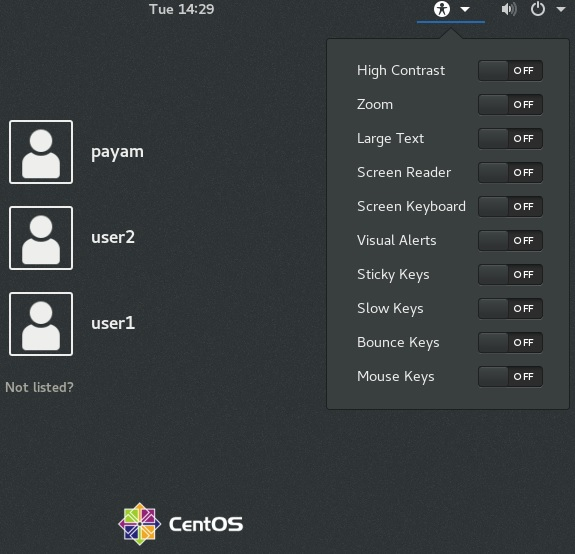

**Peso:** 1

**Descripción:** Demostrar conocimiento y conciencia de las tecnologías de accesibilidad.

**Áreas de conocimiento clave:**

* Conocimiento básico de la configuración de accesibilidad del teclado (AccessX)
* Conocimiento básico de la configuración visual y los temas
* Conocimiento básico de la tecnología de asistencia (TA)

**Términos y utilidades:**

* Teclas fijas/de repetición
* Teclas lentas/de rebote/de alternancia
* Teclas del mouse
* Temas de escritorio de alto contraste/letra grande
* Lector de pantalla
* Pantalla Braille
* Lupa de pantalla
* Teclado en pantalla
* Gestos (usados ​​al iniciar sesión, por ejemplo GDM)
* Orca
* GOK
* emacspeak

Hay algunas personas con discapacidades. Una discapacidad es cualquier condición que dificulta que una persona realice ciertas actividades o interactúe con el mundo que la rodea. A las personas con discapacidades también les puede gustar trabajar con Linux. ¡La buena noticia es que las distribuciones de Linux ofrecen grandes ventajas sobre las alternativas propietarias para las personas con discapacidades!

#### ¿Qué es la accesibilidad?

Accesibilidad significa hacer que el software sea utilizable por personas discapacitadas. Eso incluye a las personas ciegas, por supuesto, pero también a las personas con baja visión, sordas, daltónicas, que tienen una sola mano, que pueden mover solo unos pocos dedos o incluso solo los ojos.

Estas opciones están disponibles en los administradores de pantalla (pantalla de inicio de sesión) y en los principales escritorios (como gnome, kde, xfce, ...). Su logotipo es un humano estirando sus manos y piernas.

> En Gnome, la configuración se encuentra en Configuración \~ Acceso universal.

Linux ofrece accesibilidad en 3 secciones:

1. **AccessX :**_ _**AccessX** o la herramienta de preferencias **Accesibilidad del teclado** le permite configurar algunas opciones para personas que tienen dificultades con el teclado.
2. **Configuración visual : **La configuración visual ayuda a las personas con problemas de visión:
3. **Tecnologías de asistencia : **cosas como la conversión de texto a voz (TTS)

### AccessX

* **Teclas especiales**: ayuda a los usuarios que tienen problemas para presionar varias teclas a la vez y a los usuarios que pueden usar una sola mano
* **Teclas lentas** permite al usuario especificar la duración durante la cual se debe presionar y mantener presionada una **tecla** antes de que el sistema acepte la pulsación de tecla.
* **Teclas de rebote:** requiere un retraso entre las pulsaciones de teclas antes de aceptar la siguiente pulsación de tecla.
* **Teclas del mouse:** permite que un grupo de teclas emule un mouse. Al presionar las teclas de este grupo, se moverá un puntero por la pantalla y se realizarán acciones con los botones del mouse.
* **RepeatKeys:** permite al usuario que tiene problemas para soltar las teclas rápidamente una vez que las presiona, reducir la velocidad con la que las teclas comienzan a repetirse una vez que se presionan.
* **Hover Click:** permite hacer clic o arrastrar simplemente al **pasar el puntero del mouse** sobre un control u objeto en la pantalla.

### Configuración visual

* **Alto contraste**: ayuda a los usuarios que tienen problemas para ver el texto a menos que se corrija el contraste, como texto blanco sobre un fondo negro, o viceversa.
* **Zoom (lupa)**: ayuda a los usuarios con discapacidades visuales que necesitan texto e imágenes más grandes.
* **Texto grande**: facilita la lectura del texto utilizando fuentes más grandes en los menús.
* **Teclado en pantalla**: ayuda a los usuarios que no pueden escribir en absoluto, pero que pueden usar un mouse.

**GOK **es el _Teclado en pantalla de Gnome_. Como lo indica el título, es un teclado que aparece en la pantalla como una alternativa para aquellos que no pueden usar un teclado normal.

* **Alertas visuales**: reemplaza los sonidos del sistema con señales visuales (como el parpadeo de la pantalla)
* **Lector de pantalla**: un sistema de texto a voz para leer lo que está en la pantalla

### Texto a voz

Hay algunos programas de texto a voz en Linux que leen los cuadros de diálogo por nosotros. Programas como **orca **y **emac speak**.

- [https://lwn.net/Articles/302159/](https://lwn.net/Articles/302159/)
- [https://opensource.com/life/15/5/accessibility-linux](https://opensource.com/life/15/5/accessibility-linux)[https://accessibility.linuxfoundation.org/a11yweb/presentations/2005f2f/johnson-20050124-accessx.html](https://accessibility.linuxfoundation.org/a11yweb/presentations/2005f2f/johnson-20050124-accessx.html)
- [https://wiki.ubuntu.com/Accessibility/Reviews/GOK](https://wiki.ubuntu.com/Accessibility/Reviews/GOK)
- [https://jadi.gitbooks.io/lpic1/content/1063\_accessibility.html](https://jadi.gitbooks.io/lpic1/content/1063\_accessibility.html)
