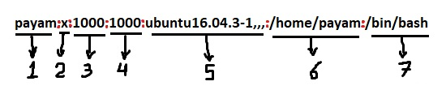
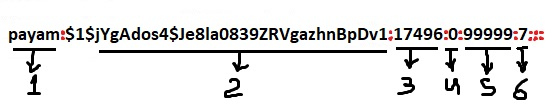
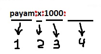

**Peso:** 5

**Descripción:** Los candidatos deben ser capaces de agregar, eliminar, suspender y cambiar cuentas de usuario.

**Áreas clave de conocimiento:**

- Agregar, modificar y eliminar usuarios y grupos
- Gestionar la información de usuarios/grupos en las bases de datos de contraseñas/grupos
- Crear y gestionar cuentas de propósito especial y limitadas

**Términos y utilidades:**

- /etc/passwd
- /etc/shadow
- /etc/group
- /etc/skel/
- chage
- getent
- groupadd
- groupdel
- groupmod
- passwd
- useradd
- userdel
- usermod

## Cambio de contraseña

### passwd

El comando `passwd` cambia las contraseñas de las cuentas de usuario. Un usuario normal solo puede cambiar la contraseña de su propia cuenta, pero el superusuario puede cambiar la contraseña de cualquier cuenta.

```bash
user1@ubuntu16-1:~$ passwd 
Changing password for user1.
(current) UNIX password: 
Enter new UNIX password: 
Retype new UNIX password: 
passwd: password updated successfully
```

1. Antes de que un usuario normal pueda cambiar su propia contraseña, debe ingresar primero su contraseña actual para su verificación. (El superusuario puede omitir este paso al cambiar la contraseña de otro usuario).
2. Después de que la contraseña actual haya sido verificada, **passwd** verifica si al usuario se le permite cambiar su contraseña en ese momento o no. Luego, el usuario será solicitado a ingresar la nueva contraseña dos veces.
3. A continuación, la contraseña se prueba para verificar su complejidad. Las contraseñas deben consistir de al menos 6 caracteres.

El usuario root puede cambiar la contraseña de cualquier usuario a cualquier valor (contraseñas débiles) sin proporcionar su contraseña actual.

```
root@ubuntu16-1:~# passwd user1
Enter new UNIX password: 
Retype new UNIX password: 
passwd: password updated successfully
```

> Los grupos también pueden tener contraseñas, las cuales se configuran con el comando `gpasswd`, ¡pero no se utilizan en absoluto!

## Usuarios y Grupos

Hemos aprendido que Linux es un sistema multiusuario. Recuerda que podemos iniciar sesión como un usuario y convertirnos en otro usuario utilizando los comandos `su` o `sudo`.

Linux también tiene el concepto de grupos.

- Cada usuario pertenece a un grupo primario y posiblemente a grupos adicionales.
- Cada archivo pertenece a un usuario y un grupo.

Aprendemos cómo crear, eliminar y gestionar usuarios y grupos.

## Gestión de usuarios

### useradd

Añadimos un usuario a un sistema Linux con el comando `useradd`.

```bash
 useradd <options> <username_or_login>
```

| switch | descripción                                         |
| ------ | --------------------------------------------------- |
| -d     | directorio home de la nueva cuenta                  |
| -m     | crear el directorio home del usuario                |
| -s     | shell de inicio de sesión de la nueva cuenta        |
| -G     | añadir a grupos adicionales                         |
| -c     | comentario, generalmente el nombre real del usuario |

En la mayoría de las distribuciones, `useradd` crea el directorio home para el nuevo usuario, pero podemos asegurarnos de ello utilizando el switch `-m`. Ejemplo (Ubuntu 16):

```bash
root@ubuntu16-1:~# useradd -m -d /home/user3 -c "Dear user3" -s /bin/bash user3
```

### /etc/skel

#### El skel del directorio home

Cuando creas un nuevo usuario y se crea un nuevo directorio home, el directorio se llena con varios archivos y subdirectorios que, por defecto, se copian desde /etc/skel.

```
root@ubuntu16-1:~# ls -a /etc/skel/
.  ..  .bash_logout  .bashrc  examples.desktop  .profile
```

### usermod

Podemos usar el comando `usermod` para modificar una cuenta de usuario. Podemos usar la mayoría de las opciones que se utilizan con `useradd`, excepto que no se puede crear ni poblar un nuevo directorio home para el usuario.

```bash
usermod <options> <username_or_login>
```

| switch | descripción                                                                                              |
| ------ | -------------------------------------------------------------------------------------------------------- |
| -L     | bloquear la cuenta de usuario                                                                            |
| -U     | desbloquear la cuenta de usuario                                                                         |
| -g     | forzar el uso de GROUP como el nuevo grupo primario                                                      |
| -G     | nueva lista de grupos adicionales (el usuario será eliminado de todos los grupos adicionales anteriores) |
| -aG    | agregar al usuario a los grupos adicionales (sin eliminarlo de otros grupos)                             |

```bash
root@ubuntu16-1:~# id user3
uid=1003(user3) gid=1003(user3) groups=1003(user3)

root@ubuntu16-1:~# usermod -g user1 user3
root@ubuntu16-1:~# id user3
uid=1003(user3) gid=1001(user1) groups=1001(user1),1003(user3)

root@ubuntu16-1:~# usermod -G user2 user3
root@ubuntu16-1:~# id user3
uid=1003(user3) gid=1001(user1) groups=1001(user1),1002(user2)

root@ubuntu16-1:~# usermod -aG payam user3
root@ubuntu16-1:~# id user3
uid=1003(user3) gid=1001(user1) groups=1001(user1),1000(payam),1002(user2)

###lets turn back to the deafult settings
root@ubuntu16-1:~# usermod -g user3 -G user3 user3
root@ubuntu16-1:~# id user3
uid=1003(user3) gid=1003(user3) groups=1003(user3)
```
### userdel

Podemos eliminar un usuario con el comando `userdel`.

```bash
userdel <opciones> <nombre_de_usuario_o_login>
```

Por defecto, `userdel` no elimina el directorio home del usuario.

|opción|descripción|
|---|---|
|-f|eliminar forzosamente los archivos|
|-r|eliminar el directorio home y el spool de correo|

Ejemplo:

```bash
root@ubuntu16-1:~# userdel -f -r user3
userdel: user3 mail spool (/var/mail/user3) not found
```

### Managing Groups

De manera similar, podemos agregar o eliminar grupos con los comandos `groupadd` y `groupdel`.
### groupadd

El comando `groupadd` se usa para crear un nuevo grupo en el sistema.

```bash
groupadd [opciones] grupo
```

|opción|descripción|
|---|---|
|-g|especificar el GID para el nuevo grupo|
|-f|salir exitosamente si el grupo ya existe, y cancelar la opción `-g` si el GID ya está en uso|
|-p|usar esta contraseña cifrada para el nuevo grupo|


```bash
root@ubuntu16-1:~# groupadd -g 666  group1
root@ubuntu16-1:~# groupadd -g 666  group1
groupadd: group 'group1' already exists
root@ubuntu16-1:~# echo $?
9
root@ubuntu16-1:~# groupadd -f -g 666  group1
root@ubuntu16-1:~# echo $?
0

```

### groupmod

Cuando necesitas modificar la información de un grupo, puedes usar el comando `groupmod`.

```bash
groupmod [opciones] GRUPO
```

|opción|descripción|
|---|---|
|-n|cambiar el nombre del grupo|
|-g|cambiar el ID del grupo|

Ejemplos:

```bash
root@ubuntu16-1:~# groupmod -n newgroup1 group1
root@ubuntu16-1:~# groupmod -g 888 newgroup1 
```

### groupdel

El comando `groupdel` se usa para eliminar un grupo y solo requiere el nombre del grupo; no tiene opciones adicionales. No se puede eliminar un grupo que sea el grupo primario de un usuario.

```bash
root@ubuntu16-1:~# groupdel newgroup1
```

> Nota: Si el root elimina un grupo con miembros, las personas no serán eliminadas. Simplemente dejarán de ser miembros de ese grupo.

Cuando ejecutamos el comando `useradd` en la terminal de Linux, realiza las siguientes acciones principales:

1. Edita los archivos `/etc/passwd`, `/etc/shadow`, `/etc/group` y `/etc/gshadow` para la nueva cuenta de usuario.
2. Crea y llena el directorio home para el nuevo usuario.
3. Establece los permisos y la propiedad del directorio home.

### ¿Qué son esos archivos?

### /etc/passwd

El archivo `/etc/passwd` es el archivo de _contraseñas_ que contiene información básica sobre los usuarios.

```bash
root@ubuntu16-1:~# tail /etc/passwd
pulse:x:117:124:PulseAudio daemon,,,:/var/run/pulse:/bin/false
rtkit:x:118:126:RealtimeKit,,,:/proc:/bin/false
saned:x:119:127::/var/lib/saned:/bin/false
usbmux:x:120:46:usbmux daemon,,,:/var/lib/usbmux:/bin/false
payam:x:1000:1000:ubuntu16.04.3-1,,,:/home/payam:/bin/bash
user1:x:1001:1001::/home/user1:
sshd:x:121:65534::/var/run/sshd:/usr/sbin/nologin
mysql:x:122:129:MySQL Server,,,:/nonexistent:/bin/false
user2:x:1002:1002::/home/user2:
postfix:x:123:130::/var/spool/postfix:/bin/false
```

El archivo `/etc/passwd` tiene una línea para cada usuario en el sistema. El formato de cada línea es el siguiente:

```bash
username:password:UID:GID:comment:home_directory:shell
```

- **username**: El nombre del usuario.
- **password**: La contraseña cifrada (o **x**, indicando que la contraseña está en el archivo `/etc/shadow`).
- **UID (User ID)**: El ID único del usuario en el sistema.
- **GID (Group ID)**: El ID del grupo primario del usuario.
- **comment**: Información adicional sobre el usuario, como el nombre completo o una descripción.
- **home_directory**: El directorio home del usuario.
- **shell**: El shell por defecto del usuario (por ejemplo, `/bin/bash`, `/bin/false`, etc.).

Este archivo es esencial para el funcionamiento de la gestión de usuarios en Linux, ya que proporciona la información básica sobre cada cuenta de usuario del sistema.



1. **Username**: Debe tener entre 1 y 32 caracteres.
2. **Password** _(será discutido más adelante)_.
3. **User ID (UID)**: A cada usuario se le debe asignar un ID de usuario (UID). El UID 0 (cero) está reservado para el root, y los UIDs 1-99 están reservados para otras cuentas predefinidas. Los UIDs 100-999 están reservados por el sistema para cuentas/grupos administrativos y de sistema.
4. **Group ID (GID)**: El ID de grupo primario (almacenado en el archivo /etc/group).
5. **El campo de comentarios**: Permite agregar información adicional sobre los usuarios, como el nombre completo del usuario, el número de teléfono, etc. Este campo es utilizado por el comando `finger`.
6. **Directorio home**.
7. **Comando/shell**: La ruta absoluta de un comando o shell (por ejemplo, `/bin/bash`). Típicamente, esto es un shell, pero no tiene que serlo.

> Hay algunos usuarios con el shell `/sbin/nologin`. Estos son cuentas del sistema que ejecutan un servicio y nadie puede iniciar sesión interactivamente con ellas. A veces, se establece `/bin/false`.

Cada usuario debe tener acceso de lectura al archivo `/etc/passwd`:

```bash
root@ubuntu16-1:~# ls -l /etc/passwd
-rw-r--r-- 1 root root 2469 Feb 12 02:53 /etc/passwd
```

En los primeros días, había un lugar donde se almacenaba toda la información del usuario, incluso la contraseña del usuario, lo que no era tan difícil de considerar como un problema de seguridad. Para solucionar este problema, se inventó `/etc/shadow`. Un carácter **x** indica que la contraseña cifrada se almacena en el archivo `/etc/shadow`.
### /etc/shadow

El archivo `/etc/shadow` contiene contraseñas cifradas, junto con la información de expiración de la contraseña y la cuenta.

```bash
root@ubuntu16-1:~# ls -l /etc/shadow
-rw-r----- 1 root shadow 1609 Feb 12 02:53 /etc/shadow
```

Veamos qué contiene:

```bash
root@ubuntu16-1:~# tail /etc/shadow
pulse:*:17379:0:99999:7:::
rtkit:*:17379:0:99999:7:::
saned:*:17379:0:99999:7:::
usbmux:*:17379:0:99999:7:::
payam:$1$jYgAdos4$Je8la0839ZRVgazhnBpDv1:17496:0:99999:7:::
user1:$6$c9PN.175$.t.CG0E0Gtr/trq4pqquSe1BemMjB6Zc3E0ExUOVufuTkPNe3BSRv3DyUuXFHPiAbEujzuSMCeMsCbpg8cV2j.:17749:0:99999:7:::
sshd:*:17749:0:99999:7:::
mysql:!:17867:0:99999:7:::
user2:$6$kN2DNYrP$XmM/3ONRnrTCuTTBxCwVBlVW9E4tVRc02JbRHPhwj128Q6aUIcUq4gxw2r74gopOs2J0HqNxuiBiqgAlkmuwV1:18290:0:99999:7:::
postfix:*:18300:0:99999:7:::
```

> Nota: **!!** significa que el usuario no puede iniciar sesión con ninguna contraseña. La mayoría de las cuentas de servicio son así.

Las contraseñas pueden ser cifradas con uno de varios algoritmos de cifrado. Los sistemas más antiguos usaban DES o MD5, pero los sistemas modernos típicamente usan Blowfish, SHA-256 o SHA-512, o posiblemente MD5. Independientemente del algoritmo de cifrado, las contraseñas son **"salted"**, lo que significa que incluso si dos contraseñas son idénticas, no generarán el mismo valor cifrado.



1. **Username**: Es tu nombre de inicio de sesión.
2. **Password**: Es tu contraseña cifrada. La contraseña debe tener entre 8 y 12 caracteres, incluyendo caracteres especiales, dígitos, letras minúsculas y más. Usualmente, el formato de la contraseña es `$id$salt$hashed`. _El `$id` es el algoritmo utilizado en GNU/Linux, de la siguiente manera: $1$ es MD5, $2a$ es Blowfish, $2y$ es Blowfish, $5$ es SHA-256, $6$ es SHA-512._
3. **Last password change (lastchanged)**: Días desde el 1 de enero de 1970 en los que se cambió por última vez la contraseña.
4. **Minimum**: El número mínimo de días requeridos entre los cambios de contraseña, es decir, el número de días restantes antes de que el usuario pueda cambiar su contraseña.
5. **Maximum**: El número máximo de días en los que la contraseña es válida (después de eso, el usuario debe cambiar su contraseña).
6. **Warn**: El número de días antes de que expire la contraseña en los que el usuario es advertido de que debe cambiarla.
7. **Inactive**: El número de días después de que la contraseña haya expirado en los que la cuenta se desactiva.
8. **Expire**: Días desde el 1 de enero de 1970 en los que la cuenta queda deshabilitada, es decir, una fecha absoluta que especifica cuándo no se podrá usar el inicio de sesión.

Los últimos 6 campos proporcionan características de envejecimiento de la contraseña y bloqueo de la cuenta. Debes usar el comando `chage` para configurar el envejecimiento de la contraseña.

**Tiempo de época (epoch time)**

El tiempo de Unix es un sistema para describir un punto en el tiempo. Es el número de segundos que han transcurrido desde la época de Unix, es decir, desde las 00:00:00 UTC del 1 de enero de 1970, menos los segundos bisiestos.

### chage

El comando **chage** se usa para ver y cambiar la información de expiración de la contraseña de un usuario. Este comando se utiliza cuando se desea proporcionar acceso a un usuario por un tiempo limitado o cuando es necesario cambiar la contraseña de inicio de sesión de forma periódica.

```
chage [options] LOGIN
```

```
Options:
  -d, --lastday LAST_DAY        set date of last password change to LAST_DAY
  -E, --expiredate EXPIRE_DATE  set account expiration date to EXPIRE_DATE
  -h, --help                    display this help message and exit
  -I, --inactive INACTIVE       set password inactive after expiration
                                to INACTIVE
  -l, --list                    show account aging information
  -m, --mindays MIN_DAYS        set minimum number of days before password
                                change to MIN_DAYS
  -M, --maxdays MAX_DAYS        set maximim number of days before password
                                change to MAX_DAYS
  -R, --root CHROOT_DIR         directory to chroot into
  -W, --warndays WARN_DAYS      set expiration warning days to WARN_DAYS

```

**chage** sin ninguna opción edita todos los elementos de forma interactiva. Probemos la opción `-l` en el usuario `user1`:

```
root@ubuntu16-1:~# chage -l user1
Último cambio de contraseña           : 06 de agosto de 2018
La contraseña expira                 : nunca
Contraseña inactiva                  : nunca
La cuenta expira                    : nunca
Número mínimo de días entre cambios de contraseña    : 0
Número máximo de días entre cambios de contraseña    : 99999
Número de días de advertencia antes de que expire la contraseña : 7
```

> `chage -d 0 nombre-de-usuario` obligará al usuario a cambiar su contraseña en el próximo inicio de sesión.

> **passwd** también puede cambiar o restablecer el período de validez de la cuenta, es decir, cuánto tiempo puede pasar antes de que la contraseña caduque y deba ser cambiada.

### /etc/group

`/etc/group` es el archivo de _grupo_ que contiene información básica sobre los grupos y qué usuarios pertenecen a ellos. Contiene una línea para cada grupo en el sistema.

```
root@ubuntu16-1:~# tail /etc/group
rtkit:x:126:
saned:x:127:
payam:x:1000:
sambashare:x:128:payam
user1:x:1001:
mysql:x:129:
user2:x:1002:
postfix:x:130:
postdrop:x:131:
mysecuregroup:x:1003:
```



1. **group_name**: Es el nombre del grupo. Si ejecutas el comando `ls -l`, verás este nombre impreso en el campo del grupo.
2. **Contraseña**: Generalmente, la contraseña no se usa, por lo que suele estar vacía o en blanco. Puede almacenar una contraseña cifrada. Esto es útil para implementar grupos privilegiados.
3. **ID del grupo (GID)**: A cada usuario se le debe asignar un ID de grupo. Puedes ver este número en tu archivo `/etc/passwd`.
4. **Lista de grupos**: Es una lista de nombres de usuarios que son miembros del grupo. Los nombres de usuario deben estar separados por comas.

```
root@ubuntu16-1:~# ls -l /etc/group
-rw-r--r-- 1 root root 1077 Feb 12 03:58 /etc/group
```

Al igual que el archivo `/etc/passwd`, el archivo `/etc/group` está sombreado por razones de seguridad y debe ser legible por todos, pero las contraseñas cifradas no deben ser legibles por todos.

Las contraseñas de los grupos se almacenan en el archivo `/etc/gshadow`, que solo es legible por root.

```
root@ubuntu16-1:~# ls -l /etc/gshadow
-rw-r----- 1 root shadow 902 Feb 12 03:58 /etc/gshadow

root@ubuntu16-1:~# tail /etc/gshadow
rtkit:!::
saned:!::
payam:!::
sambashare:!::payam
user1:!::
mysql:!::
user2:!::
postfix:!::
postdrop:!::
mysecuregroup:Aa12345::
```

> Su formato es:
> 
> `Nombre del grupo:Contraseña cifrada:Administradores del grupo: Miembros del grupo`
> 
> ¡Nota! : los grupos pueden tener contraseñas, pero nunca se han utilizado en ninguna distribución.

### getent

**getent** es un comando de Linux que ayuda al usuario a obtener las entradas en varios archivos de texto importantes llamados bases de datos.

```
getent base_de_datos [clave ...]
```

Usamos el comando `getent` para procesar la información de grupos y usuarios, en lugar de leer manualmente /etc/passwd, /etc/group.

```
root@ubuntu16-1:~# getent passwd payam
payam:x:1000:1000:ubuntu16.04.3-1,,,:/home/payam:/bin/bash

root@ubuntu16-1:~# getent group payam
payam:x:1000:
```

No olvides usar el comando `id`.

**Bonus: **Comandos y opciones para cambiar cuentas de usuario

|usermod|passwd|chage|Propósito|
|---|---|---|---|
|-L|-l (letra minúscula L)|N/A|Bloquear o suspender la cuenta.|
|-U|-u|N/A|Desbloquear la cuenta.|
|N/A|-d|N/A|Deshabilitar la cuenta configurándola sin contraseña.|
|-e|-f|-E|Establecer la fecha de expiración para una cuenta.|
|N/A|-n|-m|El tiempo mínimo de vida de la contraseña en días.|
|N/A|-X|-M|El tiempo máximo de vida de la contraseña en días.|
|N/A|-W|-W|El número de días de advertencia antes de que una contraseña deba ser cambiada.|
|-f|-i|-I (letra mayúscula i)|El número de días después de que una contraseña expire hasta que la cuenta se deshabilite.|
|N/A|-S|-l (letra minúscula L)|Mostrar un mensaje corto sobre el estado actual de la cuenta.


- [https://developer.ibm.com/technologies/linux/tutorials/l-lpic1-map/](https://developer.ibm.com/technologies/linux/tutorials/l-lpic1-map/)
- [https://www.computerhope.com/unix/upasswor.htm](https://www.computerhope.com/unix/upasswor.htm)
- [https://jadi.gitbooks.io/lpic1/content/1071\_manage_user_and_group_accounts_and_related_system_files.html](https://jadi.gitbooks.io/lpic1/content/1071\_manage_user_and_group_accounts_and_related_system_files.html)
- [https://askubuntu.com/questions/639990/what-is-the-group-id-of-this-group-name](https://askubuntu.com/questions/639990/what-is-the-group-id-of-this-group-name)
- [https://www.cyberciti.biz/faq/understanding-etcpasswd-file-format/](https://www.cyberciti.biz/faq/understanding-etcpasswd-file-format/)
- [https://www.cyberciti.biz/faq/understanding-etcshadow-file/](https://www.cyberciti.biz/faq/understanding-etcshadow-file/)
- [https://en.wikipedia.org/wiki/Unix_time](https://en.wikipedia.org/wiki/Unix_time)
- [https://www.cyberciti.biz/faq/understanding-etcgroup-file/](https://www.cyberciti.biz/faq/understanding-etcgroup-file/)
-  [https://access.redhat.com/documentation/en-US/Red_Hat_Enterprise_Linux/4/html/Introduction_To_System_Administration/s3-acctsgrps-gshadow.html](https://access.redhat.com/documentation/en-US/Red_Hat_Enterprise_Linux/4/html/Introduction_To_System_Administration/s3-acctsgrps-gshadow.html)
- [https://www.geeksforgeeks.org/chage-command-in-linux-with-examples/](https://www.geeksforgeeks.org/chage-command-in-linux-with-examples/)