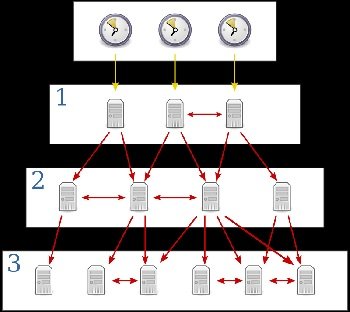

## **108.1 Mantener la hora del sistema**

**Ponderación: **3

**Descripción: **Los candidatos deben ser capaces de mantener correctamente la hora del sistema y sincronizar el reloj mediante NTP.

**Áreas de conocimiento clave:**

* Configurar la fecha y hora del sistema
* Ajustar el reloj del hardware a la hora UTC correcta
* Configurar la zona horaria correcta
* Configuración básica de NTP
* Conocimiento del uso del servicio pool.ntp.org
* Conocimiento del comando ntpq

**Términos y utilidades:**

* /usr/share/zoneinfo/
* /etc/timezone
* /etc/localtime
* /etc/ntp.conf
* date
* hwclock
* ntpd
* ntpdate
* pool.ntp.org

Al instalar un sistema Linux® gráficamente, configuramos el reloj y elegimos una zona horaria adecuada a nuestras necesidades. También podemos usar el Protocolo de Tiempo de Red (NTP) para configurar el reloj automáticamente. En esta lección mostramos cómo pasar por debajo de las interfaces gráficas y configurar los diversos aspectos relacionados con el tiempo del sistema Linux.

#### Cómo Linux controla el tiempo

Hay dos relojes en cada computadora. El primero es el reloj de hardware. Este reloj se encuentra en el chip de la placa base y mantiene la hora incluso cuando la máquina está apagada.

El otro reloj es el reloj virtual del sistema. Linux pregunta al reloj de hardware qué hora es al encenderse y luego registra la hora mediante software.

El reloj de hardware puede ser la hora local (la zona horaria de su computadora) o la hora UTC (hora estándar).

> Podemos determinar cuál está configurado consultando /etc/adjtime. Este archivo está vacío a menos que el reloj de hardware se haya configurado manualmente.

Normalmente, el reloj de hardware se configura en UTC, por lo que al arrancar el sistema, el reloj de software lee el reloj de hardware y calcula la diferencia según nuestra zona horaria.

#### Configurar el reloj del sistema

### date

El comando **date** se usa para mostrar la fecha y la hora del sistema. Por defecto, el comando date muestra la fecha en hora local, incluso si el reloj de su hardware mantiene la hora UTC. Use la opción `-u` para mostrar la hora UTC.El comando **date** se usa para mostrar la fecha y la hora del sistema. Por defecto, el comando date muestra la fecha en hora local, incluso si el reloj de su hardware mantiene la hora UTC. Use la opción `-u` para mostrar la hora UTC.

```
root@ubuntu16-1:~# date
Mon Feb 17 19:17:52 +0330 2020
```

Utilice la opción `-u` para mostrar UTC:

```
root@ubuntu16-1:~# date -u
Mon Feb 17 15:50:20 UTC 2020
```

El comando de fecha también se utiliza para establecer la fecha y la hora del sistema (el Ajuste automático (ntp) no debe estar habilitado, de lo contrario no funcionará):

```
root@ubuntu16-1:~# date
Mon Feb 17 19:37:30 +0330 2020
root@ubuntu16-1:~# date --set="20170413 21:14:00"
Thu Apr 13 21:14:00 +0430 2017
root@ubuntu16-1:~# date
Thu Apr 13 21:14:02 +0430 2017
```

Aunque podemos configurar la hora con el comando "date", el gran problema es que el cambio de hora solo durará hasta el siguiente reinicio, a menos que configuremos la hora del sistema según el reloj del hardware.

### Configuración del reloj del hardware <a href="_setting_the_hardware_clock" id="_setting_the_hardware_clock"></a>

### hwclock

Para cambiar el reloj del hardware, puedes usar la utilidad de la BIOS de la placa base al iniciar, pero si no la usas, aún hay esperanza: el comando "hwclock".

`hwclock` es una utilidad para acceder al reloj del hardware, también conocido como Reloj de Tiempo Real (RTC). Como mencionamos, es independiente del sistema operativo y funciona incluso con el equipo apagado.

```
root@ubuntu16-1:~# hwclock
Mon 17 Feb 2020 08:53:26 PM +0330  .972851 seconds
root@ubuntu16-1:~# date
Mon Feb 17 20:53:33 +0330 2020
```

>hwclock date muestra la fecha en hora local (hora después de agregar la zona horaria a la hora UTC), ¡incluso cuando el reloj del hardware está configurado en UTC!

hwclock syntax : `hwclock [function] [option...]` where :

```
 ### Functioms:
 -r, --show           read hardware clock and print result
     --get            read hardware clock and print drift corrected result
     --set            set the RTC to the time given with --date
 -s, --hctosys        set the system time from the hardware clock
 -w, --systohc        set the hardware clock from the current system time
     --systz          set the system time based on the current timezone
### Options:
--localtime            the hardware clock is kept local time
  -u, --utc            the hardware clock is kept in UTC
```

Hagamos algunos ejemplos:

```
### lets set hardware clock in utc
root@ubuntu16-1:~# hwclock --set --date="01/02/1999 10:20:30"
root@ubuntu16-1:~# hwclock
Sat 02 Jan 1999 10:20:34 AM +0330  .274999 seconds
root@ubuntu16-1:~# cat /etc/adjtime 
0.000000 915259830 0.000000
915259830
UTC
root@ubuntu16-1:~# hwclock 
Sat 02 Jan 1999 10:21:48 AM +0330  .259334 seconds
root@ubuntu16-1:~# date
Mon Feb 17 21:36:41 +0330 2020


### lets fix it by setting local time to hardware clock

root@ubuntu16-1:~# hwclock 
Sat 02 Jan 1999 10:31:10 AM +0330  .009381 seconds
root@ubuntu16-1:~# date
Mon Feb 17 21:39:56 +0330 2020
root@ubuntu16-1:~# hwclock --localtime --set --date="02/17/2020 21:40:00"
root@ubuntu16-1:~# cat /etc/adjtime 
0.000000 1581963000 0.000000
1581963000
LOCAL
root@ubuntu16-1:~# hwclock 
Mon 17 Feb 2020 09:40:08 PM +0330  .290810 seconds
root@ubuntu16-1:~# date
Mon Feb 17 21:40:55 +0330 2020

```

El comando hwclock --localtime -w haría lo mismo, pero configurar el reloj del hardware a la hora local no es recomendable, así que use hwclock -u -w en su lugar.

### NTP

El **Protocolo de Tiempo de Red (NTP)** es un protocolo de capa de aplicación que se utiliza para la sincronización de relojes entre hosts en una red TCP/IP. El objetivo de NTP es garantizar que todos los equipos de una red coincidan en la hora, ya que incluso una pequeña diferencia puede causar problemas.

NTP utiliza un sistema jerárquico de fuentes de tiempo. En la parte superior de la estructura se encuentran fuentes de tiempo de alta precisión, generalmente relojes atómicos o GPS. Estos relojes se conocen como servidores de **estrato 0**. Los servidores de **estrato 1** están conectados directamente a los servidores de **estrato 0** y los equipos ejecutan servidores NTP que envían la hora a los servidores de **estrato 2**, y así sucesivamente (fuente de la imagen: Wikipedia).



NTP utiliza una arquitectura cliente-servidor; un host se configura como servidor NTP y todos los demás hosts de la red se configuran como clientes NTP.

### pool.ntp.org

El proyecto pool.ntp.org es un gran clúster virtual de servidores de tiempo que proporciona un servicio NTP fiable y fácil de usar para millones de clientes.

Cientos de millones de sistemas en todo el mundo utilizan este clúster. Es el servidor de tiempo predeterminado para la mayoría de las principales distribuciones de Linux y muchos dispositivos en red.

### ntpdate

**ntpdate** establece la fecha y la hora locales consultando los **servidores** del Protocolo de Tiempo de Red (NTP) proporcionados como argumentos del servidor para determinar la hora correcta. Debe ejecutarse como root en el host local (es posible que deba instalarlo). `-v`: verbose

```
root@ubuntu16-1:~# ntpdate -v pool.ntp.org
17 Feb 22:59:34 ntpdate[4365]: ntpdate 4.2.8p4@1.3265-o Tue Jan  7 15:08:24 UTC 2020 (1)
17 Feb 22:59:46 ntpdate[4365]: adjust time server 194.225.150.25 offset -0.005153 sec
```

Después de esto, necesitamos configurar el reloj del sistema a la hora del sistema recién corregida mediante sudo `hwclock -w` o `hwclock -u -w` para asegurarnos de que se configura en UTC.

> El parámetro \-q consultará la hora y mostrará el resultado sin configurarla.

### ntpd

En lugar de configurar la hora manualmente cada vez, podemos usar un servicio de Linux llamado ntp. La utilidad `ntpd` es un demonio del sistema operativo que configura y mantiene la hora del sistema en sincronía con los servidores de hora estándar de Internet.

```
root@ubuntu16-1:~# apt install ntp
root@ubuntu16-1:~# systemctl start ntp
root@ubuntu16-1:~# systemctl enable ntp
```

Dato curioso: no podemos usar natpdate mientras se ejecuta el servicio ntp:

```
root@ubuntu16-1:~# ntpdate pool.ntp.org
17 Feb 23:15:34 ntpdate[5740]: the NTP socket is in use, exiting
```

### /etc/ntp.cpnf

El archivo de configuración de ntpd se encuentra en **/etc/ntp.conf**. El demonio ntpd lo lee durante el arranque inicial para especificar las fuentes de sincronización adecuadas:

```
root@ubuntu16-1:~# cat /etc/ntp.conf 
# /etc/ntp.conf, configuration for ntpd; see ntp.conf(5) for help

driftfile /var/lib/ntp/ntp.drift

# Enable this if you want statistics to be logged.
#statsdir /var/log/ntpstats/

statistics loopstats peerstats clockstats
filegen loopstats file loopstats type day enable
filegen peerstats file peerstats type day enable
filegen clockstats file clockstats type day enable

# Specify one or more NTP servers.

# Use servers from the NTP Pool Project. Approved by Ubuntu Technical Board
# on 2011-02-08 (LP: #104525). See http://www.pool.ntp.org/join.html for
# more information.
pool 0.ubuntu.pool.ntp.org iburst
pool 1.ubuntu.pool.ntp.org iburst
pool 2.ubuntu.pool.ntp.org iburst
pool 3.ubuntu.pool.ntp.org iburst

# Use Ubuntu's ntp server as a fallback.
pool ntp.ubuntu.com

# Access control configuration; see /usr/share/doc/ntp-doc/html/accopt.html for
# details.  The web page <http://support.ntp.org/bin/view/Support/AccessRestrictions>
# might also be helpful.
#
# Note that "restrict" applies to both servers and clients, so a configuration
# that might be intended to block requests from certain clients could also end
# up blocking replies from your own upstream servers.

# By default, exchange time with everybody, but don't allow configuration.
restrict -4 default kod notrap nomodify nopeer noquery limited
restrict -6 default kod notrap nomodify nopeer noquery limited

# Local users may interrogate the ntp server more closely.
restrict 127.0.0.1
restrict ::1

# Needed for adding pool entries
restrict source notrap nomodify noquery

# Clients from this (example!) subnet have unlimited access, but only if
# cryptographically authenticated.
#restrict 192.168.123.0 mask 255.255.255.0 notrust


# If you want to provide time to your local subnet, change the next line.
# (Again, the address is an example only.)
#broadcast 192.168.123.255

# If you want to listen to time broadcasts on your local subnet, de-comment the
# next lines.  Please do this only if you trust everybody on the network!
#disable auth
#broadcastclient

#Changes recquired to use pps synchonisation as explained in documentation:
#http://www.ntp.org/ntpfaq/NTP-s-config-adv.htm#AEN3918

#server 127.127.8.1 mode 135 prefer    # Meinberg GPS167 with PPS
#fudge 127.127.8.1 time1 0.0042        # relative to PPS for my hardware

#server 127.127.22.1                   # ATOM(PPS)
#fudge 127.127.22.1 flag3 1            # enable PPS API
```

Puede cambiar los servidores NTP a los que desee. No olvide reiniciar el servicio después de cualquier modificación.

### ntpq

La utilidad **ntpq** se utiliza para supervisar las operaciones del demonio NTP **ntpd** y determinar su rendimiento.

**`-p :`**Imprime una lista de los pares conocidos por el servidor, así como un resumen de su estado.

```
root@ubuntu16-1:~# ntpq -p
     remote           refid      st t when poll reach   delay   offset  jitter
==============================================================================
 0.ubuntu.pool.n .POOL.          16 p    -   64    0    0.000    0.000   0.000
 1.ubuntu.pool.n .POOL.          16 p    -   64    0    0.000    0.000   0.000
 2.ubuntu.pool.n .POOL.          16 p    -   64    0    0.000    0.000   0.000
 3.ubuntu.pool.n .POOL.          16 p    -   64    0    0.000    0.000   0.000
 ntp.ubuntu.com  .POOL.          16 p    -   64    0    0.000    0.000   0.000
-77.104.104.100  37.156.28.13     3 u   20   64  345    5.641  -40.539  13.503
+77.104.70.70    194.225.150.25   3 u   25   64  377    4.835   11.343   7.680
-5-144-132-2.sta 119.28.183.184   3 u   28   64  377    4.803   -7.711  14.597
+ntp5.mobinnet.n 62.12.173.12     2 u   46   64  377    4.920  -11.823   6.280
*golem.canonical 17.253.34.251    2 u   59   64  377   85.408   11.230   8.712
```

**-n** : Muestra todas las direcciones de host en formato numérico de cuatro puntos en lugar de convertirlas a nombres de host canónicos.

```
root@ubuntu16-1:~# ntpq -pn
     remote           refid      st t when poll reach   delay   offset  jitter
==============================================================================
 0.ubuntu.pool.n .POOL.          16 p    -   64    0    0.000    0.000   0.000
 1.ubuntu.pool.n .POOL.          16 p    -   64    0    0.000    0.000   0.000
 2.ubuntu.pool.n .POOL.          16 p    -   64    0    0.000    0.000   0.000
 3.ubuntu.pool.n .POOL.          16 p    -   64    0    0.000    0.000   0.000
 ntp.ubuntu.com  .POOL.          16 p    -   64    0    0.000    0.000   0.000
-77.104.104.100  37.156.28.13     3 u    8   64  313    4.862  -20.085  13.553
+77.104.70.70    194.225.150.25   3 u    8   64  377    4.835   11.343   6.174
-5.144.132.2     119.28.183.184   3 u    6   64  377    5.062    3.365   5.087
+37.156.28.13    62.12.173.12     2 u   13   64  377    4.920  -11.823   4.775
*91.189.89.199   17.253.34.251    2 u   18   64  377   85.408   11.230   6.346
```

El significado:

```
* Synchronized to this peer
# Almost synchronized to this peer
+ Peer selected for possible synchronization
– Peer is a candidate for selection
~ Peer is statically configured
```


- [https://developer.ibm.com/tutorials/l-lpic1-108-1/](https://developer.ibm.com/tutorials/l-lpic1-108-1/)
- [http://xed.ch/help/time.html](http://xed.ch/help/time.html)
- [https://www.geeksforgeeks.org/date-command-linux-examples/](https://www.geeksforgeeks.org/date-command-linux-examples/)
- [https://jadi.gitbooks.io/lpic1/content/1081\_maintain_system_time.html](https://jadi.gitbooks.io/lpic1/content/1081\_maintain_system_time.html)
- [https://access.redhat.com/documentation/en-us/red_hat_enterprise_linux/7/html/system_administrators_guide/sect-configuring_the_date_and_time-hwclock](https://access.redhat.com/documentation/en-us/red_hat_enterprise_linux/7/html/system_administrators_guide/sect-configuring_the_date_and_time-hwclock)
- [https://www.geeksforgeeks.org/hwclock-command-in-linux-with-examples/](https://www.geeksforgeeks.org/hwclock-command-in-linux-with-examples/)
- [https://geek-university.com/ccna/network-time-protocol/](https://geek-university.com/ccna/network-time-protocol/)
- [https://www.ntppool.org/en/](https://www.ntppool.org/en/)
- [https://linux.die.net/man/8/ntpdate](https://linux.die.net/man/8/ntpdate)
- [https://docs.ntpsec.org/latest/ntpd.html](https://docs.ntpsec.org/latest/ntpd.html)
- [https://detailed.wordpress.com/2017/10/22/understanding-ntpq-output/](https://detailed.wordpress.com/2017/10/22/understanding-ntpq-output/)

.
