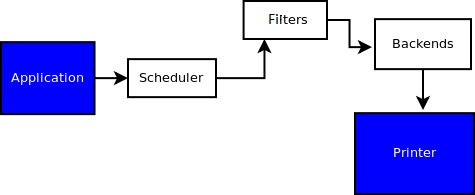
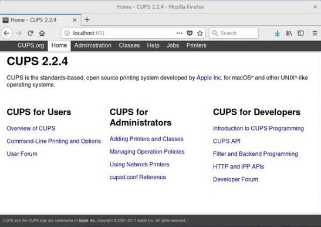

# 108.4. Administrar impresoras e impresión

**Ponderación:** 2

**Descripción:** Los candidatos deben ser capaces de administrar colas de impresión y trabajos de impresión de usuarios mediante CUPS y la interfaz de compatibilidad LPD.

**Áreas de conocimiento clave:**

* Configuración básica de CUPS (para impresoras locales y remotas)
* Administrar colas de impresión de usuarios
* Solucionar problemas generales de impresión
* Agregar y eliminar trabajos de las colas de impresión configuradas

**Términos y utilidades:**

* Archivos de configuración, herramientas y utilidades de CUPS
* /etc/cups/
* Interfaz lpd heredada (lpr, lprm, lpq)

Aunque gran parte de nuestra comunicación actual es electrónica y sin papel, aún tenemos una necesidad considerable de imprimir material desde nuestros ordenadores.

### cups

CUPS es el sistema de impresión de código abierto basado en estándares desarrollado por Apple Inc. para macOS® y otros sistemas operativos similares a UNIX®. Significa Sistema de Impresión Común de UNIX. El sistema CUPS puede actuar como servidor de impresión para una máquina local o una red de máquinas.

CUPS consta de:

* Cola de impresión/programador: Organiza los trabajos de impresión que se enviarán a la impresora.
* Sistema de filtros: Convierte los datos para que la impresora conectada pueda comprender y formatear los datos que se imprimen.
* Sistema backend: Transporta los datos de los filtros a la impresora.



En el corazón del sistema de impresión CUPS se encuentra el servidor de impresión `cupsd`, que se ejecuta como un proceso demonio.

#### Interfaz web de CUPS

Cups ofrece diferentes interfaces, como la interfaz gráfica de usuario (GUI), la interfaz web e incluso las interfaces de línea de comandos tradicionales. Aquí mostramos la herramienta de administración web de CUPS (`http://localhost:631 o http://127.0.0.1:631`) para buscar o agregar impresoras.




Si se le solicita un nombre de usuario y una contraseña al acceder a la interfaz web de CUPS (localhost:631), utilice su nombre de usuario y contraseña.

> Obviamente, para agregar una impresora se requiere acceso root. (En Ubuntu, también se aceptan miembros del grupo de administración de CUPS).

```
### cups tree of menus:
-Home
-Administration ---> For Adding printers, managing jobs,
                     and configuring the CUPS works as server.
-classes
-Help
-Jobs ---> to check the jobs the CUPS is handling
-Printers ---> shopw the orinters
```


Necesitamos saber qué controlador usar para su impresora. No todas las impresoras son totalmente compatibles con Linux y algunas podrían no funcionar o funcionar solo con limitaciones. Consulte el sitio web del fabricante de la impresora o visite OpenPrinting.org.
### /etc/cups


El directorio /etc/cups contiene otros archivos de configuración relacionados con CUPS (Fedora 30).

```
[root@earth ~]# ls -l /etc/cups
total 100
-rw-------  1 root lp     128 Dec  9 15:01 classes.conf
-rw-r-----  1 root lp     128 Dec  9 14:47 classes.conf.O
-rw-r--r--. 1 root lp       0 Nov  9  2018 client.conf
-rw-r--r--. 1 root root 27075 Apr 25  2018 cups-browsed.conf
-rw-r-----. 1 root lp    6278 Nov  9  2018 cupsd.conf
-rw-r-----. 1 root lp    6278 Nov  9  2018 cupsd.conf.default
-rw-r-----. 1 root lp    3000 Dec  4  2018 cups-files.conf
-rw-r-----. 1 root lp    3000 Nov  9  2018 cups-files.conf.default
-rw-r--r--. 1 root lp       0 Nov  9  2018 lpoptions
drwxr-xr-x. 2 root lp    4096 Dec  9 14:56 ppd
-rw-------  1 root lp     646 Jan  1 14:55 printers.conf
-rw-------  1 root lp     596 Jan  1 14:30 printers.conf.O
-rw-r--r--. 1 root lp     142 Nov  9  2018 snmp.conf
-rw-r-----. 1 root lp     142 Nov  9  2018 snmp.conf.default
drwx------. 2 root lp    4096 Nov  9  2018 ssl
-rw-r-----  1 root lp     421 Feb 19 17:39 subscriptions.conf
-rw-r-----  1 root lp     421 Feb 19 16:41 subscriptions.conf.O
-rw-r--r--. 1 root root    91 Dec  8  2018 thnuclnt.convs
-rw-r--r--. 1 root root    75 Dec  8  2018 thnuclnt.types
```

El archivo de configuración de CUPS normalmente se encuentra en /etc/cups/cupsd.conf

```
MaxLogSize 0
#
# Configuration file for the CUPS scheduler.  See "man cupsd.conf" for a
# complete description of this file.
#

# Log general information in error_log - change "warn" to "debug"
# for troubleshooting...
LogLevel warn


# Only listen for connections from the local machine.
Listen localhost:631
Listen /var/run/cups/cups.sock

# Show shared printers on the local network.
Browsing On
BrowseLocalProtocols dnssd

# Default authentication type, when authentication is required...
DefaultAuthType Basic

# Web interface setting...
WebInterface Yes

# Restrict access to the server...
<Location />
  Order allow,deny
</Location>

# Restrict access to the admin pages...
<Location /admin>
  Order allow,deny
</Location>

# Restrict access to configuration files...
<Location /admin/conf>
  AuthType Default
  Require user @SYSTEM
  Order allow,deny
</Location>

# Restrict access to log files...
<Location /admin/log>
  AuthType Default
  Require user @SYSTEM
  Order allow,deny
</Location>

# Set the default printer/job policies...
...
```

Nota 1: La configuración predeterminada de CUPS limita la administración a la máquina local.

Nota 2: La mayoría de las configuraciones son accesibles desde la interfaz web y no se recomienda editar este archivo.

Si se ha configurado alguna impresora, la configuración se almacena en etc/cups/printers.conf.

```
# Printer configuration file for CUPS v2.2.6
# Written by cupsd on 2020-01-01 14:55
# DO NOT EDIT THIS FILE WHEN CUPSD IS RUNNING
<DefaultPrinter HP-LaserJet-p2055d>
UUID urn:uuid:b55fdcb1-be5e-30a4-6fc5-d6e237a3c41a
AuthInfoRequired username,password
Info HP LaserJet p2055d
MakeModel HP LaserJet p2055d pcl3, hpcups 3.18.6
DeviceURI smb://172.16.130.2/HP%20LaserJet%20P2050%20Series%20PCL6
State Stopped
StateMessage Rendering completed
StateTime 1577877637
ConfigTime 1575890776
Reason paused
Type 36892
Accepting Yes
Shared No
JobSheets none none
QuotaPeriod 0
PageLimit 0
KLimit 0
OpPolicy default
ErrorPolicy stop-printer
</DefaultPrinter>

```

> `¡NO EDITE ESTE ARCHIVO CUANDO CUPSD ESTÉ EN EJECUCIÓN!`

### Interfaz heredada de lpd

En sistemas UNIX y Linux, la impresión utilizaba inicialmente el subsistema de impresión de Berkeley Software Distribution (BSD), que consistía en un demonio de impresora de línea (lpd) que se ejecutaba como servidor y comandos de cliente como lpr para enviar trabajos a imprimir.

Hoy en día, muchas de estas herramientas heredadas siguen existiendo para mantener la compatibilidad con versiones anteriores.

| comando | uso |
| ---------- | -------------------- |
| lpr | enviar archivo a la impresora |
| lpq | mostrar trabajos de impresión |
| lprm | eliminar trabajos de impresión |
| estado de lpc | mostrar estado de la impresora |

** lpq : q **significa** cola **y se usa cuando queremos ver los trabajos de impresión.

* `-P` : mostrar los trabajos de una impresora específica.
* `-a` : mostrar los trabajos de todas las impresoras.

```
[root@earth ~]# lpq -PHP-LaserJet-p2055d
HP-LaserJet-p2055d is not ready
Rank    Owner   Job     File(s)                         Total Size
1st     payam    15      Untitled Document 1             13312 bytes
2nd     payam    16      MOP template.docx               16384 bytes
```

No debe haber espacio entre -P y el nombre de la impresora. `-Pprintername`

**lpr: ** La forma más sencilla de imprimir cualquier archivo es usar el comando `lpr` y proporcionar el nombre del archivo. De nuevo, use `-P` para especificar la impresora:

```
[root@earth ~]#  lpr -PHP-LaserJet-p2055d minicom.log 
[root@earth ~]# lpq
HP-LaserJet-p2055d is not ready
Rank    Owner   Job     File(s)                         Total Size
1st     payam   15      Untitled Document 1             13312 bytes
2nd     payam   16      MOP template.docx               16384 bytes
3rd     root    17      minicom.log                     2048 bytes

```

**lprm: **lprm elimina trabajos de la cola de impresión. Es necesario definir el ID del trabajo para este comando. Si no se especifica, se elimina el trabajo anterior.

```
[root@earth ~]# lpq
HP-LaserJet-p2055d is not ready
Rank    Owner   Job     File(s)                         Total Size
1st     payam   15      Untitled Document 1             13312 bytes
2nd     payam   16      MOP template.docx               16384 bytes
3rd     root    17      minicom.log                     2048 bytes
[root@earth ~]# lprm 15
[root@earth ~]# lpq
HP-LaserJet-p2055d is not ready
Rank    Owner   Job     File(s)                         Total Size
1st     payam   16      MOP template.docx               16384 bytes
2nd     root    17      minicom.log                     2048 bytes
[root@earth ~]# lprm
[root@earth ~]# lpq
HP-LaserJet-p2055d is not ready
Rank    Owner   Job     File(s)                         Total Size
1st     root    17      minicom.log                     2048 bytes
[root@earth ~]# 
```

> De nuevo, se puede usar -P para especificar la impresora. También podemos usar `lprm -Pprintername -` para eliminar todos los trabajos de la impresora. Y `lprm -` eliminará todos los trabajos de la impresora predeterminada.

> Cada usuario puede eliminar sus propios trabajos, ¡pero el usuario root puede hacer cualquier cosa!

**lpc**: Podemos usar el comando lpc status para comprobar el estado de la impresora y solucionar problemas (¡conviértase en usuario root para obtener mejores resultados!).

```
[root@earth ~]# lpc status
HP-LaserJet-p2055d:
	printer is on device 'smb' speed -1
	queuing is enabled
	printing is disabled
	1 entries
	daemon present
```

Donde

* **La cola está habilitada**: significa que la impresora aceptará nuevos trabajos. Si está deshabilitada, no aceptará ningún trabajo nuevo, incluso si la impresora funciona correctamente.
* **La impresión está deshabilitada**: significa que la impresora no puede imprimir en el papel. Esto ocurre si la impresora se queda sin tinta o papel, o si se produce un atasco de papel.

En mi caso, mi impresora se quedó sin papel. Sin embargo, hay otros comandos de cups que podrían ser útiles, especialmente cuando ocurre un problema:

| comando         | describir                                                 |
| --------------- | --------------------------------------------------------- |
| **cupsaccept**  | indica a la cola de impresión que acepte nuevos trabajos  |
| **cupsreject**  | indica a la impresora que rechace cualquier trabajo nuevo |
| **cupsenable**  | habilita la impresión física de los trabajos              |
| **cupsdisable** | deshabilita la impresión física de los trabajos           |

Con todos los comandos podemos especificar el nombre de la impresora sin la opción -P.

```
[root@earth ~]# lpc status
HP-LaserJet-p2055d:
	printer is on device 'smb' speed -1
	queuing is enabled
	printing is disabled
	1 entries
	daemon present
```

Añadiendo algunos papeles:

```
[root@earth ~]# cupsenable HP-LaserJet-p2055d

[root@earth ~]# lpc status
HP-LaserJet-p2055d:
	printer is on device 'smb' speed -1
	queuing is enabled
	printing is enabled
	1 entries
	daemon present
```

Y si queremos deshabilitar una impresora intencionalmente, podemos mencionar el motivo con el interruptor -r:

```
[root@earth ~]# cupsreject HP-LaserJet-p2055d -r "Adding more paper"
[root@earth ~]# lpc status
HP-LaserJet-p2055d:
	printer is on device 'smb' speed -1
	queuing is disabled
	printing is enabled
	1 entries
	daemon present
```


[https://developer.ibm.com/tutorials/l-lpic1-108-4/](https://developer.ibm.com/tutorials/l-lpic1-108-4/)

[https://wiki.archlinux.org/index.php/CUPS](https://wiki.archlinux.org/index.php/CUPS)

[https://www.linux.com/tutorials/linux-101-printing/](https://www.linux.com/tutorials/linux-101-printing/)

[https://jadi.gitbooks.io/lpic1/content/1084\_manage_printers_and_printing.html](https://jadi.gitbooks.io/lpic1/content/1084\_manage_printers_and_printing.html)

[https://www.cups.org/](https://www.cups.org/faq.html)


