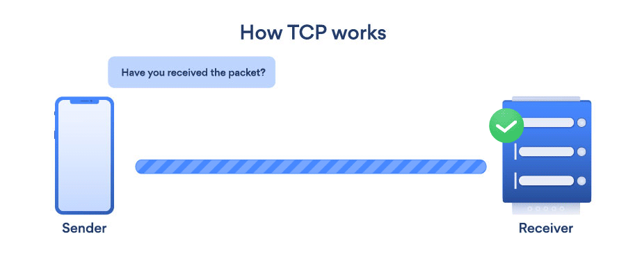
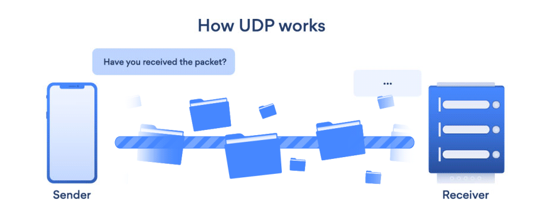

## **109.1 Fundamentos de los protocolos de internet**

**Puntuación:** 4

**Descripción:** Los candidatos deben demostrar un conocimiento adecuado de los fundamentos de la red TCP/IP.

**Áreas Clave de Conocimiento:**

* Demostrar comprensión de las máscaras de red y la notación CIDR
* Conocimiento de las diferencias entre direcciones IP privadas y públicas de "cuatro puntos"
* Conocimiento de los puertos y servicios TCP y UDP comunes (20, 21, 22, 23, 25, 53, 80, 110, 123, 139, 143, 161, 162, 389, 443, 465, 514, 636, 993, 995)
* Conocimiento de las diferencias y características principales de UDP, TCP e ICMP
* Conocimiento de las principales diferencias entre IPv4 e IPv6
* Conocimiento de las características básicas de IPv6

**Términos y Utilidades:**

* /etc/services
* IPv4, IPv6
* Subnetting
* TCP, UDP, ICMP

#### IP

El IP (Protocolo de Internet) es el protocolo fundamental para las comunicaciones en Internet. Especifica cómo los dispositivos en red empaquetan, direccionan, transfieren, enrutan y reciben la información.

#### Dirección IP

Una **dirección IP** es un número que identifica una computadora u otro dispositivo en Internet. Es similar a una dirección postal, que indica de dónde proviene el correo postal y dónde debe entregarse. Las direcciones IP identifican de forma única el origen y el destino de los datos transmitidos con el Protocolo de Internet.

### IPv4

Las direcciones IPv4 tienen una longitud de 32 bits (cuatro bytes). Un ejemplo de dirección IPv4 es 216.58.216.164, que es la página principal de Google.com.

**Desglose de la dirección IPv4**

La dirección se compone de 32 bits binarios.


Los 32 bits binarios se dividen en cuatro octetos (1 octeto = 8 bits). Cada octeto se convierte a decimal y se separa con un punto. Por esta razón, se dice que una dirección IP se expresa en formato decimal con puntos.

**Así es como los octetos binarios se convierten a decimal:** El bit más a la derecha, o el bit menos significativo, de un octeto tiene un valor de 2^0. El bit inmediatamente a la izquierda tiene un valor de 2^1. Esto continúa hasta el bit más a la izquierda, o el bit más significativo, que tiene un valor de 2^7. Por lo tanto, si todos los bits binarios son uno, el equivalente decimal sería 255, como se muestra aquí:

```
1  1  1  1 1 1 1 1
128 64 32 16 8 4 2 1 (128+64+32+16+8+4+2+1=255)
```

A continuación se muestra un ejemplo de conversión de octetos cuando no todos los bits están configurados en 1.

```
0  1 0 0 0 0 0 1
0 64 0 0 0 0 0 1 (0+64+0+0+0+0+0+1=65)
```

Y este ejemplo muestra una dirección IP representada en binario y decimal.

```
10.       1.      23.      19 (decimal)
00001010.00000001.00010111.00010011 (binary)
```

El valor máximo de un número de 32 bits es 232, o 4.294.967.296. Por lo tanto, el número máximo de direcciones IPv4, denominado espacio de direcciones, es de aproximadamente 4.300 millones. En la década de 1980, esto era suficiente para direccionar todos los dispositivos en red, pero los científicos sabían que este espacio se agotaría rápidamente.

> Tecnologías como NAT han retrasado el problema al permitir que muchos dispositivos utilicen una sola dirección IP, pero se necesita un espacio de direcciones mayor para dar servicio a la Internet moderna.

### IPv6

Una gran ventaja de IPv6 es que utiliza 128 bits de datos para almacenar una dirección, lo que permite 2128 direcciones únicas, o 340.282.366.920.938.463.463.374.607.431.768.211.456. El tamaño del espacio de direcciones de IPv6 (340 duodecillones) es mucho, mucho mayor que el de IPv4.


#### Clases de direcciones IP

Con una dirección IP IPv4, existen cinco clases de rangos IP disponibles: Clase A, Clase B, Clase C, Clase D y Clase E. Aunque solo se utilizan comúnmente A, B y C.

#### Máscara de subred

En una red IP o Protocolo de Internet, cada host conectado debe tener una dirección IP de host y una máscara de subred para funcionar correctamente. Cualquier dispositivo que utilice el protocolo IP puede referirse a sí mismo con la dirección IP 127.0.0.1 y la máscara de subred 255.0.0.0, pero para comunicarse con otros dispositivos de la red, cada dispositivo debe tener una dirección IP (privada o pública) y una máscara de subred.

La máscara de red es un código binario de 32 bits que limita esa clase IP a un número prefijado de redes y un número prefijado de hosts por red.


* Netid: La parte de una dirección IP que identifica la red.
* Hostid: La parte de una dirección IP que identifica un host en una red.

El netid y el hostid tienen longitudes variables según la clase de dirección.

Cada clase de IP cuenta con su propia máscara de subred predeterminada y permite un rango de direcciones IP válidas, como se muestra en la siguiente tabla:

| Class       | Address range                | subnetmask    | Supports                                                       |
| ----------- | ---------------------------- | ------------- | -------------------------------------------------------------- |
| **Class A** | 1.0.0.1 to 126.255.255.254   | 255.0.0.0     | Supports 16 million hosts on each of 127 networks.             |
| **Class B** | 128.1.0.1 to 191.255.255.254 | 255.255.0.0   | Supports 65,000 hosts on each of 16,000 networks.              |
| **Class C** | 192.0.1.1 to 223.255.254.254 | 255.255.255.0 | Supports 254 hosts on each of 2 million networks.              |
| **Class D** | 224.0.0.0 to 239.255.255.255 | N/A           | Reserved for multicast groups.                                 |
| **Class E** | 240.0.0.0 to 254.255.255.254 | N/A           | Reserved for future use, or research and development purposes. |
Los rangos 127.x.x.x están reservados para el bucle invertido o el host local; por ejemplo, **127.0.0.1** es la dirección del bucle invertido. El rango **255.255.255.255** se transmite a todos los hosts de la red local.

**IP privadas**

La Autoridad de Números Asignados de Internet (IANA) ha asignado varios rangos de direcciones para su uso en redes privadas.

Los rangos de direcciones que pueden utilizar las redes privadas son:

* Clase A: `10.0.0.0` a `10.255.255.255`
* Clase B: `172.16.0.0` a `172.31.255.255`
* Clase C: `192.168.0.0` a `192.168.255.255`

Cualquier red privada que necesite usar direcciones IP internamente puede usar cualquier dirección dentro de estos rangos sin coordinación. Las direcciones dentro de este espacio de direcciones privadas solo son únicas dentro de una red privada determinada.

El direccionamiento IP con clases no ofrece la flexibilidad de tener menos hosts por red ni más redes por clase de IP, donde la subred entra en juego.

### subredes

El proceso de dividir una clase de IP en bloques o grupos de IP más pequeños se conoce como subredes.

La subred puede mejorar la seguridad y ayudar a equilibrar el tráfico general de la red.

**CIDR**

CIDR **** o **Enrutamiento Interdominio sin Clase** se basa en el concepto de subred. CIDR y la subred son prácticamente lo mismo. El término "subred" se utiliza generalmente a nivel organizacional. CIDR se utiliza generalmente a nivel de ISP o superior.

**¿Cómo funciona la subred?** La subred es una operación bit a bit en una red de direcciones IP que se realiza mediante una máscara de red (máscara de subred).

Ofrece la flexibilidad de tomar prestados bits de la parte del host de la dirección IP y usarlos como una red dentro de la red, denominada subred. Mediante la subred, una sola dirección IP de Clase A puede utilizarse para crear subredes más pequeñas, lo que proporciona una mejor gestión de la red.

**Subredes de Clase A**

En la Clase A, solo el primer octeto se utiliza como identificador de red y los tres octetos restantes se asignan a los hosts (es decir, 16777214 hosts por red). Para crear más subredes en la Clase A, se toman prestados bits de la parte del host y se modifica la máscara de subred según corresponda.


**Subredes de Clase B**

De forma predeterminada, al usar redes con clases, se utilizan 14 bits como bits de red, lo que proporciona (2^14) 16384 redes y ((2^16)-2) 65534 hosts. Las direcciones IP de Clase B se pueden subredear de la misma manera que las direcciones de Clase A, tomando prestados bits de los hosts. A continuación, se muestran todas las combinaciones posibles de subredes de Clase B.


**Subredes de Clase C**

Las direcciones IP de Clase C se asignan normalmente a redes muy pequeñas, ya que solo admiten 254 hosts. A continuación, se muestra una lista de todas las combinaciones posibles de direcciones IP de Clase B subdivididas.


## Protocolos de Comunicación

Un protocolo de red define las reglas y procedimientos mediante los cuales se produce la comunicación de datos entre dispositivos a través de una red. Sin reglas o procedimientos predefinidos, los mensajes que atraviesan una red no tendrían un formato específico y podrían no ser significativos para el dispositivo receptor.

**Modelo OSI:**El modelo OSI (Interconexión de Sistemas Abiertos) fue creado por la Organización Internacional de Normalización (ISO), un organismo internacional de normalización. Fue diseñado como modelo de referencia para describir las funciones de un sistema de comunicación. El modelo OSI consta de siete capas.


**Modelo TCP/IP:**El modelo TCP/IP fue creado en la década de 1970 por la Agencia de Proyectos de Investigación Avanzada de Defensa (DARPA) como un modelo de red público, abierto y neutral respecto a los proveedores. Al igual que el modelo OSI, describe las directrices generales para el diseño e implementación de protocolos informáticos. Consta de cuatro capas.


Comparación entre el modelo TCP/IP y el modelo OSI:


Analicemos algunos de los protocolos más populares (ITCP/UDP/ICMP) y sus respectivos números de puerto:

### TCP

El Protocolo de Control de Transmisión (TCP) es un protocolo **orientado a la conexión** que opera en la capa de transporte tanto del modelo de referencia (OSI) como de la pila de protocolos (TCP/IP). Está diseñado para proporcionar un transporte fiable de datagramas a través de una red. Proporciona seguridad inicializando un protocolo de enlace de tres vías antes de la comunicación de datos entre el emisor y el receptor.



### UPD

El Protocolo de Datagramas de Usuario (UDP) es un protocolo sin conexión. Este protocolo también opera en la capa de transporte tanto del modelo de referencia (OSI) como de la pila de protocolos (TCP/IP). Sin embargo, a diferencia del Protocolo de Control de Transmisión (TCP), el Protocolo de Datagramas de Usuario (UDP) no ofrece ninguna garantía ni seguridad en la entrega de datagramas a través de una red. No todos los protocolos de la capa de aplicación utilizan TCP; existen muchos protocolos de Capa 7 que utilizan el Protocolo de Datagramas de Usuario (UDP).



#### Comparación de TCP y UDP

| tcp | UDP |
| ------------------------------------------------------------ | ------------------------------------------------------------------------- |
| Confiable | Entrega de datos muy rápida |
| Utiliza acuses de recibo para confirmar la recepción de datos | Mínima sobrecarga de red |
| Reenvía datos si se pierden paquetes durante la transmisión | No requiere paquetes de acuse de recibo |
| Entrega los datos en orden secuencial y gestiona el reensamblado | Si se pierden paquetes durante la transmisión, no reenvía los datos perdidos |
| Aplicaciones: HTTP, FTP, SMTP, Telnet | Aplicaciones: DHCP, DNS, SNMP, TFTP, VoIP, IPTV |

### ICMP

En una red, ya sea una red de área local (LAN) o una red de área extensa (WAN), los dispositivos host se comunican para intercambiar datos e información, y en ocasiones pueden producirse errores.

El Protocolo de Mensajes de Control de Internet (ICMP) se utiliza normalmente para informar de errores en una red. Existen muchos tipos de mensajes ICMP que ofrecen diferentes acciones y ofrecen información sobre errores y problemas existentes. Un buen ejemplo del uso del protocolo ICMP es el comando ping:

```
root@ubuntu16-1:~# ping google.com -c 3
PING google.com (172.217.18.142) 56(84) bytes of data.
64 bytes from arn02s05-in-f142.1e100.net (172.217.18.142): icmp_seq=1 ttl=128 time=141 ms
64 bytes from arn02s05-in-f142.1e100.net (172.217.18.142): icmp_seq=2 ttl=128 time=95.8 ms
64 bytes from arn02s05-in-f142.1e100.net (172.217.18.142): icmp_seq=3 ttl=128 time=95.7 ms

--- google.com ping statistics ---
3 packets transmitted, 3 received, 0% packet loss, time 6251ms
rtt min/avg/max/mdev = 95.746/110.869/141.042/21.337 ms
```

#### Puertos

Como mencionamos, en una red TCP/IP todos los dispositivos deben tener una dirección IP. La dirección IP identifica el dispositivo, por ejemplo, una computadora. Sin embargo, una dirección IP por sí sola no es suficiente para ejecutar aplicaciones de red, ya que una computadora puede ejecutar múltiples aplicaciones o servicios.

Al igual que la dirección IP identifica la computadora, el puerto de red identifica la aplicación o el servicio que se ejecuta en ella. El uso de puertos permite que las computadoras/dispositivos ejecuten múltiples servicios/aplicaciones.

El siguiente diagrama muestra una conexión entre computadoras e identifica las direcciones IP y los puertos:


Los puertos predeterminados de algunos protocolos son los siguientes. Son muy importantes y la mayoría de los administradores los conocen:

| Puerto | Uso |
| ------- | --------------------------- |
| 20, 21 | FTP (Un dato, un control) |
| 22 | SSH |
| 23 | Telnet |
| 25 | SMTP |
| 53 | DNS |
| 80 | HTTP |
| 110 | POP3 |
| 123 | NTP |
| 139 | NetBIOS |
| 143 | IMAP |
| 161, 162 | SNMP |
| 389 | LDAP |
| 443 | https |
| 465 | SMTPS |
| 636 | LDAP |
| 993 | IMAPS |
| 995 | POP3S |

> Todos los puertos superiores a 400 terminan en S, que significa Seguro

### /etc/services

El archivo /etc/services contiene información sobre los servicios conocidos disponibles en Internet. Para cada servicio, debe haber una sola línea con la siguiente información:

`official_service_name   port_number/protocol_name    aliases`

```
root@ubuntu16-1:~# cat  /etc/services 
# Network services, Internet style
#
# Note that it is presently the policy of IANA to assign a single well-known
# port number for both TCP and UDP; hence, officially ports have two entries
# even if the protocol doesn't support UDP operations.
#
# Updated from http://www.iana.org/assignments/port-numbers and other
# sources like http://www.freebsd.org/cgi/cvsweb.cgi/src/etc/services .
# New ports will be added on request if they have been officially assigned
# by IANA and used in the real-world or are needed by a debian package.
# If you need a huge list of used numbers please install the nmap package.

tcpmux		1/tcp				# TCP port service multiplexer
echo		7/tcp
echo		7/udp
discard		9/tcp		sink null
discard		9/udp		sink null
systat		11/tcp		users
daytime		13/tcp
daytime		13/udp
netstat		15/tcp
qotd		17/tcp		quote
msp		18/tcp				# message send protocol
msp		18/udp
chargen		19/tcp		ttytst source
chargen		19/udp		ttytst source
ftp-data	20/tcp
ftp		21/tcp
fsp		21/udp		fspd
ssh		22/tcp				# SSH Remote Login Protocol
ssh		22/udp
telnet		23/tcp
smtp		25/tcp		mail
...
```

etcétera ....

- [https://www.computerhope.com/jargon/i/ip.htm](https://www.computerhope.com/jargon/i/ip.htm)
- [https://www.cisco.com/c/en/us/support/docs/ip/routing-information-protocol-rip/13788-3.html](https://www.cisco.com/c/en/us/support/docs/ip/routing-information-protocol-rip/13788-3.html
- [https://itstillworks.com/calculate-host-id-7542379.html](https://itstillworks.com/calculate-host-id-7542379.html)
- [https://www.computerhope.com/jargon/n/netmask.htm](https://www.computerhope.com/jargon/n/netmask.htm)
- [http://compunetworx.blogspot.com/2013/01/difference-between-hostid-and-netid-in.html](http://compunetworx.blogspot.com/2013/01/difference-between-hostid-and-netid-in.html)
- [https://www.computerhope.com/jargon/s/subnetma.htm](https://www.computerhope.com/jargon/s/subnetma.htm)
- [https://www.ibm.com/support/knowledgecenter/en/SSSHRK\_4.2.0/disco/concept/dsc\_private\_addr\_ranges.html](https://www.ibm.com/support/knowledgecenter/en/SSSHRK\_4.2.0/disco/concept/dsc\_private\_addr\_ranges.html)
- [https://en.wikipedia.org/wiki/IPv6\_address#/media/File:Ipv6\_address\_leading\_zeros.svg](https://en.wikipedia.org/wiki/IPv6\_address#/media/File:Ipv6\_address\_leading\_zeros.svg)
- [https://www.tutorialspoint.com/ipv4/ipv4\_subnetting.htm](https://www.tutorialspoint.com/ipv4/ipv4\_subnetting.htm)
- [http://www.itgeared.com/articles/1347-cidr-and-subnetting-tutorial/](http://www.itgeared.com/articles/1347-cidr-and-subnetting-tutorial/)
- [http://www.steves-internet-guide.com/tcpip-ports-sockets/](http://www.steves-internet-guide.com/tcpip-ports-sockets/)
- [https://hub.packtpub.com/understanding-network-port-numbers-tcp-udp-and-icmp-on-an-operating-system/](https://hub.packtpub.com/understanding-network-port-numbers-tcp-udp-and-icmp-on-an-operating-system/)
- [https://study-ccna.com/osi-tcp-ip-models/](https://study-ccna.com/osi-tcp-ip-models/)
- [https://www.inetdaemon.com/tutorials/internet/tcp/3-way\_handshake.shtml](https://www.inetdaemon.com/tutorials/internet/tcp/3-way\_handshake.shtml)
- [https://nordvpn.com/blog/tcp-or-udp-which-is-better/](https://nordvpn.com/blog/tcp-or-udp-which-is-better/)
- [http://www.qnx.com/developers/docs/6.5.0/index.jsp?topic=%2Fcom.qnx.doc.neutrino\_utilities%2Fs%2Fservices.html](http://www.qnx.com/developers/docs/6.5.0/index.jsp?topic=%2Fcom.qnx.doc.neutrino\_utilities%2Fs%2Fservices.html)

- Cisco got you here? [https://www.pcwdld.com/cisco-commands-cheat-sheet](https://www.pcwdld.com/cisco-commands-cheat-sheet)

