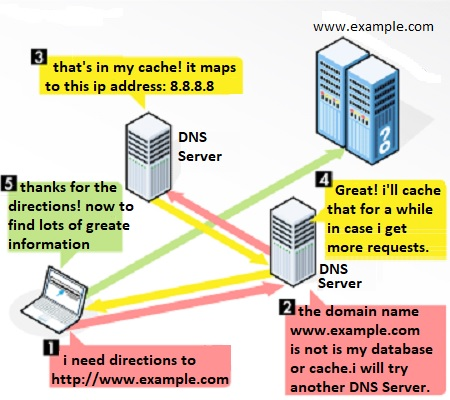

# 109.4. Configurar DNS del lado del cliente

**Ponderación**: 2

**Descripción:** Los candidatos deben ser capaces de configurar DNS en un host cliente.

**Áreas de conocimiento clave:**

* Consultar servidores DNS remotos
* Configurar la resolución de nombres local y usar servidores DNS remotos
* Modificar el orden de la resolución de nombres

**Términos y utilidades:**

* /etc/hosts
* /etc/resolv.conf
* /etc/nsswitch.conf
* host
* dig
* getent

Hemos visto todos estos temas en lecciones anteriores, por lo que en esta lección primero los revisaremos brevemente y luego hablaremos sobre los pasos de la resolución de nombres del lado del cliente.

### DNS

El DNS (Sistema de Nombres de Dominio) resuelve los nombres de los sitios de internet con sus direcciones IP subyacentes.



#### Consultar servidores DNS remotos

### dig

Dig (Domain Information Groper) es una potente herramienta de línea de comandos para consultar servidores de nombres DNS. Es la herramienta más utilizada por los administradores de sistemas para solucionar problemas de DNS gracias a su flexibilidad y facilidad de uso.

En su forma más simple, al consultar un solo host (dominio) sin opciones adicionales, el comando `dig` es bastante complejo.

```
root@ubuntu16-1:~# dig lpi.org

; <<>> DiG 9.10.3-P4-Ubuntu <<>> lpi.org
;; global options: +cmd
;; Got answer:
;; ->>HEADER<<- opcode: QUERY, status: NOERROR, id: 23520
;; flags: qr rd ra; QUERY: 1, ANSWER: 1, AUTHORITY: 0, ADDITIONAL: 1

;; OPT PSEUDOSECTION:
; EDNS: version: 0, flags:; udp: 512
;; QUESTION SECTION:
;lpi.org.			IN	A

;; ANSWER SECTION:
lpi.org.		599	IN	A	65.39.134.165

;; Query time: 501 msec
;; SERVER: 8.8.8.8#53(8.8.8.8)
;; WHEN: Sat Feb 29 17:16:01 +0330 2020
;; MSG SIZE  rcvd: 52
```

No olvide que, por defecto, dig envía la consulta DNS a los servidores de nombres listados en el resolver (/etc/resolv.conf). Sin embargo, podemos consultar diferentes servidores DNS usando @.

### host

El comando host es una utilidad de búsqueda DNS que encuentra la dirección IP de un nombre de dominio. También realiza búsquedas inversas, encontrando el nombre de dominio asociado a una dirección IP.

```
root@ubuntu16-1:~# host yahoo.com
yahoo.com has address 72.30.35.10
yahoo.com has address 98.137.246.7
yahoo.com has address 98.138.219.231
yahoo.com has address 98.138.219.232
yahoo.com has address 98.137.246.8
yahoo.com has address 72.30.35.9
yahoo.com has IPv6 address 2001:4998:c:1023::4
yahoo.com has IPv6 address 2001:4998:58:1836::10
yahoo.com has IPv6 address 2001:4998:44:41d::4
yahoo.com has IPv6 address 2001:4998:58:1836::11
yahoo.com has IPv6 address 2001:4998:44:41d::3
yahoo.com has IPv6 address 2001:4998:c:1023::5
yahoo.com mail is handled by 1 mta6.am0.yahoodns.net.
yahoo.com mail is handled by 1 mta7.am0.yahoodns.net.
yahoo.com mail is handled by 1 mta5.am0.yahoodns.net.
```

 Y viceversa Para averiguar el nombre de host del host con la dirección IP**:**

```
root@ubuntu16-1:~# host 72.30.35.10
10.35.30.72.in-addr.arpa domain name pointer media-router-fp2.prod1.media.vip.bf1.yahoo.com.
```

Si no se proporcionan argumentos ni opciones, _host_ imprime un breve resumen de sus argumentos y opciones en la línea de comandos:

#### Resolución de nombres del cliente

Cuando un cliente desea acceder a otros equipos de la red, primero necesita conocer la dirección IP de destino. Existen diferentes lugares dentro del sistema operativo que almacenan información; analicémoslos juntos:

### /etc/host

Si no queremos usar un servidor DNS para la resolución de nombres, podemos usar el archivo **/etc/hosts**. Este es un archivo de texto simple que contiene las asignaciones de direcciones IP a nombres de host. Cada línea contiene una dirección IP, seguida de uno o más nombres de host (ubuntu16):

```
root@ubuntu16-1:~# cat /etc/hosts
127.0.0.1	localhost
127.0.1.1	ybyntu16-1

# The following lines are desirable for IPv6 capable hosts
::1     ip6-localhost ip6-loopback
fe00::0 ip6-localnet
ff00::0 ip6-mcastprefix
ff02::1 ip6-allnodes
ff02::2 ip6-allrouters
```

Puede ver el contenido predeterminado típico del archivo **hosts**, que contiene las entradas para las direcciones de bucle invertido. Para configurar nuestras propias asignaciones, agregue las entradas con el formato **`IP_ADDRESS HOSTNAME`**:

```
root@ubuntu16-1:~# ping thisismyexample.com
ping: unknown host thisismyexample.com

root@ubuntu16-1:~# vim /etc/hosts
root@ubuntu16-1:~# 
root@ubuntu16-1:~# cat /etc/hosts
127.0.0.1	localhost
127.0.1.1	ybyntu16-1

# The following lines are desirable for IPv6 capable hosts
::1     ip6-localhost ip6-loopback
fe00::0 ip6-localnet
ff00::0 ip6-mcastprefix
ff02::1 ip6-allnodes
ff02::2 ip6-allrouters

# this is my example:
172.217.164.238 thisismyexample
```

La línea **`172.217.164.238 thisismyexample.com`** asignará la dirección IP de **172.217.164.238** al nombre de host **thisismyexample.com**. Ahora podemos usar el nombre de host **thisismyexample** para comunicarnos con la máquina remota:

```
root@ubuntu16-1:~# ping thisismyexample -c3
PING thisismyexample (172.217.164.238) 56(84) bytes of data.
64 bytes from thisismyexample (172.217.164.238): icmp_seq=1 ttl=63 time=281 ms
64 bytes from thisismyexample (172.217.164.238): icmp_seq=2 ttl=63 time=324 ms
64 bytes from thisismyexample (172.217.164.238): icmp_seq=3 ttl=63 time=262 ms

--- thisismyexample ping statistics ---
3 packets transmitted, 3 received, 0% packet loss, time 2002ms
rtt min/avg/max/mdev = 262.673/289.474/324.462/25.881 ms

```

### /etc/resolv.conf

El archivo /etc/resolv.conf contiene información sobre el servidor DNS actual del sistema. Si bien podemos modificarlo manualmente, no olvide que la configuración no será permanente hasta el próximo reinicio.

```
root@ubuntu16-1:~# cat /etc/resolv.conf 
# Dynamic resolv.conf(5) file for glibc resolver(3) generated by resolvconf(8)
#     DO NOT EDIT THIS FILE BY HAND -- YOUR CHANGES WILL BE OVERWRITTEN
nameserver 8.8.8.8
nameserver 4.2.2.4
search mydomain.local
```

### /etc/nsswitch

El archivo /etc/nsswitch.conf define el orden de contacto con los diferentes servicios de nombres. Para el uso de Internet, es importante que _dns_ aparezca en la línea "hosts":

```
root@ubuntu16-1:~# cat /etc/nsswitch.conf | grep hosts
hosts:          files mdns4_minimal [NOTFOUND=return] dns
```

La línea hosts especifica el orden en que se probarán los distintos servicios de resolución de nombres. El valor predeterminado es:

* `files` lee `/etc/hosts`
* `mdns4_minimal` resuelve direcciones IPv4 con DNS multicast SOLO si el nombre de host solicitado termina en `.local`.
* `[NOTFOUND=return]` detiene el proceso de resolución si no se encuentra el nombre de host `.local`.
* `dns` probablemente realiza la resolución DNS.

> Puede cambiar el orden de resolución de nombres aquí.

### getent

Como ya dijimos, **getent** es un comando de Linux que ayuda al usuario a obtener las entradas de varios archivos de texto importantes llamados bases de datos. Esto incluye la contraseña y el grupo de bases de datos que almacena la información del usuario. El comando **getent** muestra las entradas de las bases de datos compatibles con las bibliotecas de conmutación de servicios de nombres, que se configuran en /etc/nsswitch.conf.

```bash
root@ubuntu16-1:~# getent hosts thisismyexample
172.217.164.238 thisismyexample
```

- [https://www.networkworld.com/article/3268449/what-is-dns-and-how-does-it-work.html](https://www.networkworld.com/article/3268449/what-is-dns-and-how-does-it-work.html)
- [https://computer.howstuffworks.com/dns3.htm](https://computer.howstuffworks.com/dns3.html
- [https://linuxize.com/post/how-to-use-dig-command-to-query-dns-in-linux/](https://linuxize.com/post/how-to-use-dig-command-to-query-dns-in-linux/)
- ****[https://www.computerhope.com/unix/host.htm](https://www.computerhope.com/unix/host.htm)
- [https://www.geeksforgeeks.org/host-command-in-linux-with-examples/](https://www.geeksforgeeks.org/host-command-in-linux-with-examples/)
- [https://geek-university.com/linux/etc-hosts-file/](https://geek-university.com/linux/etc-hosts-file/)
- [https://www.shellhacks.com/setup-dns-resolution-resolvconf-example/](https://www.shellhacks.com/setup-dns-resolution-resolvconf-example/
- [https://www.linuxtopia.org/online_books/introduction_to_linux/linux\_\_etc_nsswitch.conf.html](https://www.linuxtopia.org/online_books/introduction_to_linux/linux\_\_etc_nsswitch.conf.html
- [https://www.reddit.com/r/linuxquestions/comments/co02ui/hosts_and_mdns_configuration_in_etcnsswitchconf/](https://www.reddit.com/r/linuxquestions/comments/co02ui/hosts_and_mdns_configuration_in_etcnsswitchconf/)
- [https://ubuntuforums.org/showthread.php?t=971693](https://ubuntuforums.org/showthread.php?t=971693)
- [https://www.geeksforgeeks.org/getent-command-in-linux-with-examples/](https://www.geeksforgeeks.org/getent-command-in-linux-with-examples/)
- [https://linux.die.net/man/1/getent](https://linux.die.net/man/1/getent)

