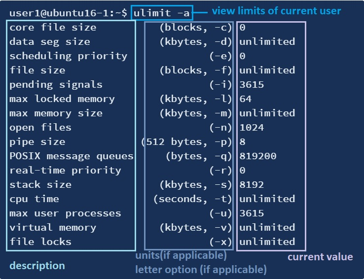

# Realizar tareas de administración de seguridad

**Ponderación:** 3

**Descripción: **Los candidatos deben saber revisar la configuración del sistema para garantizar la seguridad del host de acuerdo con las políticas de seguridad locales.

**Áreas de conocimiento clave:**

* Auditar un sistema para encontrar archivos con el bit suid/sgid activado
* Establecer o cambiar contraseñas de usuario e información sobre su caducidad
* Poder usar nmap y netstat para descubrir puertos abiertos en un sistema
* Establecer límites en los inicios de sesión de usuarios, procesos y uso de memoria
* Determinar qué usuarios han iniciado sesión en el sistema o lo han hecho
* Configuración y uso básico de sudo

**Términos y utilidades:**

* find
* passwd
* fuser
* lsof
* nmap
* chage
* netstat
* sudo
* /etc/sudoers
* su
* usermod
* ulimit
* who, w, last

En esta lección, repasaremos las auditorías de seguridad básicas. Primero, revisaremos varios comandos que hemos aprendido desde la perspectiva de seguridad y luego conoceremos otros comandos nuevos.

## find suid/guid

Aprendimos sobre suid/guid al hablar sobre la gestión de permisos y propiedad de archivos. Para un repaso rápido, consulte la tabla a continuación:

| Modo de acceso | **en archivo** | **en directorio** |
| -------------- | --------------------------------------- | -------------------------------------------- |
| **SUID** | Se ejecuta con los permisos del propietario del archivo | Nada |
| **GUID** | Se ejecuta con los permisos del grupo | Los archivos nuevos pertenecen al grupo del directorio |
| **Bit persistente** | Nada | Solo el propietario puede eliminar archivos |

Existen algunas preocupaciones de seguridad al usar suid/guid, por ejemplo, ¿qué sucede si un programa dañino tiene permisos suid/guid? ¿Por qué programas peligrosos como rm deberían tener permisos suid? Para buscar todos los archivos suid/guid, usamos el comando find:

> sudo find / -perm -u+s
>
> sudo find / -perm -g+s

```bash
xnoxos@ubuntu16-1:~> find / -perm -u+s
/bin/ping
/bin/fusermount
/bin/ping6
/bin/mount
/bin/su
/bin/ntfs-3g
/bin/umount
find: ‘/run/user/1001/gvfs’: Permission denied
/usr/bin/chsh
/usr/bin/passwd
/usr/bin/gpasswd
/usr/bin/pkexec
/usr/bin/newgrp
/usr/bin/sudo
/usr/bin/chfn
/usr/lib/x86_64-linux-gnu/oxide-qt/chrome-sandbox
/usr/lib/snapd/snap-confine
/usr/lib/policykit-1/polkit-agent-helper-1
/usr/lib/eject/dmcrypt-get-device
/usr/lib/vmware-tools/bin64/vmware-user-suid-wrapper
/usr/lib/vmware-tools/bin32/vmware-user-suid-wrapper
/usr/lib/dbus-1.0/dbus-daemon-launch-helper
/usr/lib/openssh/ssh-keysign
/usr/lib/xorg/Xorg.wrap
/usr/sbin/pppd
...

xnoxos@ubuntu16-1:~> find / -perm -g+s
find: ‘/run/user/1001/gvfs’: Permission denied
/run/log/journal
/run/log/journal/b4f9fc6cf1ca4724b56e6e4235c77155
/usr/bin/wall
/usr/bin/crontab
/usr/bin/bsd-write
/usr/bin/chage
/usr/bin/expiry
/usr/bin/ssh-agent
/usr/bin/mlocate
/usr/share/ppd/custom
...
```

Obviamente, examinar cada uno de estos archivos y averiguar su función queda fuera del alcance de este curso, pero debemos estar atentos para detectar si alguno de ellos tiene sentido, como por ejemplo, si se encuentra algo en el directorio personal de los usuarios. Se recomienda guardar esta lista para futuras comparaciones y detectar nuevos cambios.

## Buscando puertos abiertos

Es importante verificar qué puertos están escuchando en las interfaces de red del servidor. A continuación, se muestran las diferentes categorías de puertos:

1. **0-1023**: Puertos conocidos, también conocidos como puertos del sistema.
2. **1024-49151**: Puertos registrados, también conocidos como puertos de usuario.
3. **49152-65535**: Puertos dinámicos, también conocidos como puertos privados.

Debemos prestar atención a los puertos abiertos para detectar una intrusión. Además de una intrusión, para la resolución de problemas, puede ser necesario comprobar si un puerto ya está siendo utilizado por otra aplicación en nuestros servidores. Por ejemplo, ¡podríamos instalar servidores Apache y Nginx en el mismo sistema!

Esta sección describe los pasos para usar los comandos netstat, lsof y nmap para comprobar los puertos en uso y ver la aplicación que los utiliza.

### netstat

Uno de los usos de la herramienta de línea de comandos **netstat** es la monitorización de conexiones entrantes y salientes de red. Por defecto, netstat muestra una lista de sockets abiertos, lo cual no es muy útil, por lo que normalmente se usa junto con las opciones `-tuna`.

| Opción netstat | uso                                                                                                        |
| -------------- | ---------------------------------------------------------------------------------------------------------- |
| -t             | mostrar puertos TCP                                                                                        |
| -u             | mostrar puertos UDP                                                                                        |
| -n             | Mostrar direcciones numéricas en lugar de intentar determinar nombres simbólicos de host, puerto o usuario |
| -a             | Mostrar conexiones tanto en escucha como en no escucha (para TCP, esto significa conexiones establecidas)  |
```bash
xnoxos@ubuntu16-1:~> netstat -tuna
Active Internet connections (servers and established)
Proto Recv-Q Send-Q Local Address           Foreign Address         State      
tcp        0      0 127.0.1.1:53            0.0.0.0:*               LISTEN     
tcp        0      0 0.0.0.0:22              0.0.0.0:*               LISTEN     
tcp        0      0 127.0.0.1:631           0.0.0.0:*               LISTEN     
tcp        0      0 0.0.0.0:445             0.0.0.0:*               LISTEN     
tcp        0      0 127.0.0.1:3306          0.0.0.0:*               LISTEN     
tcp        0      0 0.0.0.0:139             0.0.0.0:*               LISTEN     
tcp        0      0 192.168.52.144:41270    172.217.0.227:80        ESTABLISHED
tcp        0      0 192.168.52.144:43418    72.21.91.29:80          TIME_WAIT  
tcp        0      0 192.168.52.144:43416    72.21.91.29:80          TIME_WAIT  
tcp        0      0 127.0.0.1:631           127.0.0.1:52720         ESTABLISHED
...
udp        0      0 0.0.0.0:45821           0.0.0.0:*                          
udp    14400      0 0.0.0.0:51238           0.0.0.0:*                          
udp    11520      0 127.0.1.1:53            0.0.0.0:*                          
udp    10880      0 0.0.0.0:68              0.0.0.0:*                          
udp        0      0 0.0.0.0:631             0.0.0.0:*                          
udp    24576      0 192.168.52.255:137      0.0.0.0:*                          
udp        0      0 192.168.52.144:137      0.0.0.0:*                          
udp    52224      0 0.0.0.0:137             0.0.0.0:*                          
udp    34560      0 192.168.52.255:138      0.0.0.0:*                          
udp        0      0 192.168.52.144:138      0.0.0.0:*                          
udp     7680      0 0.0.0.0:138             0.0.0.0:*                          
udp     6144      0 0.0.0.0:5353            0.0.0.0:*                          
...
```

Antes de abrir una conexión TCP, necesitamos un **servidor** con un receptor. Este receptor escuchará las conexiones entrantes en un puerto específico. Este estado se representa como `LISTEN`. Si todo funcionó correctamente, la conexión se marca como `ESTABLISHED` en ambos extremos. En estas tablas, `0.0.0.0` indica _cualquier dirección_ o _cualquier interfaz_.

### lsof

**lsof**, que significa **‘Listar archivos abiertos’**, se utiliza para averiguar qué archivos están abiertos por cada proceso. Como sabemos, en Linux todo es un archivo, por lo que incluso podemos comprobar los archivos abiertos por algunas conexiones de red en el sistema mediante el comando lsof con la opción -i, -i lista todas las conexiones de red:

```bash
xnoxos@ubuntu16-1:~> lsof -i
COMMAND     PID   USER   FD   TYPE DEVICE SIZE/OFF NODE NAME
avahi-dae   791  avahi   12u  IPv4  24139      0t0  UDP *:mdns 
avahi-dae   791  avahi   13u  IPv6  24140      0t0  UDP *:mdns 
avahi-dae   791  avahi   14u  IPv4  24141      0t0  UDP *:45821 
avahi-dae   791  avahi   15u  IPv6  24142      0t0  UDP *:57596 
mysqld      967  mysql   27u  IPv4  27331      0t0  TCP localhost:mysql (LISTEN)
sshd        979   root    3u  IPv4 468063      0t0  TCP *:ssh (LISTEN)
sshd        979   root    4u  IPv6 468070      0t0  TCP *:ssh (LISTEN)
nmbd       1745   root   16u  IPv4  31466      0t0  UDP *:netbios-ns 
nmbd       1745   root   17u  IPv4  31467      0t0  UDP *:netbios-dgm 
nmbd       1745   root   21u  IPv4 468314      0t0  UDP 192.168.52.136:netbios-ns 
nmbd       1745   root   24u  IPv4 468315      0t0  UDP 192.168.52.255:netbios-ns 
nmbd       1745   root   25u  IPv4 468316      0t0  UDP 192.168.52.136:netbios-dgm 
nmbd       1745   root   26u  IPv4 468317      0t0  UDP 192.168.52.255:netbios-dgm 
smbd       1761   root   34u  IPv6  31629      0t0  TCP *:microsoft-ds (LISTEN)
smbd       1761   root   35u  IPv6  31630      0t0  TCP *:netbios-ssn (LISTEN)
smbd       1761   root   36u  IPv4  31631      0t0  TCP *:microsoft-ds (LISTEN)
smbd       1761   root   37u  IPv4  31632      0t0  TCP *:netbios-ssn (LISTEN)
cupsd      3683   root   10u  IPv6  41942      0t0  TCP ip6-localhost:ipp (LISTEN)
cupsd      3683   root   11u  IPv4  41943      0t0  TCP localhost:ipp (LISTEN)
cups-brow  3685   root    8u  IPv4  41958      0t0  UDP *:ipp 
gvfsd-smb 14071  user1   13u  IPv4 465267      0t0  TCP 192.168.52.144:60122->192.168.52.144:netbios-ssn (ESTABLISHED)
gvfsd-smb 14071  user1   14u  IPv4 465449      0t0  TCP 192.168.52.144:60124->192.168.52.144:netbios-ssn (ESTABLISHED)
dnsmasq   14148 nobody    4u  IPv4 466564      0t0  UDP ubuntu:domain 
dnsmasq   14148 nobody    5u  IPv4 466565      0t0  TCP ubuntu:domain (LISTEN)
dnsmasq   14148 nobody   11u  IPv4 466600      0t0  UDP *:44999 
dhclient  14166   root    6u  IPv4 466685      0t0  UDP *:bootpc 
```

Este comando muestra el comando, el PID, el usuario que lo ejecuta, la dirección IP de origen y destino, e indica si se trata de una conexión en ESCUCHA o ESTABLECIDA.

| lsof switch | uso |
| ---------------- | ----------------------------------------------------- |
| -iTCP o -iUDP | solo muestra las conexiones TCP o UDP |
| -i 4 o -i 6 | puede mostrar los archivos IPv4 e IPv6 por separado |
| -n | no usar nombre DNS |
| -P | no convertir números de puerto a nombres de puerto |

Si queremos comprobar qué proceso está usando un puerto específico, podemos buscar en la salida de cualquiera de los comandos anteriores o simplemente usar el comando `fuser`.

### fuser

El comando `fuser` es una utilidad muy inteligente que se utiliza para encontrar qué proceso está usando un archivo, un directorio o un socket.

El siguiente comando crea un receptor TCP en el puerto 8080:

```bash
xnoxos@ubuntu16-1:~> nc -l -p 8080

```

Dado que un servidor TCP escucha en el puerto 8080, se puede usar la utilidad Fuser para encontrar el proceso que usa el socket del servidor. La opción `-v` activa el modo detallado de la utilidad Fuser y la opción `-n` selecciona el protocolo TCP como espacio de nombres:

```bash
xnoxos@ubuntu16-1:~> fuser -v -n tcp 8080
                     USER        PID ACCESS COMMAND
8080/tcp:            root      15663 F.... nc
```

De forma predeterminada, la herramienta de fusión buscará en sockets IPv6 e IPv4, pero la opción predeterminada se puede cambiar con las opciones -4 y -6.

### nmap

**Nmap**, también conocido como **Network Mapper**, es una herramienta de código abierto muy versátil para administradores de sistemas/redes Linux. **Nmap** se utiliza para **explorar redes**, **realizar análisis de seguridad**, **auditar redes** y **encontrar puertos abiertos** en equipos locales o remotos.

Ten en cuenta que escanear sitios web desde Nmap no es legal. En algunos casos, si intentas profundizar demasiado, necesitarás permisos por escrito del propietario del sitio web y del titular de la IP.

```bash
xnoxos@ubuntu16-1:~> nmap localhost

Starting Nmap 7.01 ( https://nmap.org ) at 2020-03-18 00:47 +0330
Nmap scan report for localhost (127.0.0.1)
Host is up (0.000025s latency).
Not shown: 995 closed ports
PORT     STATE SERVICE
22/tcp   open  ssh
139/tcp  open  netbios-ssn
445/tcp  open  microsoft-ds
631/tcp  open  ipp
3306/tcp open  mysql

Nmap done: 1 IP address (1 host up) scanned in 1.62 seconds
```

Por defecto, Nmap escanea los 1000 puertos más comunes para cada protocolo.

| Selección de destino de nmap | Descripción |
| ------------------------- | ----------------------------- |
| nmap 192.168.10.151 | escanear una sola IP |
| nmap scanme.nmap.org | escanear un host |
| nmap 192.168.10.150-155 | escanear un rango de IP |
| nmap 192.168.10.0/24 | escanear una subred |
| nmap -iL myserverlist.txt | escanear destinos desde un archivo de texto |
| nmap -6 \[IP-V6-HERE] | habilita el escaneo de IP v6 |

nmap cuenta con numerosos parámetros para obtener más información sobre los hosts.

| nmap switch | uso |
| ------------- | ---------------------------------------------- |
| -v | proporciona información más detallada |
| -p_ \<puerto#>_ | busca información sobre un puerto específico |
| -A | descubre información del sistema operativo |
| -O | revela más información del sistema operativo |

## examinar la configuración de sudo

#### su vs sudo

sudo y su, los comandos más importantes y usados ​​en Linux. Es fundamental que un usuario de Linux los comprenda para aumentar la seguridad y evitar imprevistos. Primero, veremos qué hacen estos comandos y luego conoceremos la diferencia entre ambos. Comencemos.

Antes de comenzar, en algunas distribuciones como Ubuntu, la contraseña de root predeterminada no se establece al instalar un sistema operativo nuevo, así que configúrela primero con el comando `sudo passwd root`.

### su

El comando de Linux "su" se usa para cambiar de una cuenta a otra. Se le solicitará al usuario la contraseña del usuario al que se cambia.

```bash
user1@ubuntu16-1:~$ su payam
Password: 
payam@ubuntu16-1:/home/user1$ 
```

Los usuarios también pueden usar "su" para acceder a la cuenta root. Si solo escribe "su" sin ninguna opción, se le considerará root y se le solicitará que ingrese su contraseña.

```bash
payam@ubuntu16-1:/home/user1$ su 
Password: 
root@ubuntu16-1:/home/user1# pwd
/home/user1
root@ubuntu16-1:/home/user1# exit
exit
payam@ubuntu16-1:
```

¿Cuál es la diferencia entre 'su' y 'su -'?

Bueno, la diferencia radica en las variables de entorno. 'su -' cambia el entorno, 'su' no. 'su' conserva el entorno del usuario anterior/original incluso después de cambiar a root, mientras que 'su -' crea un nuevo entorno (según lo indicado por el archivo \~/.bashrc del usuario root), similar al caso cuando se inicia sesión explícitamente como root desde la pantalla de inicio de sesión.

```
payam@ubuntu16-1:/home/user1$ su -
Password: 
xnoxos@ubuntu16-1:~> pwd
/root
```

Tenga en cuenta que los parámetros `-, -l, --login` son todos iguales.

### sudo

Como todos sabemos, Linux protege de muchas maneras las computadoras de los usuarios contra el uso indebido de personas malintencionadas. Usar sudo es una de esas buenas maneras. Siempre que un usuario intenta instalar, desinstalar o modificar cualquier software, debe tener privilegios de root para realizar dichas tareas. El comando `sudo` en Linux se usa para otorgar dichos permisos a cualquier comando que un usuario desee ejecutar. `sudo` requiere que el usuario ingrese su contraseña para otorgar permisos basados ​​en el sistema. Por ejemplo, un usuario desea actualizar el sistema operativo mediante el comando:

```bash
payam@ubuntu16-1:~$ apt-get update
Reading package lists... Done
W: chmod 0700 of directory /var/lib/apt/lists/partial failed - SetupAPTPartialDirectory (1: Operation not permitted)
E: Could not open lock file /var/lib/apt/lists/lock - open (13: Permission denied)
E: Unable to lock directory /var/lib/apt/lists/
W: Problem unlinking the file /var/cache/apt/pkgcache.bin - RemoveCaches (13: Permission denied)
W: Problem unlinking the file /var/cache/apt/srcpkgcache.bin - RemoveCaches (13: Permission denied)
```

Este error se debe a la falta de privilegios de root para el usuario "payam". Se pueden requerir privilegios de root ejecutando "sudo" al principio, como se muestra a continuación:

```bash
payam@ubuntu16-1:~$ sudo apt-get update
[sudo] password for payam: 
Hit:1 http://ppa.launchpad.net/peek-developers/stable/ubuntu xenial InRelease                         
Hit:2 http://archive.ubuntu.com/ubuntu xenial InRelease
Get:3 http://archive.ubuntu.com/ubuntu xenial-updates InRelease [109 kB]
Get:4 http://archive.ubuntu.com/ubuntu xenial-backports InRelease [107 kB]
Get:5 http://archive.ubuntu.com/ubuntu xenial-security InRelease [109 kB]
0% [5 InRelease 240 B/109 kB 0%]
...
```

### /etc/sudoers

Pero ¿cómo sabe sudo quién debería tener permisos de root? ¿Qué comando se puede ejecutar con privilegios de root? Sudo guarda sus configuraciones en el archivo /etc/sudoers:

```bash
xnoxos@ubuntu16-1:~> cat /etc/sudoers
#
# This file MUST be edited with the 'visudo' command as root.
#
# Please consider adding local content in /etc/sudoers.d/ instead of
# directly modifying this file.
#
# See the man page for details on how to write a sudoers file.
#
Defaults	env_reset
Defaults	mail_badpass
Defaults	secure_path="/usr/local/sbin:/usr/local/bin:/usr/sbin:/usr/bin:/sbin:/bin:/snap/bin"

# Host alias specification

# User alias specification

# Cmnd alias specification

# User privilege specification
root	ALL=(ALL:ALL) ALL

# Members of the admin group may gain root privileges
%admin ALL=(ALL) ALL

# Allow members of group sudo to execute any command
%sudo	ALL=(ALL:ALL) ALL

# See sudoers(5) for more information on "#include" directives:

#includedir /etc/sudoers.d
```

La especificación de sintaxis para una regla en el archivo `sudoers` es:

> usuario (host)=(usuario:grupo) comandos

Las 3 líneas importantes:

* (root ALL=(ALL) ALL) permite que root haga todo en cualquier máquina como cualquier usuario.
* (%admin ALL=(ALL) ALL) permite que cualquier usuario del grupo admin ejecute cualquier comando como cualquier usuario.
* %sudo ALL=(ALL:ALL) ALL: todos los usuarios del grupo sudo tienen privilegios para ejecutar cualquier comando.

> Nota: En CentOS, el grupo _**wheel **_** se suele encontrar en lugar de _**sudo **_**group**.
#### La diferencia entre el grupo _wheel/sudo_ y el usuario _sudo_

En CentOS y Debian, un usuario perteneciente al grupo _wheel/sudo_ puede ejecutar _**su**_ y ascender directamente a _root_. Por otro lado, un usuario _sudo_ tendría que usar _sudo su_ primero. En esencia, no hay ninguna diferencia real, salvo por la sintaxis utilizada para _**convertirse en root**_, y los usuarios de ambos grupos pueden usar el comando _sudo_.

**¿Cómo editar el archivo `/etc/sudors`?** Si usas un editor simple, modificas la sintaxis y guardas... `sudo` probablemente dejará de funcionar y, como `/etc/sudoers` solo puede ser modificado por `root`, ¡no podrás hacerlo! Así que usamos **visudo** en su lugar. **visudo** edita el archivo `sudoers` de forma segura, haciendo dos cosas:

	* **visudo** comprueba la sintaxis del archivo _antes_ de sobrescribir el archivo `s/etcudoers`.
* Además, **visudo** bloquea el archivo `sudoers` contra múltiples ediciones simultáneas. Este bloqueo es importante si necesitas asegurarte de que nadie más pueda alterar los cambios de configuración que has realizado cuidadosamente.
## Administración de recursos del sistema

Los sistemas operativos Linux permiten limitar la cantidad de recursos del sistema disponibles para un proceso de usuario. Estas limitaciones incluyen la cantidad de archivos que un proceso puede tener abiertos, el tamaño de archivo que el usuario puede crear y la cantidad de memoria que pueden utilizar los diferentes componentes del proceso. **ulimit** es el comando utilizado para lograr esto.

### ulimit

El comando ulimit proporciona control sobre los recursos disponibles para el shell y/o los procesos que este inicia.

```bash
user1@ubuntu16-1:~$ ulimit 
unlimited
```

Para obtener el informe detallado, añada la marca "-a" al final. Esto mostrará todos los límites de recursos del usuario actual.



Para establecer el valor ulimit en un parámetro, utilice el siguiente comando:

`ulimit -<letra Opción> <NuevoValor>`

A modo de ejemplo, establezcamos límites al tamaño del archivo en el shell actual:

```bash
user1@ubuntu16-1:~$ ulimit -f 0

user1@ubuntu16-1:~$ ulimit -a | grep file
core file size          (blocks, -c) 0
file size               (blocks, -f) 0
open files                      (-n) 1024
file locks                      (-x) unlimited

user1@ubuntu16-1:~$ vim new.txt 
Vim: Caught deadly signal XFSZ
Vim: Finished.


File size limit exceeded (core dumped)
```

Para que los ulimits persistan después de los reinicios, debemos establecer los valores de ulimit en el archivo de configuración **/etc/security/limits.conf**. También se utiliza para límites de todo el sistema:

```bash
xnoxos@ubuntu16-1:~> cat /etc/security/limits.conf 
# /etc/security/limits.conf
#
#Each line describes a limit for a user in the form:
#
#<domain>        <type>  <item>  <value>
#
#Where:
#<domain> can be:
#        - a user name
#        - a group name, with @group syntax
#        - the wildcard *, for default entry
#        - the wildcard %, can be also used with %group syntax,
#                 for maxlogin limit
#        - NOTE: group and wildcard limits are not applied to root.
#          To apply a limit to the root user, <domain> must be
#          the literal username root.
#
#<type> can have the two values:
#        - "soft" for enforcing the soft limits
#        - "hard" for enforcing hard limits
#
#<item> can be one of the following:
#        - core - limits the core file size (KB)
#        - data - max data size (KB)
#        - fsize - maximum filesize (KB)
#        - memlock - max locked-in-memory address space (KB)
#        - nofile - max number of open files
#        - rss - max resident set size (KB)
#        - stack - max stack size (KB)
#        - cpu - max CPU time (MIN)
#        - nproc - max number of processes
#        - as - address space limit (KB)
#        - maxlogins - max number of logins for this user
#        - maxsyslogins - max number of logins on the system
#        - priority - the priority to run user process with
#        - locks - max number of file locks the user can hold
#        - sigpending - max number of pending signals
#        - msgqueue - max memory used by POSIX message queues (bytes)
#        - nice - max nice priority allowed to raise to values: [-20, 19]
#        - rtprio - max realtime priority
#        - chroot - change root to directory (Debian-specific)
#
#<domain>      <type>  <item>         <value>
#

#*               soft    core            0
#root            hard    core            100000
#*               hard    rss             10000
#@student        hard    nproc           20
#@faculty        soft    nproc           20
#@faculty        hard    nproc           50
#ftp             hard    nproc           0
#ftp             -       chroot          /ftp
#@student        -       maxlogins       4

# End of file
```

Hay dos tipos de límites: un **límite flexible** es como una advertencia y un **límite rígido** es un límite máximo real. Por ejemplo, el siguiente comando impedirá que cualquier persona del grupo de profesores tenga más de 50 procesos, y se emitirá una advertencia al alcanzar los 20 procesos.

Nota: El límite flexible no puede ser mayor que el límite rígido.

> ulimits forma parte del sistema de módulo de autenticación conectable (PAM), que se tratará en el libro lpic-2.

## Verificación de usuarios en el sistema

Como administrador del sistema, es posible que desee saber quién está conectado al sistema en cualquier momento. También puede que desee saber qué están haciendo. En este artículo, revisaremos tres métodos diferentes para identificar quién está conectado a su sistema Linux.

### w

El comando **w** en Linux se utiliza para mostrar quién ha iniciado sesión y qué está haciendo. Este comando muestra información sobre los usuarios que están actualmente en la máquina y sus procesos.

```bash
xnoxos@ubuntu16-1:~> w
 01:24:45 up  4:33,  4 users,  load average: 0.00, 0.00, 0.00
USER     TTY      FROM             LOGIN@   IDLE   JCPU   PCPU WHAT
user1    tty7     :0               15:11   10:13m 40.45s  0.27s /sbin/upstart -
payam    pts/19   127.0.0.1        01:11   12:47   0.04s  0.04s -bash
user2    pts/21   127.0.0.1        01:24   13.00s  0.04s  0.04s -bash
root     pts/22   192.168.52.133   01:16    3:41   0.03s  0.03s -bash
```

La salida del comando w contiene las siguientes columnas:

1. El encabezado muestra, en este orden, la hora actual, el tiempo de ejecución del sistema, el número de usuarios conectados y el promedio de carga del sistema de los últimos 1, 5 y 15 minutos.

2. Se muestran las siguientes entradas para cada usuario:

* `Nombre del usuario`
* `Número de máquina o número de TTY del usuario`
* `Dirección de la máquina remota`
* `Tiempo de inicio de sesión del usuario`
* `Tiempo de inactividad (no utilizable)`
* `Tiempo utilizado por todos los procesos conectados a la TTY (tiempo de JCPU)`
* `Tiempo utilizado por el proceso actual (tiempo de PCPU)`
* `Comando que los usuarios están ejecutando actualmente`

`w` tiene varias opciones; pruebe `w --help` para verlas.

### who

El comando who se utiliza para obtener información sobre los usuarios conectados al sistema.

```bash
xnoxos@ubuntu16-1:~> who
user1    tty7         2020-03-22 15:11 (:0)
payam    pts/19       2020-03-23 01:11 (127.0.0.1)
user2    pts/21       2020-03-23 01:24 (127.0.0.1)
root     pts/22       2020-03-23 01:16 (192.168.52.133)
```

El comando "who" muestra la siguiente información de cada usuario conectado al sistema si no se proporciona ninguna opción:

1. `Nombre de inicio de sesión del usuario`
2. `Números de línea del terminal`
3. `Hora de inicio de sesión del usuario`
4. `Nombre del host remoto del usuario`

"who" tiene muchas opciones; pruebe con `who --help`.

"w" y "who" leen su información del archivo /var/run/utmp. Este archivo contiene información sobre los usuarios conectados al sistema.

Por lo tanto, necesitamos otro comando para obtener información sobre los usuarios desconectados: `last`.

### last

El comando **last** en Linux se usa para mostrar la lista de todos los usuarios conectados y desconectados.

```bash
xnoxos@ubuntu16-1:~> last
user2    pts/21       127.0.0.1        Mon Mar 23 01:24   still logged in
root     pts/22       192.168.52.133   Mon Mar 23 01:16   still logged in
user2    pts/21       127.0.0.1        Mon Mar 23 01:13 - 01:21  (00:08)
payam    pts/19       127.0.0.1        Mon Mar 23 01:11   still logged in

wtmp begins Mon Mar 23 01:11:58 2020
```

La salida de este comando contiene las siguientes columnas:

1. `Nombre de usuario`
2. `Número de dispositivo TTY`
3. `Fecha y hora de inicio de sesión`
4. `Hora de cierre de sesión`
5. `Tiempo total de trabajo`

El último comando utiliza el archivo /var/log/wtmp para mostrar la lista de los últimos usuarios conectados. Este archivo funciona como el historial de un archivo utmp; es decir, mantiene los registros de todos los usuarios conectados y desconectados (en el pasado).


/var/log/btmp registra los intentos fallidos de inicio de sesión. Pruebe `last -f /var/log/btmp` para comprobar los últimos inicios de sesión fallidos.

`last` también nos proporciona información sobre los últimos reinicios del sistema; no olvide consultar `last --help`.


- [https://www.cyberciti.biz/faq/unix-linux-check-if-port-is-in-use-command/](https://www.cyberciti.biz/faq/unix-linux-check-if-port-is-in-use-command/)
- [https://www.tecmint.com/find-open-ports-in-linux/](https://www.tecmint.com/find-open-ports-in-linux/)
- [https://blog.confirm.ch/tcp-connection-states/](https://blog.confirm.ch/tcp-connection-states/)
- [https://jadi.gitbooks.io/lpic1/content/1101\_perform_security_administration_tasks.html](https://jadi.gitbooks.io/lpic1/content/1101\_perform_security_administration_tasks.html)
- [https://www.geeksforgeeks.org/lsof-command-in-linux-with-examples/](https://www.geeksforgeeks.org/lsof-command-in-linux-with-examples/)
- [https://www.cyberciti.biz/faq/how-to-check-open-ports-in-linux-using-the-cli/](https://www.cyberciti.biz/faq/how-to-check-open-ports-in-linux-using-the-cli/)
- [https://linux.die.net/man/8/lsof](https://linux.die.net/man/8/lsof)
- [https://www.digitalocean.com/community/tutorials/how-to-use-the-linux-fuser-command](https://www.digitalocean.com/community/tutorials/how-to-use-the-linux-fuser-command)
- [https://www.tecmint.com/nmap-command-examples/](https://www.tecmint.com/nmap-command-examples/)
- [https://www.tecmint.com/nmap-command-examples/](https://www.tecmint.com/nmap-command-examples/)
- [https://phoenixnap.com/kb/nmap-command-linux-examples](https://phoenixnap.com/kb/nmap-command-linux-examples)
- [https://www.linux.com/training-tutorials/how-use-sudo-and-su-commands-linux-introduction/](https://www.linux.com/training-tutorials/how-use-sudo-and-su-commands-linux-introduction/)
- [https://superuser.com/questions/580568/any-differences-between-su-vs-su-beside-the-pathing](https://superuser.com/questions/580568/any-differences-between-su-vs-su-beside-the-pathing)
- [https://www.howtoforge.com/tutorial/sudo-vs-su/](https://www.howtoforge.com/tutorial/sudo-vs-su/)
- [https://help.ubuntu.com/community/Sudoers](https://help.ubuntu.com/community/Sudoers)
- [https://www.hostinger.com/tutorials/sudo-and-the-sudoers-file/](https://www.hostinger.com/tutorials/sudo-and-the-sudoers-file/)
- [https://support.hostway.com/hc/en-us/articles/115001509750-How-To-Install-and-Configure-Sudo](https://support.hostway.com/hc/en-us/articles/115001509750-How-To-Install-and-Configure-Sudo)
- [https://unix.stackexchange.com/questions/27594/why-do-we-need-to-use-visudo-instead-of-directly-modifying-the-sudoers-file](https://unix.stackexchange.com/questions/27594/why-do-we-need-to-use-visudo-instead-of-directly-modifying-the-sudoers-file)
- [https://www.computerhope.com/unix/visudo.htm](https://www.computerhope.com/unix/visudo.htm)
- [https://www.thegeekdiary.com/understanding-etc-security-limits-conf-file-to-set-ulimit/](https://www.thegeekdiary.com/understanding-etc-security-limits-conf-file-to-set-ulimit/)
- [http://geekswing.com/geek/quickie-tutorial-ulimit-soft-limits-hard-limits-soft-stack-hard-stack/](http://geekswing.com/geek/quickie-tutorial-ulimit-soft-limits-hard-limits-soft-stack-hard-stack/
- [https://gerardnico.com/os/linux/limits.conf](https://gerardnico.com/os/linux/limits.conf)
- [https://www.thegeekstuff.com/2009/03/4-ways-to-identify-who-is-logged-in-on-your-linux-system/](https://www.thegeekstuff.com/2009/03/4-ways-to-identify-who-is-logged-in-on-your-linux-system/)
- [https://www.geeksforgeeks.org/w-command-in-linux-with-examples/](https://www.geeksforgeeks.org/w-command-in-linux-with-examples/)
- [https://www.geeksforgeeks.org/who-command-in-linux/](https://www.geeksforgeeks.org/who-command-in-linux/)
- [https://www.geeksforgeeks.org/last-command-in-linux-with-examples/](https://www.geeksforgeeks.org/last-command-in-linux-with-examples/)
