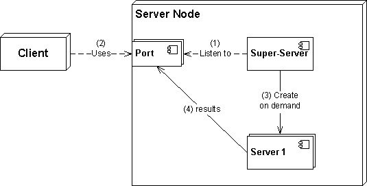

# Configurar la seguridad del host

**Ponderación: **3

**Descripción: **Los candidatos deben saber cómo configurar un nivel básico de seguridad del host.

**Áreas de conocimiento clave:**

* Conocimiento de las contraseñas shadow y su funcionamiento
* Desactivar los servicios de red que no se utilizan
* Comprender la función de los wrappers TCP

**Términos y utilidades:**

* /etc/nologin
* /etc/passwd
* /etc/shadow
* /etc/xinetd.d/
* /etc/xinetd.conf
* /etc/inetd.d/
* /etc/inetd.conf
* /etc/inittab
* /etc/init.d/
* /etc/hosts.allow
* /etc/hosts.deny

Ya hemos hablado de /etc/passwd, /etc/nologin y /etc/shadow. Repasémoslos rápidamente:

### /etc/passwd

El archivo **/etc/passwd** almacena información esencial, necesaria para iniciar sesión. En otras palabras, almacena la información de la cuenta de usuario. El archivo /etc/passwd es un archivo de texto sin formato.

```
root@ubuntu16-1:~# tail /etc/passwd
pulse:x:117:124:PulseAudio daemon,,,:/var/run/pulse:/bin/false
rtkit:x:118:126:RealtimeKit,,,:/proc:/bin/false
saned:x:119:127::/var/lib/saned:/bin/false
usbmux:x:120:46:usbmux daemon,,,:/var/lib/usbmux:/bin/false
payam:x:1000:1000:ubuntu16.04.3-1,,,:/home/payam:/bin/bash
user1:x:1001:1001::/home/user1:/bin/bash
sshd:x:121:65534::/var/run/sshd:/usr/sbin/nologin
mysql:x:122:129:MySQL Server,,,:/nonexistent:/bin/false
user3:x:1003:1003::/home/user3:
user2:x:1004:1004::/home/user2:/bin/bash
```

Cada línea del archivo /etc/passwd representa una cuenta de usuario individual y contiene los siguientes siete campos separados por dos puntos (**:**):

1. Nombre de usuario o nombre de inicio de sesión
2. Contraseña cifrada
3. ID de usuario
4. ID de grupo
5. Descripción del usuario
6. Directorio personal del usuario
7. Shell de inicio de sesión del usuario

El archivo /etc/passwd debe tener permiso de lectura general, ya que muchas utilidades de comandos lo utilizan para asignar los ID de usuario a los nombres de usuario. Sin embargo, el acceso de escritura a /etc/passwd debe estar limitado únicamente a la cuenta de superusuario/root.

```
root@ubuntu16-1:~# ls -l /etc/passwd
-rw-r--r-- 1 root root 2470 Mar 23 01:24 /etc/passwd
```

as we said, in old days /etc/passwd  was a place that  all users information even the user's password, and it caused security issues . To solve the problem /etc/shadow was invented.  An x character indicates that encrypted password is stored in /etc/shadow file.

### /etc/shadow

El archivo /etc/shadow contiene contraseñas cifradas, junto con información sobre la expiración de la contraseña y la cuenta.

```
root@ubuntu16-1:~# tail -5 /etc/shadow
user1:$6$c9PN.175$.t.CG0E0Gtr/trq4pqquSe1BemMjB6Zc3E0ExUOVufuTkPNe3BSRv3DyUuXFHPiAbEujzuSMCeMsCbpg8cV2j.:17749:0:99999:7:::
sshd:*:17749:0:99999:7:::
mysql:!:17867:0:99999:7:::
user3:$6$LPhxz61y$V0/HsC6SF6olabfoKuDKj3Gfm.wRVvbUI.GXWGJ2Icejs91ZQDgZHIAc153x4VYrJcg.oetNlwq.X7xxJIRDR0:18343:0:99999:7:::
user2:$6$sd2T1NDd$ihaP8mO7/rhSUFDccY3evqQqM/VwDVDYSQwZJstV6Dnjy3Me83faro6pk/Nb1GuvRqy8J66ZBHIGqIpIrzl5a0:18343:0:99999:7:::
```

Cada línea del archivo **/etc/shadow** representa una cuenta de usuario individual y contiene los siguientes nueve campos separados por dos puntos (**:**):

1. Nombre de usuario
2. Contraseña cifrada
3. Fecha del último cambio de contraseña
4. Mínimo de días requeridos entre cambios de contraseña
5. Máximo de días permitidos entre cambios de contraseña
6. Número de días de anticipación para mostrar el mensaje de expiración de la contraseña
7. Número de días después de la expiración de la contraseña para deshabilitar la cuenta
8. Fecha de expiración de la cuenta
9. Campo de reserva

A diferencia del archivo **/etc/passwd**, el archivo **/etc/shadow** no es legible para todo el mundo. Solo puede ser leído por el usuario root o el superusuario.

```
root@ubuntu16-1:~# ls -l /etc/shadow
-rw-r----- 1 root shadow 1704 Mar 23 01:23 /etc/shadow
```

### /etc/nologin

```
root@ubuntu16-1:~# cat /etc/nologin
cat: /etc/nologin: No such file or directory
```

Si el archivo /etc/nologin existe y es legible, el inicio de sesión solo permitirá el acceso al usuario root. A los demás usuarios se les mostrará el contenido de este archivo y se les denegará el acceso. Elimínelo y los usuarios podrán volver a iniciar sesión.

> /etc/nologin eliminado durante el reinicio mediante el script de apagado.

### Desactivar servicios de red

Como administrador del sistema, es nuestra tarea encontrar servicios en ejecución innecesarios y desactivarlos para minimizar los riesgos de seguridad. Anteriormente, aprendimos que las diferentes distribuciones de Linux utilizan diferentes soluciones de inicialización al arrancar el sistema, así que utilice los comandos adecuados según su administrador de servicios para desactivarlos:

| Linux Distro                        | service manager | command                                                                                                                                                |
| ----------------------------------- | --------------- | ------------------------------------------------------------------------------------------------------------------------------------------------------ |
| older linux systems (pre 2006)      | SysV            | <p><strong>chkconfig </strong><em>ServiceName</em> <strong>off</strong><br><strong>sysv-rc-conf</strong> <em>ServiceName</em> <strong>off</strong></p> |
| Ubuntu(2006-2019),CentOS(2011-2020) | Upstart         | **update-rc.d** _ServiceName _**remove**                                                                                                               |
| ubuntu(2015-????),CentOS(2014-????) | systemd         | **systemctl disable** _ServiceName_                                                                                                                    |

Tenga en cuenta que estos comandos impiden que el servicio se inicie al arrancar el sistema. Sin embargo, el paquete sigue instalado en la máquina y podemos ejecutarlo si es necesario.

### superservidores

En la mayoría de los demás sistemas Unix, los servicios de red se implementan como daemons. Cada daemon de red responde a las solicitudes en un puerto específico. El servicio Telnet, por ejemplo, opera en el puerto 23. Para que los servicios de red funcionen correctamente, algún proceso debe estar activo y escuchando en cada puerto correspondiente. Hay dos maneras de ofrecer servicios TCP/IP:

* ejecutando aplicaciones de servidor de forma independiente como daemon
* o utilizando el **superservidor** de Internet

Este **superservidor** es un daemon especial que escucha en los puertos de todos los servicios de red habilitados. Cuando una solicitud llega desde un puerto específico, se inicia el daemon de red correspondiente y se le pasa la solicitud para su servicio.



Este esquema ofrece dos ventajas principales. En primer lugar, solo el conjunto mínimo de daemons necesarios está activo en todo momento, por lo que no se desperdician recursos del sistema. En segundo lugar, existe un mecanismo centralizado para la gestión y monitorización de los servicios de red.

Las desventajas de un superservidor son que su inicio requiere mucho tiempo, lo que aumenta el tiempo de reacción según la disponibilidad del servicio de red.

Los superservidores ya no se utilizan y la mayoría de las distribuciones utilizan servicios independientes que se ejecutan en ellos.

### inetd, xinetd

Existen dos superservidores de Internet principales disponibles para Linux: inetd y xinetd. Aunque inetd solía ser el superservidor estándar para la mayoría de las distribuciones de Linux, está siendo reemplazado gradualmente por xinetd, que ofrece más funciones. Sin embargo, dado que inetd ofrece menos funciones que xinetd, también es más pequeño y podría ser más adecuado para un sistema Linux integrado.

#### Archivos de configuración de inetd

### /etc/inetd.conf

El archivo **/etc/inetd.conf** es el archivo de configuración predeterminado del demonio inetd. Este archivo permite especificar los demonios que se iniciarán por defecto y proporcionar los argumentos correspondientes al estilo de funcionamiento deseado para cada uno. Veamos una línea de ejemplo de inetd.conf:

```
# File Transfer Protocol (FTP) server:
ftp     stream  tcp     nowait  root    /usr/sbin/tcpd  proftpd
```

### /etc/inetd.d/

El directorio /etc/inet.d contiene los archivos de configuración de cada servicio administrado por `inetd` y los nombres de los archivos corresponden al servicio.

#### Archivos de configuración de xinetd

### /etc/xinetd.conf

El archivo `/etc/xinetd.conf` contiene la configuración general que afecta a todos los servicios bajo el control de `xinetd`. Se lee una vez al iniciar el servicio `xinetd`, por lo que para que los cambios de configuración surtan efecto, el administrador debe reiniciar el servicio `xinetd`. A continuación, se muestra un ejemplo del archivo `/etc/xinetd.conf`:

```
defaults
{
        instances               = 60
        log_type                = SYSLOG authpriv
        log_on_success          = HOST PID
        log_on_failure          = HOST
        cps                     = 25 30
}
includedir /etc/xinetd.d
```

### /etc/xinetd.d/

El directorio `/etc/xinetd.d/` contiene los archivos de configuración de cada servicio administrado por `xinetd` y sus nombres corresponden al servicio. Al igual que con `xinetd.conf`, este directorio es de solo lectura cuando se inicia el servicio `xinetd`. Para comprender la estructura de estos archivos, consulte el archivo `/etc/xinetd.d/telnet`:

```
service telnet
{
        flags           = REUSE
        socket_type     = stream
        wait            = no
        user            = root
        server          = /usr/sbin/in.telnetd
        log_on_failure  += USERID
        disable         = yes
}
```

Para que los cambios surtan efecto, el administrador debe reiniciar el servicio `xinetd`.

El archivo `/etc/services` contiene una lista de servicios de red y los puertos asignados a ellos. `inetd` o `xinetd` examina estos detalles para poder llamar a un programa específico cuando el paquete llega al puerto correspondiente y se solicita el servicio.
### Encapsuladores TCP

Como puede ver en /etc/inetd.conf, las conexiones para la mayoría de los protocolos se realizan a través de **tcpd**, en lugar de pasar la conexión directamente a un programa de servicio. Por ejemplo:

```
# File Transfer Protocol (FTP) server:
ftp     stream  tcp     nowait  root    /usr/sbin/tcpd  proftpd
```

En este ejemplo, las conexiones FTP se pasan a través de **tcpd**. **tcpd** registra la conexión mediante syslog y permite realizar comprobaciones adicionales. Una de las funciones más utilizadas de **tcpd** es el control de acceso basado en host. Un contenedor TCP es un sistema de lista de control de acceso (ACL) de red basado en host que se utiliza para filtrar el acceso a Internet.

### /etc/hosts.allow, /etc/host.deny

Cuando una solicitud de red llega a su servidor, los contenedores TCP utilizan `hosts.allow` y `hosts.deny` (en ese orden) para determinar si el cliente puede usar un servicio determinado.

Por defecto, estos archivos están vacíos, comentados o no existen. Por lo tanto, todo pasa a través de la capa de contenedores TCP y su sistema depende del firewall para una protección completa.

```
root@ubuntu16-1:~# cat /etc/hosts.allow 
# /etc/hosts.allow: list of hosts that are allowed to access the system.
#                   See the manual pages hosts_access(5) and hosts_options(5).
#
# Example:    ALL: LOCAL @some_netgroup
#             ALL: .foobar.edu EXCEPT terminalserver.foobar.edu
#
# If you're going to protect the portmapper use the name "rpcbind" for the
# daemon name. See rpcbind(8) and rpc.mountd(8) for further information.
#
```

```
root@ubuntu16-1:~# cat /etc/hosts.deny 
# /etc/hosts.deny: list of hosts that are _not_ allowed to access the system.
#                  See the manual pages hosts_access(5) and hosts_options(5).
#
# Example:    ALL: some.host.name, .some.domain
#             ALL EXCEPT in.fingerd: other.host.name, .other.domain
#
# If you're going to protect the portmapper use the name "rpcbind" for the
# daemon name. See rpcbind(8) and rpc.mountd(8) for further information.
#
# The PARANOID wildcard matches any host whose name does not match its
# address.
#
# You may wish to enable this to ensure any programs that don't
# validate looked up hostnames still leave understandable logs. In past
# versions of Debian this has been the default.
# ALL: PARANOID
```

Ambos archivos tienen una regla en cada línea con el siguiente formato: `service: hosts`.

Los hosts se pueden especificar por nombre de host o dirección IP. La palabra clave ALL especifica todos los hosts o todos los servicios.

Por ejemplo, añadir `telnet 192.168.` a `/etc/hosts.allow` hace que solo se acepten las conexiones Telnet del rango de IP 192.168.x.x.

Añadir la misma línea a `/etc/hosts.deny` hace que se denieguen las conexiones Telnet del rango de IP 192.168.x.x, pero se aceptarán las conexiones Telnet de cualquier otra dirección.

> Después de modificar estos archivos, se debe reiniciar xinetd.

Eso es todo.

- [https://www.cyberciti.biz/faq/understanding-etcpasswd-file-format/](https://www.cyberciti.biz/faq/understanding-etcpasswd-file-format/)
- [https://www.computernetworkingnotes.com/rhce-study-guide/etc-passwd-file-in-linux-explained-with-examples.html](https://www.computernetworkingnotes.com/rhce-study-guide/etc-passwd-file-in-linux-explained-with-examples.html)
- [https://www.cyberciti.biz/faq/understanding-etcshadow-file/](https://www.cyberciti.biz/faq/understanding-etcshadow-file/)
- [https://www.computernetworkingnotes.com/rhce-study-guide/etc-shadow-file-in-linux-explained-with-examples.html](https://www.computernetworkingnotes.com/rhce-study-guide/etc-shadow-file-in-linux-explained-with-examples.html)
- [https://linux.die.net/man/5/nologin](https://linux.die.net/man/5/nologin)
- [https://jadi.gitbooks.io/lpic1/content/1102\_setup_host_security.html](https://jadi.gitbooks.io/lpic1/content/1102\_setup_host_security.html)
- [http://etutorials.org/Linux+systems/embedded+linux+systems/Chapter+10.+Setting+Up+Networking+Services/10.1+The+Internet+Super-Server/](http://etutorials.org/Linux+systems/embedded+linux+systems/Chapter+10.+Setting+Up+Networking+Services/10.1+The+Internet+Super-Server/)
- [https://en.wikipedia.org/wiki/Super-server](https://en.wikipedia.org/wiki/Super-server)
- [https://thecustomizewindows.com/2011/11/super-server-what-is-it-how-it-works/](https://thecustomizewindows.com/2011/11/super-server-what-is-it-how-it-works/)
- [https://www.ibm.com/support/knowledgecenter/ssw_aix\_72/filesreference/inetd.conf.html](https://www.ibm.com/support/knowledgecenter/ssw_aix\_72/filesreference/inetd.conf.html)
- [https://book.huihoo.com/slackware-linux-basics/html/inetd.html](https://book.huihoo.com/slackware-linux-basics/html/inetd.html)
- [https://access.redhat.com/documentation/en-us/red_hat_enterprise_linux/4/html/reference_guide/s1-tcpwrappers-xinetd-config](https://access.redhat.com/documentation/en-us/red_hat_enterprise_linux/4/html/reference_guide/s1-tcpwrappers-xinetd-config)
- [https://access.redhat.com/documentation/en-us/red_hat_enterprise_linux/4/html/reference_guide/s2-tcpwrappers-xinetd-config-files](https://access.redhat.com/documentation/en-us/red_hat_enterprise_linux/4/html/reference_guide/s2-tcpwrappers-xinetd-config-files)
- [https://kerneltalks.com/linux/understanding-etc-services-file-in-linux/](https://kerneltalks.com/linux/understanding-etc-services-file-in-linux/)
- [https://www.tecmint.com/secure-linux-tcp-wrappers-hosts-allow-deny-restrict-access/](https://www.tecmint.com/secure-linux-tcp-wrappers-hosts-allow-deny-restrict-access/)
