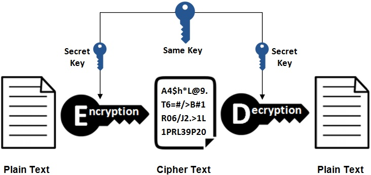
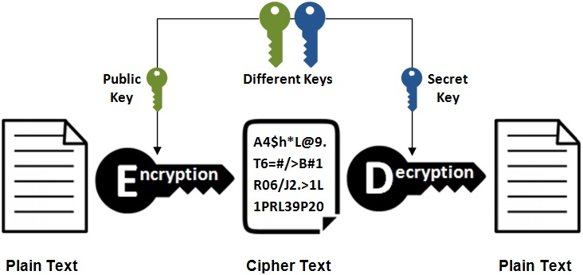
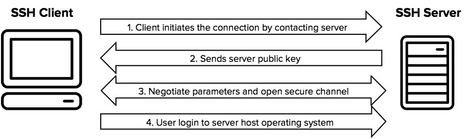
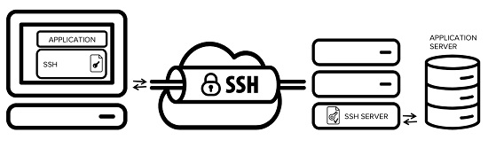
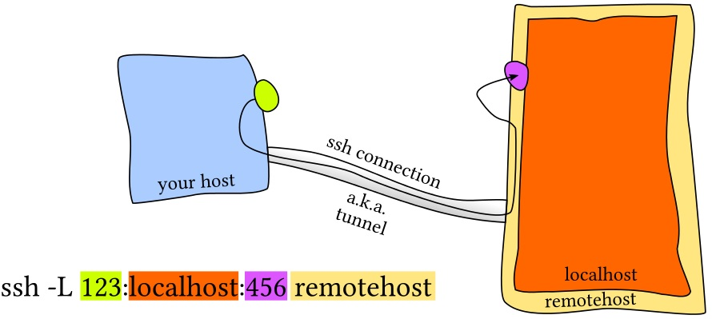
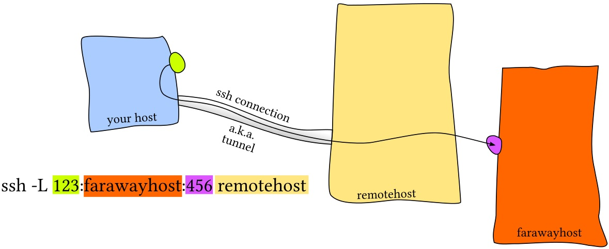
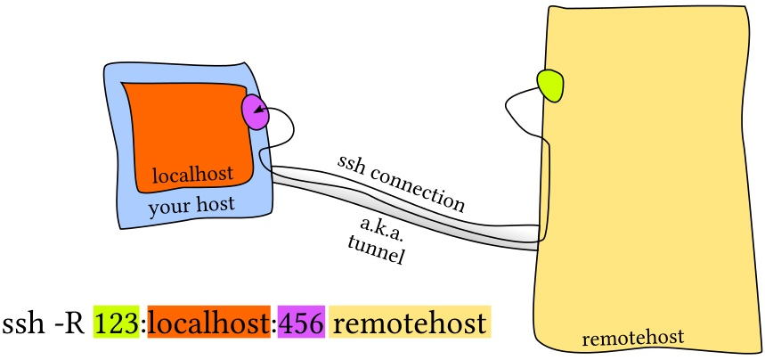
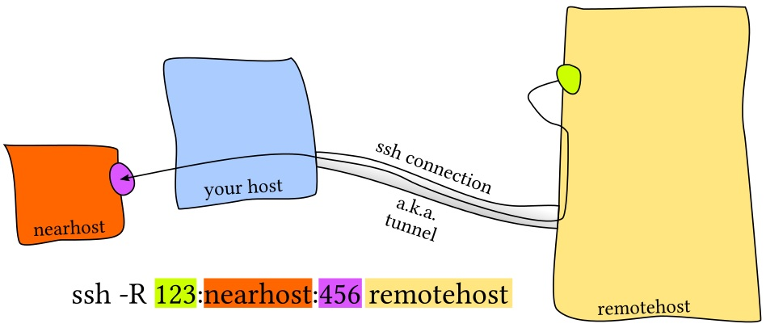
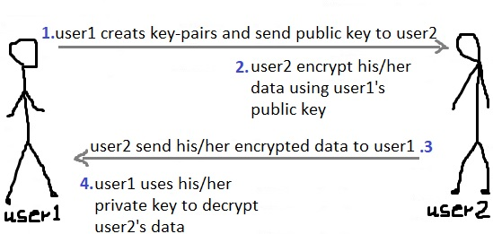

# Protección de datos con cifrado

**Ponderación:** 3

**Descripción:** El candidato debe ser capaz de utilizar técnicas de clave pública para proteger los datos y la comunicación.

**Áreas de conocimiento clave:**

* Configuración y uso básicos del cliente OpenSSH 2
* Comprender la función de las claves de host del servidor OpenSSH 2
* Configuración, uso y revocación básicos de GnuPG
* Comprender los túneles de puerto SSH (incluidos los túneles X11)

**Términos y utilidades:**

* ssh
* ssh-keygen
* ssh-agent
* ssh-add
* \~/.ssh/id\_rsa and id\_rsa.pub
* \~/.ssh/id\_dsa and id\_dsa.pub
* /etc/ssh/ssh\_host\_rsa\_key and ssh\_host\_rsa\_key.pub
* /etc/ssh/ssh\_host\_dsa\_key and ssh\_host\_dsa\_key.pub
* \~/.ssh/authorized\_keys
* ssh\_known\_hosts
* gpg
* \~/.gnupg/


Primero, veamos algunos conceptos.

## Criptografía

La criptografía es un método que utiliza principios matemáticos avanzados para almacenar y transmitir datos en un formato específico, de modo que solo quienes los reciben puedan leerlos y procesarlos. El cifrado es un concepto clave en criptografía.

* **Cifrado**: En criptografía, el cifrado es el proceso de codificar un mensaje o información de tal manera que solo las partes autorizadas puedan acceder a él, mientras que quienes no lo estén no lo puedan.
* **Descifrado**: La conversión de datos cifrados a su forma original se denomina descifrado. Generalmente, es el proceso inverso del cifrado.

### Cifrado simétrico vs. asimétrico

Los algoritmos de cifrado se suelen dividir en dos categorías: cifrado simétrico y asimétrico.

#### Cifrado simétrico



El cifrado simétrico es la técnica más antigua y conocida. Se aplica una clave secreta, que puede ser un número, una palabra o simplemente una cadena de letras aleatorias, al texto de un mensaje para modificar su contenido de una forma específica. Esto puede ser tan simple como desplazar cada letra un número determinado en el alfabeto. Siempre que tanto el remitente como el destinatario conozcan la clave secreta, podrán cifrar y descifrar todos los mensajes que la utilicen.

#### Cifrado asimétrico

El problema con las claves secretas reside en su intercambio a través de Internet o de una gran red, evitando que caigan en manos indebidas. Cualquiera que conozca la clave secreta puede descifrar el mensaje. Una solución es el cifrado asimétrico, en el que existen dos claves relacionadas: un par de claves. Una clave pública está disponible gratuitamente para cualquiera que desee enviarte un mensaje. Una segunda clave, la privada, se mantiene en secreto, de modo que solo tú la conoces.



Cualquier mensaje (texto, archivos binarios o documentos) cifrado con la clave pública solo se puede descifrar aplicando el mismo algoritmo, pero con la clave privada correspondiente. Cualquier mensaje cifrado con la clave privada solo se puede descifrar con la clave pública correspondiente.

Esto significa que no tienes que preocuparte por pasar claves públicas por internet (se supone que las claves son públicas).

> Sin embargo, un problema del cifrado asimétrico es que es más lento que el cifrado simétrico. Requiere mucha más potencia de procesamiento tanto para cifrar como para descifrar el contenido del mensaje.

**Cifrado vs. Firma**

Al cifrar, usas la **clave pública** para escribir un mensaje y la otra persona usa la **clave privada** para leerlo.

Al firmar, usas tu **clave privada** para escribir la firma del mensaje y la otra persona usa tu **clave pública** para comprobar si es realmente tuya.
#### ¿Qué es un servidor de claves?

Servidor de claves (criptográfico), un servidor donde se almacenan claves públicas para uso de terceros.

Con esta introducción, hablemos de SSH.

## ¿Qué es SSH?

El protocolo SSH (también conocido como Secure Shell) es un método para el inicio de sesión remoto seguro entre ordenadores. Ofrece varias opciones para una autenticación robusta y protege la seguridad e integridad de las comunicaciones con un cifrado robusto. Es una alternativa segura a los protocolos de inicio de sesión no protegidos (como Telnet y Rlogin) y a los métodos de transferencia de archivos inseguros (como FTP).

Usos típicos del protocolo SSH:

* Proporcionar acceso seguro a usuarios y procesos automatizados
* Transferencias de archivos interactivas y automatizadas
* Emitir comandos remotos
* Gestionar la infraestructura de red y otros componentes críticos del sistema.

### ¿Cómo funciona el protocolo SSH?

SSH funciona mediante un modelo cliente-servidor que permite la autenticación de dos sistemas remotos y el cifrado de los datos que se transfieren entre ellos.

SSH opera en el puerto TCP 22 por defecto (aunque esto se puede cambiar si es necesario). El host (servidor) escucha las conexiones entrantes en el puerto 22 (o en cualquier otro puerto asignado a SSH).

SSH ofrece múltiples mecanismos para autenticar al servidor y al cliente. Dos de los mecanismos de autenticación más utilizados son la autenticación basada en contraseña y la autenticación basada en clave. Si bien la autenticación basada en contraseña también es segura, se recomienda utilizar la autenticación basada en clave.



La conexión se establece mediante el cliente SSH al conectarse al servidor SSH. El cliente SSH gestiona el proceso de configuración de la conexión y utiliza criptografía de clave pública para verificar la identidad del servidor SSH. Tras la configuración, el protocolo SSH utiliza un cifrado simétrico robusto y algoritmos hash para garantizar la privacidad e integridad de los datos que se intercambian entre el cliente y el servidor.

### ¿Qué es OpenSSH?

OpenSSH es una implementación gratuita y de código abierto del protocolo SSH (Secure Shell). OpenSSH es muy popular entre los administradores de sistemas gracias a su compatibilidad multiplataforma y sus prácticas funciones.


Todas las comunicaciones y credenciales de usuario que utilizan OpenSSH están cifradas y protegidas contra ataques de intermediario. Si un tercero intenta interceptar nuestra conexión, OpenSSH lo detecta y nos informa.

Usamos Ubuntu 16-1 como servidor SSH y Ubuntu 16-2 como cliente.
#### /etc/ssh

OpenSSH tiene dos conjuntos de archivos de configuración: uno para los programas cliente (ssh, scp y sftp) y otro para el demonio del servidor (sshd).

```
root@ubuntu16-1:~# ls -1 /etc/ssh
moduli
ssh_config
sshd_config
ssh_host_dsa_key
ssh_host_dsa_key.pub
ssh_host_ecdsa_key
ssh_host_ecdsa_key.pub
ssh_host_ed25519_key
ssh_host_ed25519_key.pub
ssh_host_rsa_key
ssh_host_rsa_key.pub
ssh_import_id
```

El archivo `sshd_config` es el archivo de configuración del **daemon** ssh (o proceso del servidor ssh), mientras que el archivo `ssh_config` es el archivo de configuración del cliente ssh. Este archivo solo influye al usar el comando ssh para conectarse a otro host ssh. Como puede ver, existen claves públicas y privadas con diferentes algoritmos que SSH puede usar para cifrar la sesión.

## Configuraciones del cliente ssh

Hasta ahora hemos comprendido cómo funciona SSH. Como mencionamos, al iniciar una conexión ssh, la clave pública del servidor ssh se transfiere al cliente (almacenada en ./ssh/known\_hosts) y el cliente la usará para continuar la negociación con el servidor. El usuario deberá autenticarse enviando su nombre de usuario y contraseña.

Comencemos conectándonos a Ubuntu 16-1 desde Ubuntu 16-2 y veamos las claves:

```
user1@ubuntu16-2:~$ ssh user1@192.168.52.146
The authenticity of host '192.168.52.146 (192.168.52.146)' can't be established.
ECDSA key fingerprint is SHA256:GV/PpX9YGvMZTAbuz6w3zBDreokesZHhVSM1zrXmHLw.
Are you sure you want to continue connecting (yes/no)? yes
Warning: Permanently added '192.168.52.146' (ECDSA) to the list of known hosts.
user1@192.168.52.146's password: 
Welcome to Ubuntu 16.04.5 LTS (GNU/Linux 4.15.0-39-generic x86_64)

 * Documentation:  https://help.ubuntu.com
 * Management:     https://landscape.canonical.com
 * Support:        https://ubuntu.com/advantage

445 packages can be updated.
365 updates are security updates.

New release '18.04.4 LTS' available.
Run 'do-release-upgrade' to upgrade to it.

Last login: Fri Mar 27 15:51:55 2020 from 192.168.52.133
user1@ubuntu16-1:~$ 
```

¿Qué es una huella digital? Una huella digital de clave pública es una secuencia corta de bytes que se utiliza para identificar una clave pública más larga. Las huellas digitales se crean aplicando una función hash criptográfica a una clave pública. Dado que las huellas digitales son más cortas que las claves a las que hacen referencia, pueden utilizarse para simplificar ciertas tareas de gestión de claves.

Ahora comparemos las claves en el servidor y el cliente:

```
### server
user1@ubuntu16-1:~$ cat /etc/ssh/ssh_host_ecdsa_key.pub 
ecdsa-sha2-nistp256 AAAAE2VjZHNhLXNoYTItbmlzdHAyNTYAAAAIbmlzdHAyNTYAAABBBIjnKq9Wr0C2faQCf4+gcqPN4bOMFyx1nywTjLS/mh/S30V0r/mvy9cvfWvA2LY/y7zqxg+/gMvELQznikQiaTo= root@server1
```

```
### client
user1@ubuntu16-2:~$ tree .ssh/
.ssh/
└── known_hosts

0 directories, 1 file
user1@ubuntu16-2:~$ cat .ssh/known_hosts 
|1|gD2R1tW6jKBSyL1A0XpynmG8Vok=|1X2nzVcwHLQGT5T8FOUxeCejtvQ= ecdsa-sha2-nistp256 AAAAE2VjZHNhLXNoYTItbmlzdHAyNTYAAAAIbmlzdHAyNTYAAABBBIjnKq9Wr0C2faQCf4+gcqPN4bOMFyx1nywTjLS/mh/S30V0r/mvy9cvfWvA2LY/y7zqxg+/gMvELQznikQiaTo=
```

Configuración de la autenticación basada en clave SSH

Es posible omitir el nombre de usuario y la contraseña y conectarse al servidor SSH utilizando las claves pública y privada del cliente.


Ahora, generemos las claves públicas y privadas del cliente y copiemos la clave pública del cliente al servidor.
### ssh-keygen

ssh-keygen: crea un par de claves para la autenticación con clave pública:

```
user1@ubuntu16-2:~$ ssh-keygen 
Generating public/private rsa key pair.
Enter file in which to save the key (/home/user1/.ssh/id_rsa): 
Enter passphrase (empty for no passphrase): 
Enter same passphrase again: 
Your identification has been saved in /home/user1/.ssh/id_rsa.
Your public key has been saved in /home/user1/.ssh/id_rsa.pub.
The key fingerprint is:
SHA256:rer76yQU+8Mmrg33xCA51RtnpTUVHT1cVMX7kB2+aUI user1@ubuntu16-2
The key's randomart image is:
+---[RSA 2048]----+
|            +.+*@|
|       .   + . ++|
|      o o +   .o+|
|     o o *   Eoo.|
|    + + S . .  .+|
|     + = .   . +.|
|    . + X     o  |
|     = O .       |
|    .o*+=.       |
+----[SHA256]-----+
user1@ubuntu16-2:~$ 
user1@ubuntu16-2:~$ tree .ssh
.ssh
├── id_rsa
├── id_rsa.pub
└── known_hosts

0 directories, 3 files
user1@ubuntu16-2:~$ cat .ssh/id_rsa.pub 
ssh-rsa AAAAB3NzaC1yc2EAAAADAQABAAABAQC818rxUXbwnwwxtFhUKvgtZV+Ygao1nUEHcaBvYEsXsBa4hQcV0+ITPEMHfk0zUag3sKyQZWckKmREK+lpiF+7Nrw83eKxjgHdwZC0ibxPTenklZNSBEMZMBDeq8H3bKoAfuyczX0IfVDA2Iyebsg2KYIIZQ/Otw7hAm2IH3perUqzeYliLhIYb0Gd3jyOpl4VMaPb2p+f5+fG87MnzjDplyorruhZyUcv8CMUc6XZ3dJjeiSsNNCRKLEb6Cm6msQxuCUq+Xz1n0+ay6fsaJbbhzFwNvbRH2YSzBg5BmtBXVt68U6XM3SzynWAqQaDS44Cuv3M1q88baTlOTjRkFRZ user1@ubuntu16-2
user1@ubuntu16-2:~$ 


```

No hemos establecido una contraseña en nuestra demostración, pero si la estableciéramos, se nos solicitaría que la introdujéramos al copiarla al servidor.

### ssh-copy-id

Usamos ssh-copy-id, que configura una clave pública como autorizada en un servidor.

```
user1@ubuntu16-2:~$ ssh-copy-id -i .ssh/id_rsa.pub user1@192.168.52.146
/usr/bin/ssh-copy-id: INFO: Source of key(s) to be installed: ".ssh/id_rsa.pub"
/usr/bin/ssh-copy-id: INFO: attempting to log in with the new key(s), to filter out any that are already installed
/usr/bin/ssh-copy-id: INFO: 1 key(s) remain to be installed -- if you are prompted now it is to install the new keys
user1@192.168.52.146's password: 

Number of key(s) added: 1

Now try logging into the machine, with:   "ssh 'user1@192.168.52.146'"
and check to make sure that only the key(s) you wanted were added.
```

Ahora echemos un vistazo al lado del servidor:

```
user1@ubuntu16-1:~$ cat .ssh/authorized_keys 
ssh-rsa AAAAB3NzaC1yc2EAAAADAQABAAABAQC818rxUXbwnwwxtFhUKvgtZV+Ygao1nUEHcaBvYEsXsBa4hQcV0+ITPEMHfk0zUag3sKyQZWckKmREK+lpiF+7Nrw83eKxjgHdwZC0ibxPTenklZNSBEMZMBDeq8H3bKoAfuyczX0IfVDA2Iyebsg2KYIIZQ/Otw7hAm2IH3perUqzeYliLhIYb0Gd3jyOpl4VMaPb2p+f5+fG87MnzjDplyorruhZyUcv8CMUc6XZ3dJjeiSsNNCRKLEb6Cm6msQxuCUq+Xz1n0+ay6fsaJbbhzFwNvbRH2YSzBg5BmtBXVt68U6XM3SzynWAqQaDS44Cuv3M1q88baTlOTjRkFRZ user1@ubuntu16-2
```

Ahora vamos a comprobar el resultado de la cliente:

```
user1@ubuntu16-2:~$ ssh user1@192.168.52.146
Welcome to Ubuntu 16.04.5 LTS (GNU/Linux 4.15.0-39-generic x86_64)

 * Documentation:  https://help.ubuntu.com
 * Management:     https://landscape.canonical.com
 * Support:        https://ubuntu.com/advantage

445 packages can be updated.
365 updates are security updates.

New release '18.04.4 LTS' available.
Run 'do-release-upgrade' to upgrade to it.

Last login: Fri Mar 27 15:57:29 2020 from 192.168.52.133
user1@ubuntu16-1:~$ 

```

Y parece correcto. Podemos copiar y pegar las claves de otros usuarios si lo desea, pero no olvide que estas claves permiten a los usuarios iniciar sesión sin contraseña.

#### ¿Por qué usar una frase de contraseña? ¿Para qué sirve?

Hemos configurado una conexión SSH sin contraseña mediante autenticación basada en clave. Pero ¿qué pasaría si nuestro sistema se viera comprometido? Un hacker malicioso podría conectarse a otros servidores mediante autenticación basada en clave sin conocer las contraseñas.

La frase de contraseña puede ayudarnos a evitar este tipo de problemas de seguridad al requerir una frase de contraseña al inicio de cada autenticación SSH basada en clave. Así que borremos la clave autorizada anterior y comencemos:

```
user1@ubuntu16-1:~$ 
user1@ubuntu16-1:~$ vim .ssh/authorized_keys 
user1@ubuntu16-1:~$ cat .ssh/authorized_keys 
user1@ubuntu16-1:~$ exit
logout
Connection to 192.168.52.146 closed.
```

Ahora genere un nuevo par de claves con frase de contraseña en el cliente (deje que sobrescriba la clave privada y pública actual):

```
user1@ubuntu16-2:~$ ssh-keygen 
Generating public/private rsa key pair.
Enter file in which to save the key (/home/user1/.ssh/id_rsa): 
/home/user1/.ssh/id_rsa already exists.
Overwrite (y/n)? y
Enter passphrase (empty for no passphrase): 
Enter same passphrase again: 
Your identification has been saved in /home/user1/.ssh/id_rsa.
Your public key has been saved in /home/user1/.ssh/id_rsa.pub.
The key fingerprint is:
SHA256:NYUt7TiSY2pBH7jtmZqGDdV545CRZxTFvOg3KJ3trxo user1@ubuntu16-2
The key's randomart image is:
+---[RSA 2048]----+
|       . ooOo    |
|      o + =.=    |
|     . = Oo= .   |
|      + %.*.o    |
|     . =S@ *     |
|    . o = * +    |
|     = o .Eo .   |
|    . =    ..    |
|     .    ...o.  |
+----[SHA256]-----+
user1@ubuntu16-2:~$ 
user1@ubuntu16-2:~$ tree .ssh/
.ssh/
├── id_rsa
├── id_rsa.pub
└── known_hosts

0 directories, 3 files
user1@ubuntu16-2:~$ cat .ssh/id_rsa.pub 
ssh-rsa AAAAB3NzaC1yc2EAAAADAQABAAABAQDjF4K2XDLQIysT9QvwQKFFvJ6LeBN3XsmEO9cTZfnRPhPjKOpcwvyCPaFJwXpiSXLE+RUjy2lwghZ6sOIXezGG9+oqkVegBOJ9RonQfvg5nUCr/Khx+dT/5ZV8JEjJVYqWnrgxKiKgzFHfzInE3qKG4kN2yuanomqIPFGQs0Mk/ShmYCPEEDIxyapRWkSJMa1OeS4/Elk1gGcna0TwgNVF8zmGkg5JO3ruwia2uSbdDWxA2vVtae2qA02lFh0Gb/LJO8vR24MAwlyMMHU2UdszA4eWqQBrZtpKmQ0A4plT8EUkh2cZHgaUeMVloWDmFRyiU2LIFgC5AacnwRIFTtTD user1@ubuntu16-2
user1@ubuntu16-2:~$ 
```

Ahora transfiramos nuestra nueva clave pública al servidor:

```
user1@ubuntu16-2:~$ ssh-copy-id -i .ssh/id_rsa.pub user1@192.168.52.146
/usr/bin/ssh-copy-id: INFO: Source of key(s) to be installed: ".ssh/id_rsa.pub"
/usr/bin/ssh-copy-id: INFO: attempting to log in with the new key(s), to filter out any that are already installed
/usr/bin/ssh-copy-id: INFO: 1 key(s) remain to be installed -- if you are prompted now it is to install the new keys
user1@192.168.52.146's password: 

Number of key(s) added: 1

Now try logging into the machine, with:   "ssh 'user1@192.168.52.146'"
and check to make sure that only the key(s) you wanted were added.
```

Verifiquemos la clave que hemos copiado en el servidor:

```
user1@ubuntu16-1:~$ cat .ssh/authorized_keys 
ssh-rsa AAAAB3NzaC1yc2EAAAADAQABAAABAQDjF4K2XDLQIysT9QvwQKFFvJ6LeBN3XsmEO9cTZfnRPhPjKOpcwvyCPaFJwXpiSXLE+RUjy2lwghZ6sOIXezGG9+oqkVegBOJ9RonQfvg5nUCr/Khx+dT/5ZV8JEjJVYqWnrgxKiKgzFHfzInE3qKG4kN2yuanomqIPFGQs0Mk/ShmYCPEEDIxyapRWkSJMa1OeS4/Elk1gGcna0TwgNVF8zmGkg5JO3ruwia2uSbdDWxA2vVtae2qA02lFh0Gb/LJO8vR24MAwlyMMHU2UdszA4eWqQBrZtpKmQ0A4plT8EUkh2cZHgaUeMVloWDmFRyiU2LIFgC5AacnwRIFTtTD user1@ubuntu16-2
```

Ahora, cuando nos comunicamos por SSH con el servidor remoto (ubuntu16-1) desde nuestro cliente (ubuntu16-2), se nos solicita que ingresemos nuestra frase de contraseña de clave local en lugar de la contraseña de la cuenta de usuario remota:

```
user1@ubuntu16-2:~$ ssh user1@192.168.52.146
Enter passphrase for key '/home/user1/.ssh/id_rsa': 
Welcome to Ubuntu 16.04.5 LTS (GNU/Linux 4.15.0-39-generic x86_64)

 * Documentation:  https://help.ubuntu.com
 * Management:     https://landscape.canonical.com
 * Support:        https://ubuntu.com/advantage

445 packages can be updated.
365 updates are security updates.

New release '18.04.4 LTS' available.
Run 'do-release-upgrade' to upgrade to it.

Last login: Fri Mar 27 16:19:57 2020 from 192.168.52.133

```

salgamos y hagamos ssh una y otra vez:

```
user1@ubuntu16-1:~$ exit
logout
Connection to 192.168.52.146 closed.

user1@ubuntu16-2:~$ ssh user1@192.168.52.146
Enter passphrase for key '/home/user1/.ssh/id_rsa': 
Welcome to Ubuntu 16.04.5 LTS (GNU/Linux 4.15.0-39-generic x86_64)

 * Documentation:  https://help.ubuntu.com
 * Management:     https://landscape.canonical.com
 * Support:        https://ubuntu.com/advantage

445 packages can be updated.
365 updates are security updates.

New release '18.04.4 LTS' available.
Run 'do-release-upgrade' to upgrade to it.

Last login: Fri Mar 27 16:30:00 2020 from 192.168.52.133
user1@ubuntu16-1:~$ exit
logout
Connection to 192.168.52.146 closed.

```

Como pueden ver, cada vez que se nos solicita la contraseña, esto era lo que buscábamos para detener a un hacker si nuestro sistema se veía comprometido. Existe una forma de mantener la contraseña en la sesión actual del usuario y conservarla para las siguientes conexiones SSH, evitando así tener que volver a introducirla.

### ssh-agent

El **ssh-agent** es un programa auxiliar que registra las claves de identidad y las contraseñas de los usuarios. El **agente** puede usar las claves para iniciar sesión en otros servidores sin que el usuario tenga que volver a introducir la contraseña o la contraseña. Esto implementa un tipo de inicio de sesión único (SSO). El agente SSH se utiliza para la autenticación de clave pública SSH.

```
user1@ubuntu16-2:~$ ssh-agent
SSH_AUTH_SOCK=/tmp/ssh-7dlnU2k64PSA/agent.65150; export SSH_AUTH_SOCK;
SSH_AGENT_PID=65151; export SSH_AGENT_PID;
echo Agent pid 65151;
```

Si recibe un error, primero intente ejecutar ssh-agent /bin/bash.

### ssh-add

De forma predeterminada, el agente usa las claves SSH almacenadas en el directorio `.ssh`, dentro del directorio personal del usuario. El comando **ssh-add** se usa para agregar identidades al agente. En la forma más simple, simplemente ejecute `if` sin argumentos para agregar los archivos predeterminados `~/.ssh/id_rsa`, `.ssh/id_dsa`, `~/.ssh/id_ecdsa`, `~/.ssh/id_ed25519` y `~/.ssh/identity`. De lo contrario, asigne como argumento el nombre del archivo de clave privada que se agregará.

```
user1@ubuntu16-2:~$ ssh-add 
Enter passphrase for /home/user1/.ssh/id_rsa: 
Identity added: /home/user1/.ssh/id_rsa (/home/user1/.ssh/id_rsa)

user1@ubuntu16-2:~$ ssh-add -l
2048 SHA256:NYUt7TiSY2pBH7jtmZqGDdV545CRZxTFvOg3KJ3trxo /home/user1/.ssh/id_rsa (RSA)
user1@ubuntu16-2:~$ 
```

`-l` listará las claves privadas actualmente accesibles para el agente.

`-D` Elimina todas las identidades del agente, si lo desea.

Y luego podemos iniciar sesión en el servidor OpenSSH (ubuntu 16-1) sin contraseña ni frase de contraseña una y otra vez:

```
user1@ubuntu16-2:~$ ssh user1@192.168.52.146
Welcome to Ubuntu 16.04.5 LTS (GNU/Linux 4.15.0-39-generic x86_64)

 * Documentation:  https://help.ubuntu.com
 * Management:     https://landscape.canonical.com
 * Support:        https://ubuntu.com/advantage

445 packages can be updated.
365 updates are security updates.

New release '18.04.4 LTS' available.
Run 'do-release-upgrade' to upgrade to it.

Last login: Fri Mar 27 16:31:26 2020 from 192.168.52.133
user1@ubuntu16-1:~$ exit
logout

```

Hasta que salgamos del bash que usa la clave asociada, necesitaremos ingresar la contraseña nuevamente.

#### ¿Qué es la tunelización SSH?

La tunelización SSH es un método para transportar datos de red arbitrarios a través de una conexión SSH cifrada. Se puede usar para agregar cifrado a aplicaciones heredadas. También se puede usar para implementar VPN (redes privadas virtuales) y acceder a servicios de intranet a través de firewalls.

SSH es un estándar para inicios de sesión remotos seguros y transferencias de archivos a través de redes no confiables. También proporciona una forma de proteger el tráfico de datos de cualquier aplicación mediante el reenvío de puertos, básicamente tunelizando cualquier puerto TCP/IP a través de SSH. Esto significa que el tráfico de datos de la aplicación se dirige dentro de una conexión SSH cifrada para que no pueda ser interceptado mientras está en tránsito. La tunelización SSH permite agregar seguridad de red a aplicaciones heredadas que no admiten cifrado de forma nativa.



¿Qué es el reenvío de puertos SSH?

El reenvío de puertos SSH es un mecanismo en SSH para tunelizar los puertos de las aplicaciones desde el equipo cliente al servidor, o viceversa. Algunos administradores de sistemas y profesionales de TI lo utilizan para abrir puertas traseras a la red interna desde sus equipos domésticos. También puede ser utilizado por hackers y malware para abrir acceso desde Internet a la red interna.

Existen tres tipos de reenvío de puertos SSH:

* **Reenvío de puertos local**: las conexiones de un cliente SSH se reenvían, a través del servidor SSH, a un servidor de destino.





* **Reenvío de puerto remoto**: las conexiones desde un servidor SSH se reenvían, a través del cliente SSH, a un servidor de destino




**Reenvío dinámico de puertos**: las conexiones de varios programas se reenvían, a través del cliente SSH, a un servidor SSH y, finalmente, a varios servidores de destino.

### ssh

Al igual que otros comandos, ssh también tiene algunas opciones. Veamos las opciones más útiles:

| Comandos SSH | Descripción |
| ---------------------------------------- | ----------------------------------------------------------------------------------------------------------------- |
| ssh -V | Muestra la versión del cliente SSH |
| ssh usuario1@servidor1.ejemplo.com | Conectar al host remoto; añadir "-v" para el modo detallado |
| ssh -l login\_name servidor1.ejemplo.com | Especifica el usuario con el que se iniciará sesión en la máquina remota. |
| ssh usuario1@servidor1.ejemplo.com \<comando> | Ejecutar \<comando> en el host remoto mediante ssh |
| ssh -X usuario@servidor1.ejemplo.com | Habilite Xforwarding en el lado del cliente. X11Forwarding debe estar habilitado en el lado del servidor en el archivo sshd\_config. |

## cifrado de datos

El cifrado **es importante** porque permite proteger de forma segura los datos a los que no desea que nadie más tenga acceso.

### gpg

GnuPG (más conocido como GPG) es una implementación del estándar PGP (Pretty Good Privacy). Utiliza un sistema de claves públicas y privadas para el cifrado y la firma de mensajes o datos.

Para la demostración, utilizamos dos usuarios en Ubuntu 16: usuario1 y usuario2.



Ok, iniciemos sesión a través del usuario1 y comencemos a crear pares de claves usando el comando `gpg --gen-key`:

```
user1@ubuntu16-1:~$ gpg --gen-key 
gpg (GnuPG) 1.4.20; Copyright (C) 2015 Free Software Foundation, Inc.
This is free software: you are free to change and redistribute it.
There is NO WARRANTY, to the extent permitted by law.

gpg: keyring `/home/user1/.gnupg/secring.gpg' created
Please select what kind of key you want:
   (1) RSA and RSA (default)
   (2) DSA and Elgamal
   (3) DSA (sign only)
   (4) RSA (sign only)
Your selection? 1
RSA keys may be between 1024 and 4096 bits long.
What keysize do you want? (2048) 
Requested keysize is 2048 bits
Please specify how long the key should be valid.
         0 = key does not expire
      <n>  = key expires in n days
      <n>w = key expires in n weeks
      <n>m = key expires in n months
      <n>y = key expires in n years
Key is valid for? (0) 
Key does not expire at all
Is this correct? (y/N) y

You need a user ID to identify your key; the software constructs the user ID
from the Real Name, Comment and Email Address in this form:
    "Heinrich Heine (Der Dichter) <heinrichh@duesseldorf.de>"

Real name: RealUser1
Email address: user1@localhost
Comment: created by user1
You selected this USER-ID:
    "RealUser1 (created by user1) <user1@localhost>"

Change (N)ame, (C)omment, (E)mail or (O)kay/(Q)uit? o
You need a Passphrase to protect your secret key.

We need to generate a lot of random bytes. It is a good idea to perform
some other action (type on the keyboard, move the mouse, utilize the
disks) during the prime generation; this gives the random number
generator a better chance to gain enough entropy.
.+++++
+++++
We need to generate a lot of random bytes. It is a good idea to perform
some other action (type on the keyboard, move the mouse, utilize the
disks) during the prime generation; this gives the random number
generator a better chance to gain enough entropy.

Not enough random bytes available.  Please do some other work to give
the OS a chance to collect more entropy! (Need 74 more bytes)
....+++++

gpg: key 6D187851 marked as ultimately trusted
public and secret key created and signed.

gpg: checking the trustdb
gpg: 3 marginal(s) needed, 1 complete(s) needed, PGP trust model
gpg: depth: 0  valid:   1  signed:   0  trust: 0-, 0q, 0n, 0m, 0f, 1u
pub   2048R/6D187851 2020-03-28
      Key fingerprint = 8772 5C1E 3F2F 88DB DBB7  7F37 E06C 3317 6D18 7851
uid                  RealUser1 (created by user1) <user1@localhost>
sub   2048R/F00A0A74 2020-03-28
```

Crea claves dentro del directorio \~/.gnupg. Veamos el par de claves creado con el comando `gpg --list-key`:

```
user1@ubuntu16-1:~$ gpg --list-key
/home/user1/.gnupg/pubring.gpg
------------------------------
pub   2048R/6D187851 2020-03-28
uid                  RealUser1 (created by user1) <user1@localhost>
sub   2048R/F00A0A74 2020-03-28
```

Luego, necesitamos compartir nuestra clave pública con otras personas. Para exportar nuestro archivo de clave pública, ejecutamos:

```
user1@ubuntu16-1:~$ gpg --export RealUser1 > user1.pub
```

Vamos a ponerlo en el directorio /tmp para el usuario2:

```
user1@ubuntu16-1:~$ mv user1.pub /tmp/
```

Ahora inicie sesión como usuario2 e importe la clave pública del usuario1 a través de `gpg --import`:

```
user2@ubuntu16-1:~$ gpg --import /tmp/user1.pub 
gpg: directory `/home/user2/.gnupg' created
gpg: new configuration file `/home/user2/.gnupg/gpg.conf' created
gpg: WARNING: options in `/home/user2/.gnupg/gpg.conf' are not yet active during this run
gpg: keyring `/home/user2/.gnupg/secring.gpg' created
gpg: keyring `/home/user2/.gnupg/pubring.gpg' created
gpg: /home/user2/.gnupg/trustdb.gpg: trustdb created
gpg: key 6D187851: public key "RealUser1 (created by user1) <user1@localhost>" imported
gpg: Total number processed: 1
gpg:               imported: 1  (RSA: 1)
```

A continuación, cree un archivo de muestra para cifrar:

```
user2@ubuntu16-1:~$ vim user2file 
user2@ubuntu16-1:~$ cat user2file 
water boils at 100 degrees celsius!
```

Todo está listo para cifrar el archivo user2:

```
### list keys
user2@ubuntu16-1:~$ gpg --list-key
/home/user2/.gnupg/pubring.gpg
------------------------------
pub   2048R/6D187851 2020-03-28
uid                  RealUser1 (created by user1) <user1@localhost>
sub   2048R/F00A0A74 2020-03-28
```

```
### encrypt
user2@ubuntu16-1:~$ gpg --output user2secret --recipient Realuser1 --encrypt user2file
gpg: F00A0A74: There is no assurance this key belongs to the named user

pub  2048R/F00A0A74 2020-03-28 RealUser1 (created by user1) <user1@localhost>
 Primary key fingerprint: 8772 5C1E 3F2F 88DB DBB7  7F37 E06C 3317 6D18 7851
      Subkey fingerprint: 28DD 00C2 443C EA3B CD1A  9D5F 901E 5A02 F00A 0A74

It is NOT certain that the key belongs to the person named
in the user ID.  If you *really* know what you are doing,
you may answer the next question with yes.

Use this key anyway? (y/N) y
```

```
### take a look at inside encrypted file!
user2@ubuntu16-1:~$ cat user2secret 
�
  �Z�

t�}�D?�Y���Ky
               ��Ƹ�TB$+��!�M�z�(�s}jc�_�#,$u�z��]�K�Kܮ�H�g���m˚�o���^;J��IvI������ �&(���W��Y'Y�Mm,���*���F)��-��$vj�U򳶜m����M���(Xr�����I�+H�ko�%k^��Lߍ5h�7�s�[�N.2 o�fe�d ���Ż�[Dӿ�'�^�fⳐKn{AS&#,��̊ښ��}�5�!01e;Ē�h�j1������Jkt��VY6���k�H�߳�rt�-nA
      ?gzȬ��#j1)]
(�
  L�1Ey���CJ�Ĭ�cуk��QP�
                             I2y_���8G�›user2@ubuntu16-1:~$ 
```

Es hora de enviar el secreto del usuario 2 al usuario 1:

```
user2@ubuntu16-1:~$ mv user2secret /tmp/
```

Inicie sesión como usuario1 e intente descifrar el secreto del usuario2:

```
user1@ubuntu16-1:~$ gpg --out from_user2 --decrypt /tmp/user2secret 

You need a passphrase to unlock the secret key for
user: "RealUser1 (created by user1) <user1@localhost>"
2048-bit RSA key, ID F00A0A74, created 2020-03-28 (main key ID 6D187851)

gpg: encrypted with 2048-bit RSA key, ID F00A0A74, created 2020-03-28
      "RealUser1 (created by user1) <user1@localhost>"
```

¿Veamos cuál es la información secreta del usuario2?

```
user1@ubuntu16-1:~$ cat from_user2 
water boils at 100 degrees celsius!
```

Generación de un certificado de revocación

Si otros usuarios conocen su clave privada, deberá desvincular las claves antiguas de su identidad para poder generar las nuevas. Para ello, necesitará un certificado de revocación. Lo haremos ahora y lo guardaremos en un lugar seguro.

```
user1@ubuntu16-1:~$ gpg --output revoke_User1.crt --gen-revoke user1@localhost

sec  2048R/6D187851 2020-03-28 RealUser1 (created by user1) <user1@localhost>

Create a revocation certificate for this key? (y/N) y
Please select the reason for the revocation:
  0 = No reason specified
  1 = Key has been compromised
  2 = Key is superseded
  3 = Key is no longer used
  Q = Cancel
(Probably you want to select 1 here)
Your decision? 0
Enter an optional description; end it with an empty line:
> 
Reason for revocation: No reason specified
(No description given)
Is this okay? (y/N) y

You need a passphrase to unlock the secret key for
user: "RealUser1 (created by user1) <user1@localhost>"
2048-bit RSA key, ID 6D187851, created 2020-03-28

ASCII armored output forced.
Revocation certificate created.

Please move it to a medium which you can hide away; if Mallory gets
access to this certificate he can use it to make your key unusable.
It is smart to print this certificate and store it away, just in case
your media become unreadable.  But have some caution:  The print system of
your machine might store the data and make it available to others!
```

La opción `--output` debe ir seguida del nombre de archivo del certificado que desea crear. La opción `--gen-revoke` hace que `gpg` genere un certificado de revocación. Debe proporcionar la dirección de correo electrónico que utilizó para generar las claves.

```
user1@ubuntu16-1:~$ cat revoke_User1.crt 
-----BEGIN PGP PUBLIC KEY BLOCK-----
Version: GnuPG v1
Comment: A revocation certificate should follow

iQEfBCABAgAJBQJef1iqAh0AAAoJEOBsMxdtGHhRuU0H/RHrxodSkniRE+iD15PW
dfcWcPZVAv9m2SWzmPN0vU/ywgUE5G60pNsOC6bxWbtmxbxm/PutCA+ipC/KPTcZ
RwZvU8ge0PLulrQ5km9xea2295b2dOBEPCzOkgv6BTeAMADrBmi2shhLqUWeoRRr
7H6oTC6RFr76o1jPb9UUMVDh840ttMlpYPAlir6JqCvwSL2ZJE58vWSuC/rou1ds
4Z1Q0EFjpMQ5S1TmukVF4h4xxGsiZpgoubKJb++1CtYfqoPgCV/yiQFjaSGdiQbL
0uqjfEERjOUUc5FKAY9fmvfAjmRzUBhit1U9wWiQ7O+JBxzMUDda3eas5OzpweeK
0Lw=
=z2hv
-----END PGP PUBLIC KEY BLOCK-----
```

## firma

Al cifrar un documento con tu clave privada, permites que cualquiera pueda intentar abrirlo con tu clave pública. Si lo logran, estarán seguros de que lo has firmado con tu clave privada. `gpg` tiene un comando específico para firmar documentos:

```
user1@ubuntu16-1:~$ vim notice
user1@ubuntu16-1:~$ cat notice 
Lets start learning LPIC-2!
user1@ubuntu16-1:~$ 
user1@ubuntu16-1:~$ gpg --clearsign notice

You need a passphrase to unlock the secret key for
user: "RealUser1 (created by user1) <user1@localhost>"
2048-bit RSA key, ID 6D187851, created 2020-03-28
```

Aquí, la instrucción --clearsign indica a gpg que incluya también el mensaje de texto sin cifrar en el archivo de salida. El archivo de salida será `originalfile.asc`:

```
user1@ubuntu16-1:~$ cat notice.asc 
-----BEGIN PGP SIGNED MESSAGE-----
Hash: SHA1

Lets start learning LPIC-2!
-----BEGIN PGP SIGNATURE-----
Version: GnuPG v1

iQEcBAEBAgAGBQJef2DyAAoJEOBsMxdtGHhReQoH/j33csnEJUlS6IqdlzeIDyw3
D6HVli8TaywfdZLTCXhSRHNM7NISCIsPdULHVs1J8vwYKLqshNOlx7F+HNAmkYtv
WqHlNL03x2TOEca+qr31iUFdtpRKrMsQ3mpai2aaI8MoILO1gRYGMZ717O31YGGh
yQ5Teft6q2QorWXpbACN0JlWcKs5OiFCgcCOOp2RHnjM4NtCJEmI+ZGBuqVJL98P
Aa/fP5AteexMuj4GwRfC542f9Tsaw03je4SlAcgq7cJ+iwpy5vHGwN0sPwbRoqbS
ABL1zaTA2TZmnS5Jx5ii8IyndObuVHtDUEGROaqxiVWZ/JrMAAfAjtv/mnL79HQ=
=W+EU
-----END PGP SIGNATURE-----
```

Copie el archivo notice.asc en /tmp y otros usuarios podrán verificar que un documento esté firmado correctamente:

```
user2@ubuntu16-1:~$ gpg --verify /tmp/notice.asc 
gpg: Signature made Sat 28 Mar 2020 07:06:34 PM +0430 using RSA key ID 6D187851
gpg: Good signature from "RealUser1 (created by user1) <user1@localhost>"
gpg: WARNING: This key is not certified with a trusted signature!
gpg:          There is no indication that the signature belongs to the owner.
Primary key fingerprint: 8772 5C1E 3F2F 88DB DBB7  7F37 E06C 3317 6D18 7851
user2@ubuntu16-1:~$ 
```

¡Y eso es todo, amigos!

¡Felicidades, hemos completado lpic1-102!


- [https://www.ssl2buy.com/wiki/symmetric-vs-asymmetric-encryption-what-are-differences](https://www.ssl2buy.com/wiki/symmetric-vs-asymmetric-encryption-what-are-differences)
- [https://hackernoon.com/symmetric-and-asymmetric-encryption-5122f9ec65b1](https://hackernoon.com/symmetric-and-asymmetric-encryption-5122f9ec65b1)
- [https://economictimes.indiatimes.com/definition/decryption](https://economictimes.indiatimes.com/definition/decryption)
- [https://support.microsoft.com/en-us/help/246071/description-of-symmetric-and-asymmetric-encryption](https://support.microsoft.com/en-us/help/246071/description-of-symmetric-and-asymmetric-encryption)
- [https://stackoverflow.com/questions/454048/what-is-the-difference-between-encrypting-and-signing-in-asymmetric-encryption](https://stackoverflow.com/questions/454048/what-is-the-difference-between-encrypting-and-signing-in-asymmetric-encryption)
- [https://en.wikipedia.org/wiki/Key\_server](https://en.wikipedia.org/wiki/Key\_server)
- [https://www.ssh.com/ssh/protocol](https://www.ssh.com/ssh/protocol)
- [https://www.hivelocity.net/kb/what-is-openssh/](https://www.hivelocity.net/kb/what-is-openssh/)
- [https://www.ssh.com/ssh/agent](https://www.ssh.com/ssh/agent)
- [https://www.ssh.com/ssh/tunneling](https://www.ssh.com/ssh/tunneling)
- [https://www.ssh.com/ssh/tunneling/example](https://www.ssh.com/ssh/tunneling/example)
- [https://unix.stackexchange.com/questions/115897/whats-ssh-port-forwarding-and-whats-the-difference-between-ssh-local-and-remot](https://unix.stackexchange.com/questions/115897/whats-ssh-port-forwarding-and-whats-the-difference-between-ssh-local-and-remot)
- [https://www.ssh.com/ssh/command](https://www.ssh.com/ssh/command)
- [https://www.taoeffect.com/espionage/EspionageHelp/pages/faq-encryption.html](https://www.taoeffect.com/espionage/EspionageHelp/pages/faq-encryption.html)
- [https://www.privex.io/articles/what-is-gpg/](https://www.privex.io/articles/what-is-gpg/)
- [https://www.howtogeek.com/427982/how-to-encrypt-and-decrypt-files-with-gpg-on-linux/](https://www.howtogeek.com/427982/how-to-encrypt-and-decrypt-files-with-gpg-on-linux/)
- [https://jadi.gitbooks.io/lpic1/content/1103\_securing\_data\_with\_encryption.html](https://jadi.gitbooks.io/lpic1/content/1103\_securing\_data\_with\_encryption.html)
