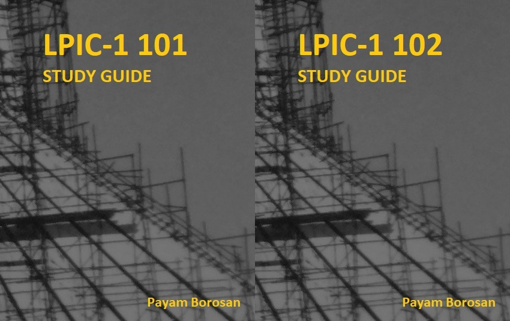

# Introducción

Bienvenido a la guía del examen de certificación LPIC1. Esta es una puerta hacia un nuevo mundo, un mundo de archivos y procesos. Vivir en este nuevo mundo requiere nuevas actitudes y nuevas habilidades. Así que sea paciente y primero conozcamos cómo mantenerse con vida.

Puede ver la descripción general de la certificación LPIC1 [aquí](http://www.lpi.org/our-certifications/lpic-1-overview) y, como probablemente sepa, LPIC1 consta de dos exámenes [101](http://www.lpi.org/our-certifications/exam-101-objectives) y [102](http://www.lpi.org/our-certifications/exam-102-objectives). Ambos cursos tratan sobre Linux en sí. Hablaremos sobre algunos conceptos clave y comandos y herramientas relacionados. Mientras se familiariza con la caja de herramientas de los administradores de Linux, estará preparado para el siguiente nivel del examen LPI.

